# Visualizing data from a ClickHouse database

The data source is a table from a ClickHouse database with information about sales, including total amount, region, segment, and year.

{{ datalens-short-name }} can be used to visualize sales, for example:

* By year and region.
* By region, segment, and year.

To visualize dependencies, you need to connect to the ClickHouse database, create a dataset based on the connection, and configure a dashboard by adding the corresponding charts to it.

This includes the following steps:

- [Step 1. Create a dataset](data-from-db-visualization.md#step1)
- [Step 2. Create a bar chart](data-from-db-visualization.md#step2)
- [Step 3. Create a pivot table chart](data-from-db-visualization.md#step3)
- [Step 4. Create a dashboard](data-from-db-visualization.md#step4)
- [Step 5. Add charts to the dashboard](data-from-db-visualization.md#step5)
- [Step 6. Add selectors to the dashboard](data-from-db-visualization.md#step6)

Create a [connection](../concepts/connection.md) to the ClickHouse database where the table is stored.

## Step 1. Create a dataset {#step1}

Create a [dataset](../concepts/dataset.md) based on the [connection](../concepts/connection.md) to the ClickHouse database where the table is stored.

1. Go to [{{ datalens-short-name }}](https://datalens.yandex.ru).

1. Click **Create dataset**.

    

1. Select the **Sample ClickHouse** connection.

    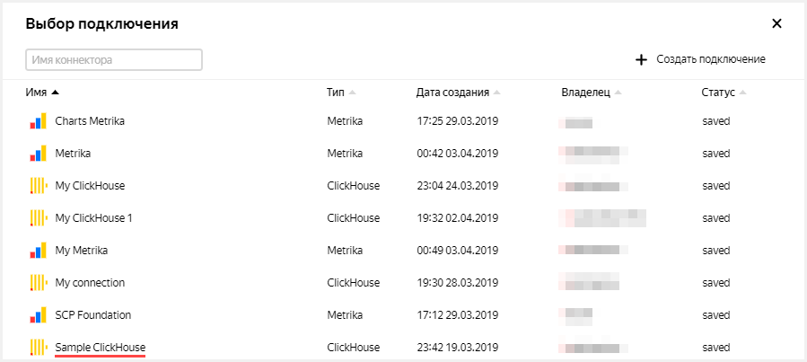

1. Enter the connection name: **My DataSet**.

1. Under the word **Table**, select the **SampleLight** table.

1. Click **Create**.

    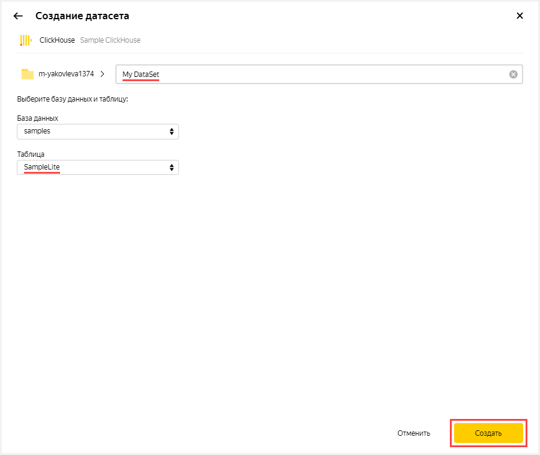

1. In the Aggregation column, select **Amount** for the **Profit** field.

    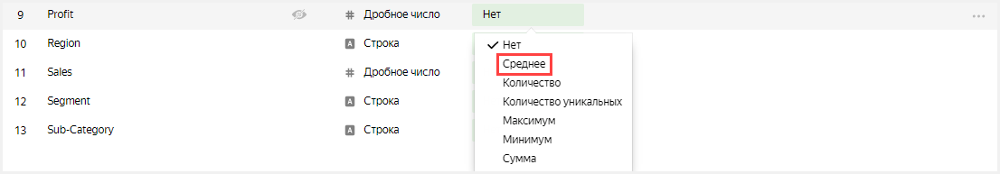

1. In the Aggregation column, select ** Amount** for the **Sales** field.

    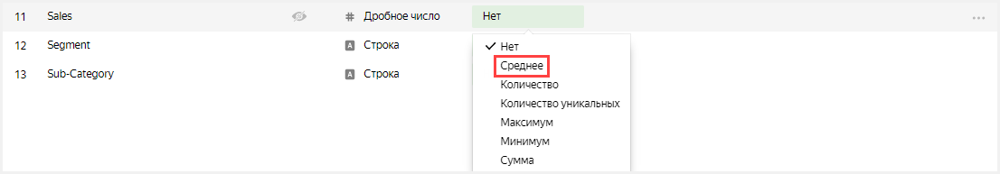

1. Rename the **Customer ID** field to **Customer Count**: click on the field name, delete the current name, and enter the new one.

1. In the **Aggregation** column, select **Number of unique** for the **Customer Count** field.

    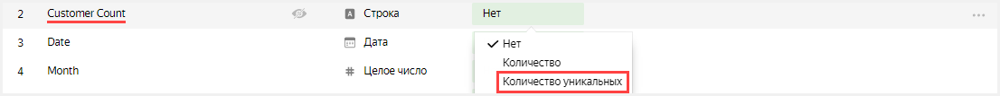

1. Create a calculated field for calculating sales per customer.

    1. In the upper-right corner, click **Add field**.

        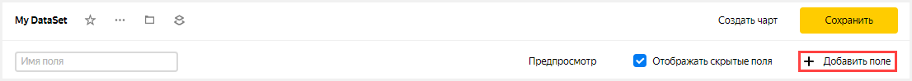

    1. In the **Name** field, specify **Sales per Customer**.

    1. In the column to the left, click on the **Sales** field.

    1. Enter a `/`.

    1. In the column to the left, click on the **Customer Count** field.

    1. Click **Create**.

        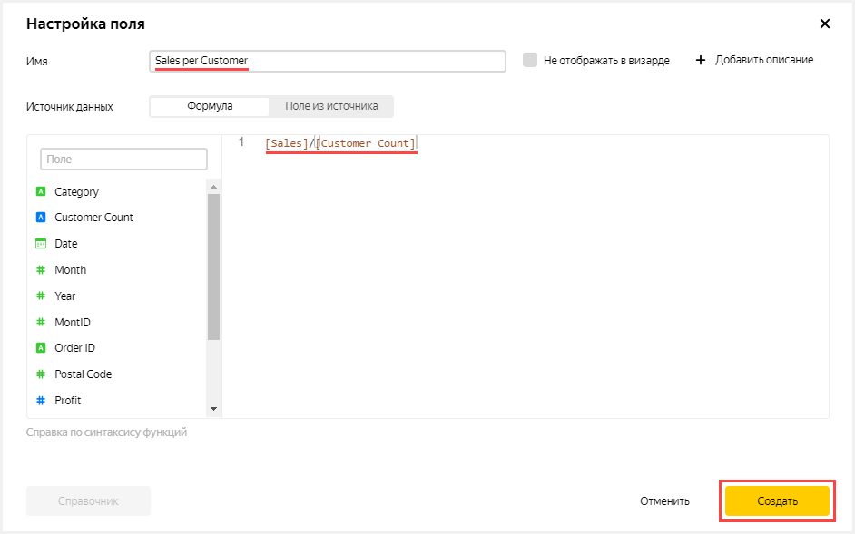

1. Click **Save** in the upper-right corner to save the dataset.

    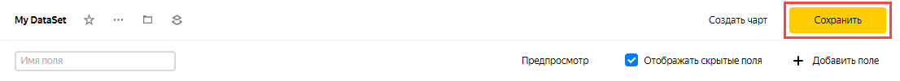

## Step 2. Create a bar chart {#step2}

To visualize sales by year and region, create a bar chart type [chart](../concepts/chart.md).

1. Click **Create chart** in the upper-right corner.

   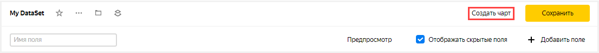

1. In the second column of the window that opens, click **Line chart** and choose a different [chart](../concepts/chart.md) type: **Bar chart**.

    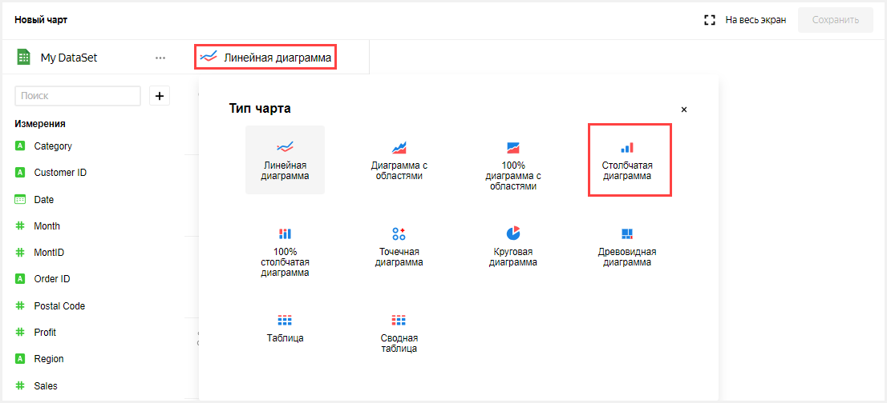

1. Add years to the chart. To do this, from the first column in the **Dimensions** section, drag the **Year** field to the **X**-axis in the second column.

1. Add sales information to the chart. To do this, from the first column in the **Measures** section, drag the **Sales** field to the **Y**-axis in the second column.

1. Add a color division by region to the chart. To do this, from the first column in the **Measures** section, drag the **Region** field to the **Color** section.

    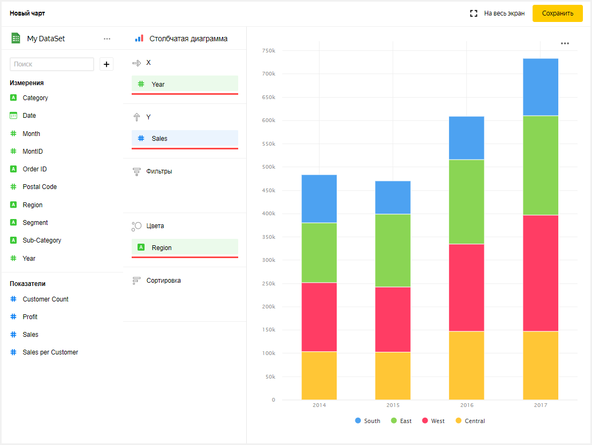

1. Save the chart.

    1. Click **Save** in the upper-right corner to save the chart.

        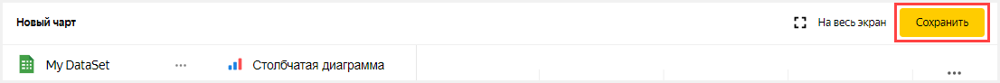

    1. In the window that opens, click **Save**.

        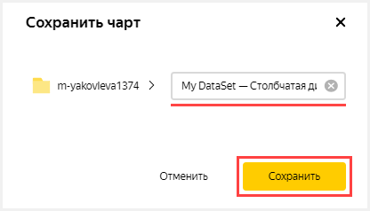

## Step 3. Create a pivot table chart {#step3}

To visualize sales by region, segment, and year, create a pivot table type chart.

1. Copy the chart from the previous step.

    1. Click  in the upper-left corner next to the chart name.

    1. Choose **Copy**.

        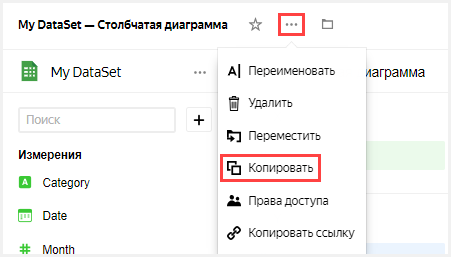

    1. In the window that opens, enter the name of the new chart: **My DataSet — Pivot table**.

    1. Click **Ready**.

        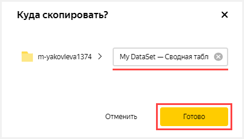

1. In the second column of the window that opens, click **Bar chart** and choose a different chart type: **Pivot table**.
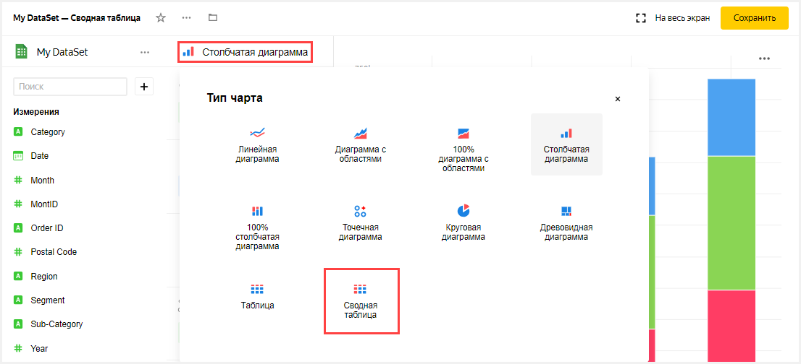

1. Add information about regions to the table. To do this, from the first column in the **Dimensions** section, drag the **Region** field to the **Rows** section.

1. Add information about segments to the table. To do this, from the first column in the **Dimensions** section, drag the **Segment** field to the **Rows** section.

1. Add a color division by sales per customer to the chart. From the first column in the **Dimensions** section, drag the **Sales per Customer** field to the **Color** section.

1. Click **Save** in the upper-right corner to save the chart.

    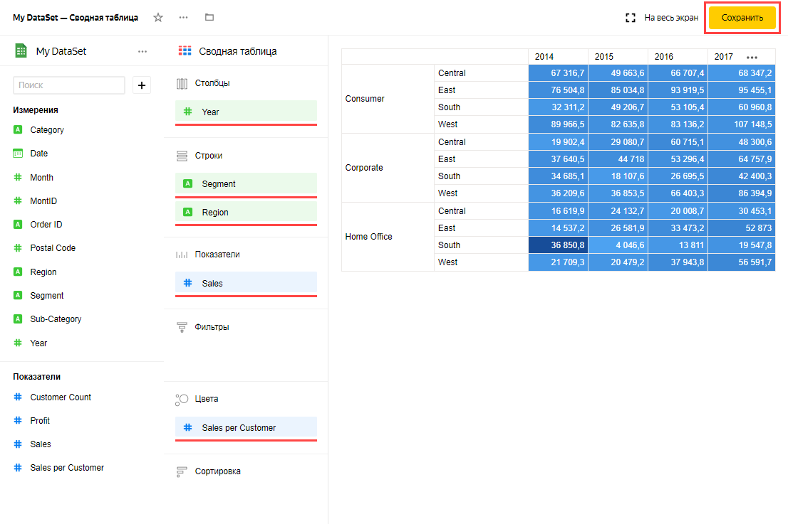

## Step 4. Create a dashboard {#step4}

Create a [dashboard](../concepts/dashboard.md) that the chart and table will be added to.

1. Go to the {{ datalens-short-name }} homepage. To do this, click on the word **Yandex DataLens** in the upper-left corner.

1. Click **Create dashboard**.

    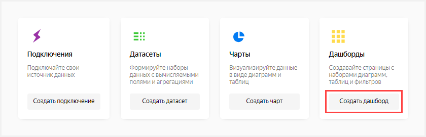

1. Enter the dashboard name: **Dashboard**.

1. Click **Create**.

    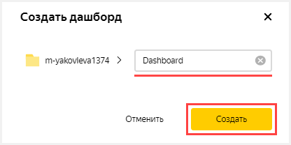

## Step 5. Add charts to the dashboard {#step5}

Add a chart and table to the dashboard.

1. In the dashboard that opens, click **Edit** in the upper-right corner.

    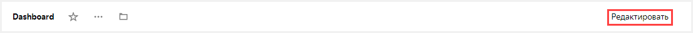

1. Click **Add**.

1. Choose **Chart**.

    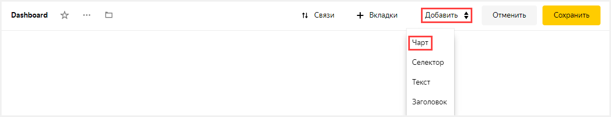

1. In the window that opens, click **Select**.

1. Select the **My DataSet — Pivot table** chart. This automatically fills in the **Title** field with the name of the selected chart.

1. Click **Add**.

    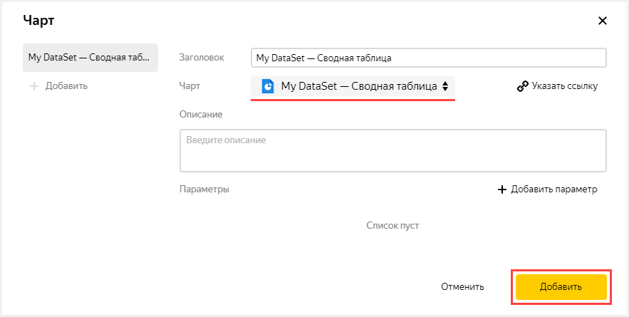

1. Add another chart. Perform all the steps from the beginning and specify **My DataSet — Bar chart** in step 5.

    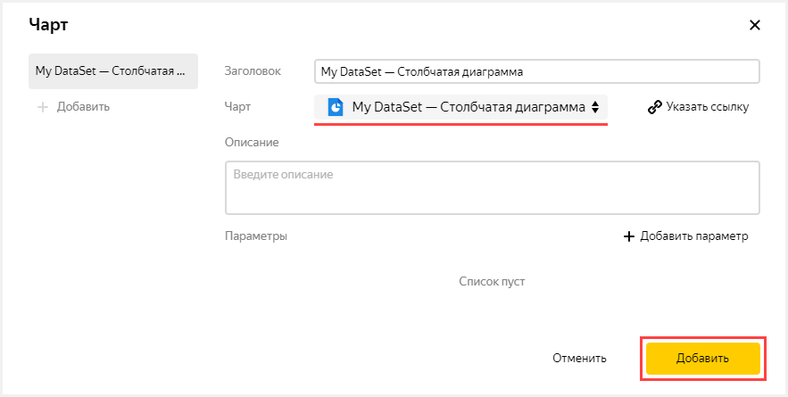

1. Place the charts on the dashboard however you like (for example, stretch them and drag the chart to the right of the table).

    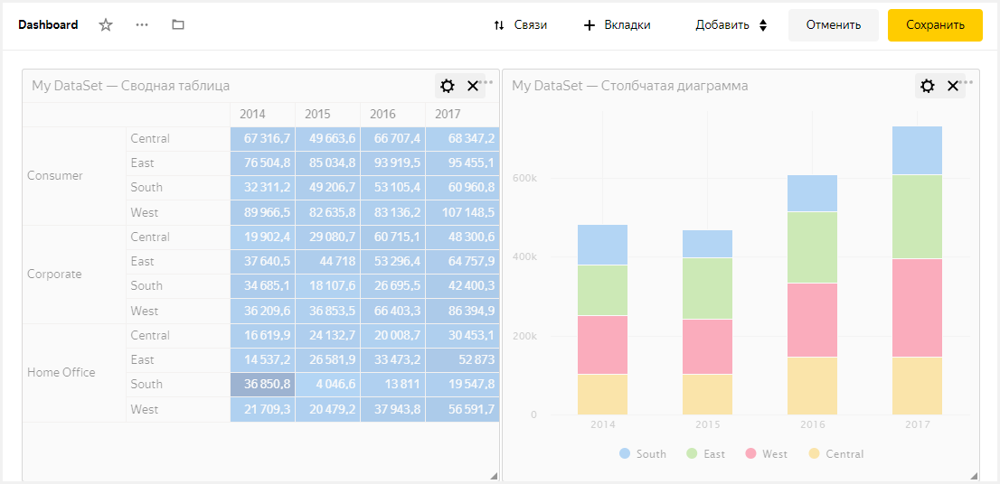

## Step 6. Add selectors to the dashboard {#step6}

Add [selectors](../concepts/dashboard.md#selector) to be able to filter sales by year (the **Year** field) and category (the **Category** field).

1. Click **Add**.

1. Choose **Selector**.

    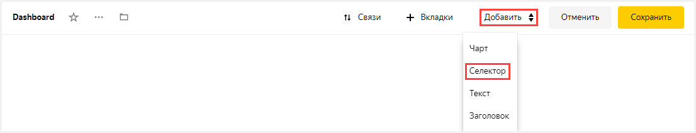

1. Under the word **Dataset**, click **Select**.

1. Select the dataset named **My DataSet**.

1. Under the word **Field**, click **Select**.

1. Choose the **Year** field. This will automatically fill in the **Title** field with the name of the selected field.

1. Under **Default value**, specify **2014** and **2015**.

1. Enable the **Multiple choice** option.

1. Click **Add**.

    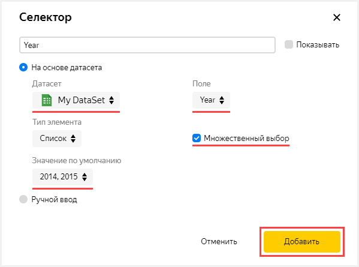

1. Add another selector.

    1. Perform all the steps from the beginning and specify the **Category** field in step 6.

    1. **Don't specify** a default value in step 7.

        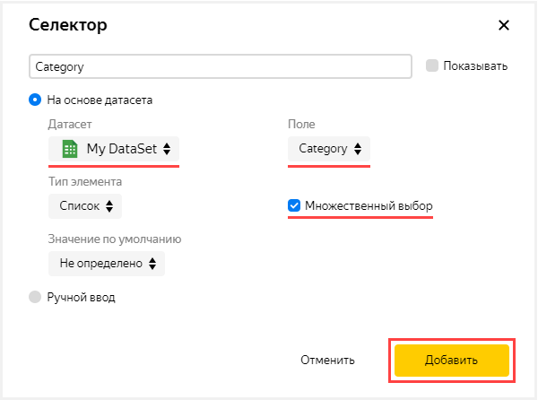

1. Click **Save** in the upper-right corner to save the dashboard.

1. Place the selectors on the dashboard however you like (for example, drag them to the top of the dashboard above the pivot table).

    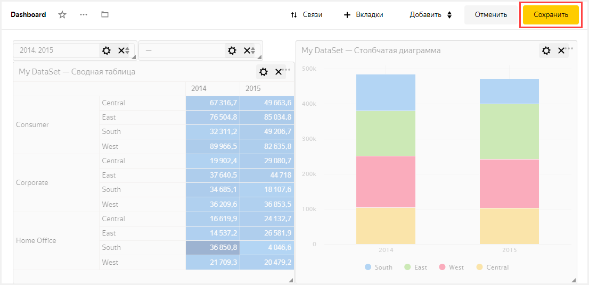

