# Visualizing data from Yandex.Metriсa

Statistics from Yandex.Metrica are used as source data. {{ datalens-short-name }} automatically creates a dashboard based on a Yandex.Metrica tag with a selection of charts that you can edit however you like.

This includes the following steps:

- [Step 1. Create a connection and a standard dashboard](data-from-metrica-visualization#step1)
- [Step 2. Change the standard dashboard](data-from-metrica-visualization#step2)
- [Step 3. Change the chart](data-from-metrica-visualization#step3)

## Step 1. Create a connection and a standard dashboard {#step1}



This step is available to users who have permission to any Yandex.Metrica tag. If don't have permission to a tag, open a ready-to-use **Yandex.Metriсa** dashboard and proceed to step 2.



1. Go to [{{ datalens-short-name }}](https://datalens.yandex.ru).

1. Click **Create connection**.

    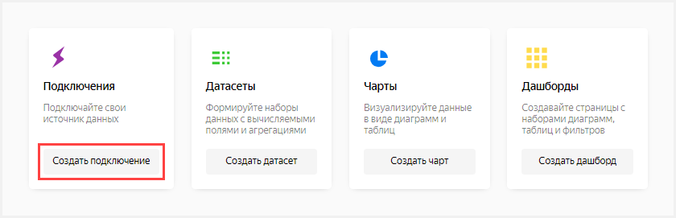

1. Select **Metriсa**.

    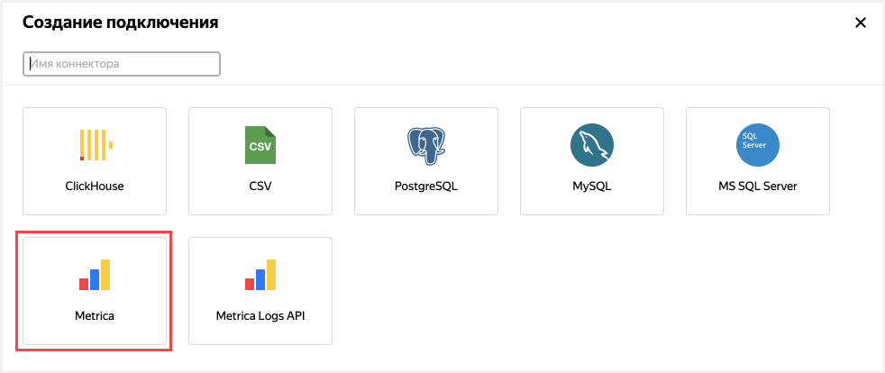

1. Enter the connection name: **Metriсa connect**.

1. Click **Get token**.

1. In the window that opens, grant the necessary permissions to the service.

1. From the drop-down list under the word **Tag**, select the desired tag.

1. Enable **Automatically create a dashboard on this connection**.

1. Click **Create connection**.

    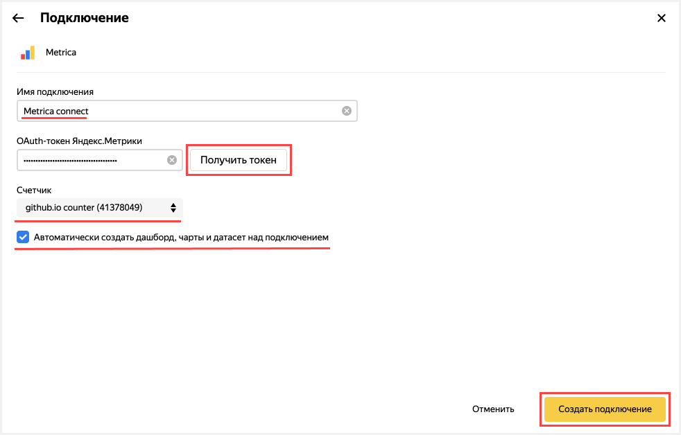

## Step 2. Change the standard dashboard {#step2}



If you don't have a Yandex.Metriсa tag and you skipped step 1, use the dashboard named **Metriсa Live Demo Dashboard**.



You can change the [dashboard](../concepts/dashboard.md) however you want, such as by deleting a chart.

1. Select the standard dashboard named **Metrica Dashboard** from the list.

    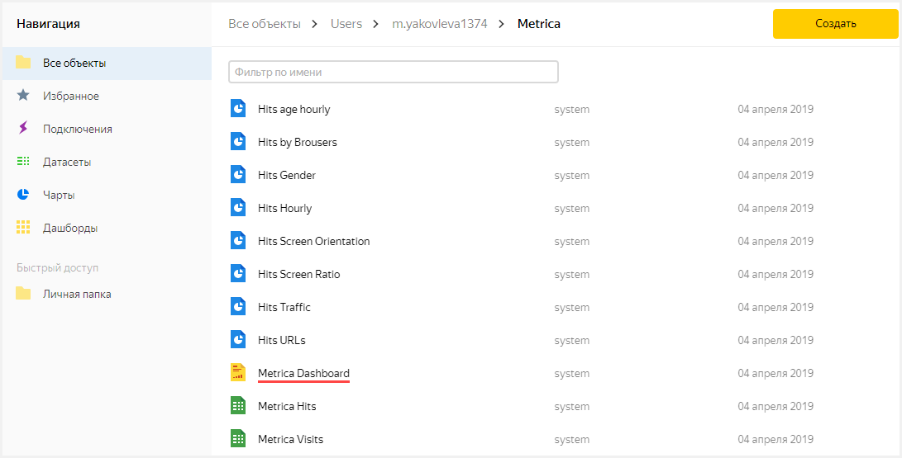

1. In the dashboard that opens, click **Edit** in the upper-right corner.

    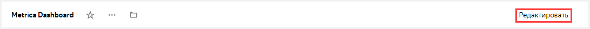

1. Delete the chart.

    1. Scroll down to the **Technology** section.

    1. Delete the **Visits browsers share** chart. To do this, click  in the upper-right corner of the chart.

        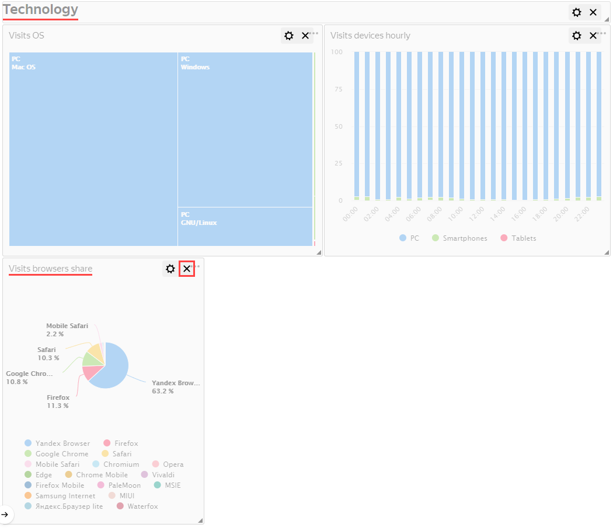

1. Click **Save** in the upper-right corner to save the dashboard.

     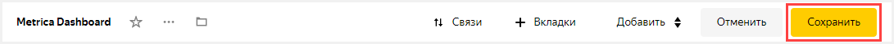

## Step 3. Change the chart {step3}

You can edit any chart on the dashboard. For example, change the visualization type for the **Visits OS** chart from the **Technology** section.

1. Click  in the upper-right corner of the **Visits OS** chart.

1. Select **Edit**.

    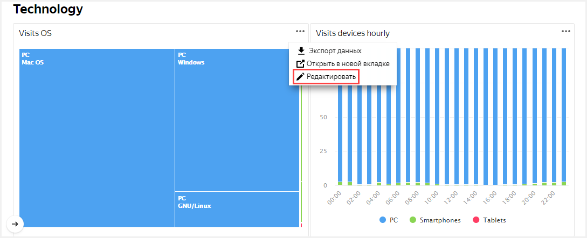

1. In the second column of the window that opens, click **Tree chart** and choose a different chart type: **Pie chart**.

    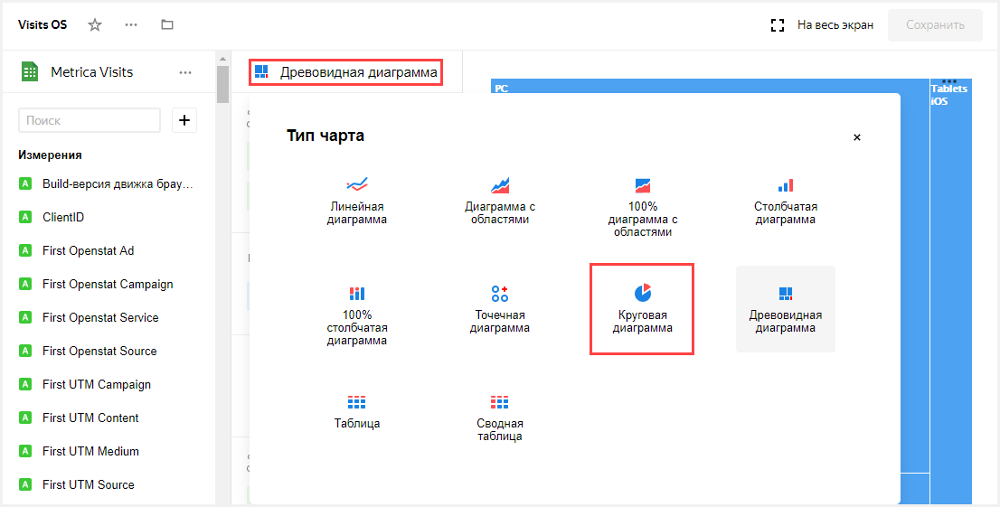

1. Click **Save** in the upper-right corner to save the chart.

    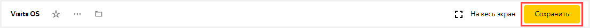

1. Close the chart editing tab.

1. Go back to the dashboard window.

1. Update the dashboard.

    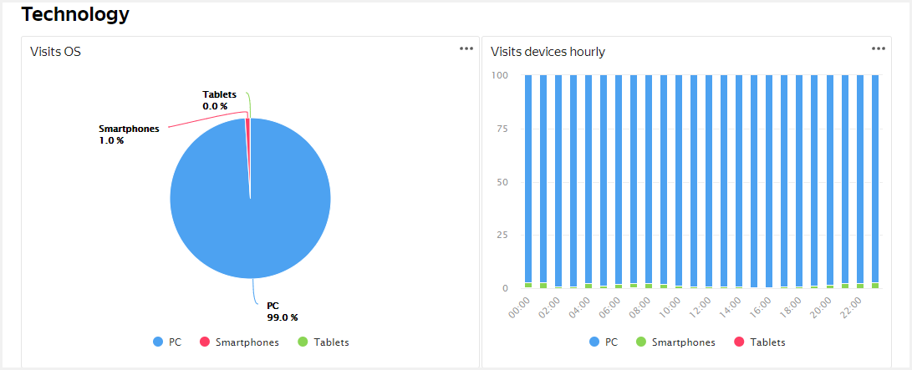

