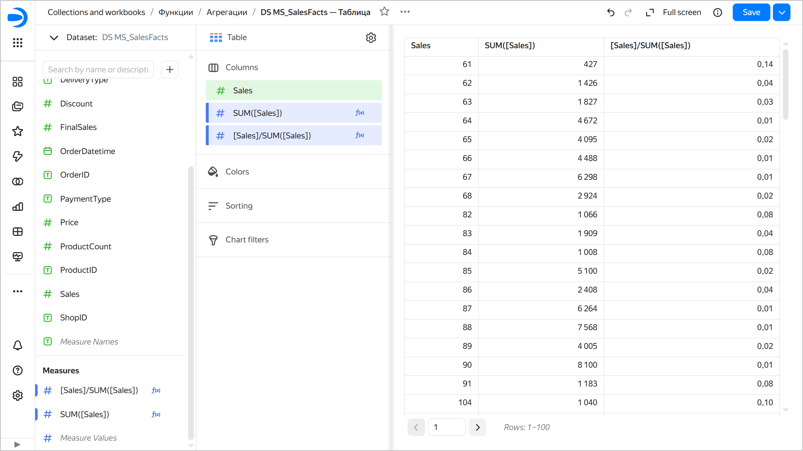
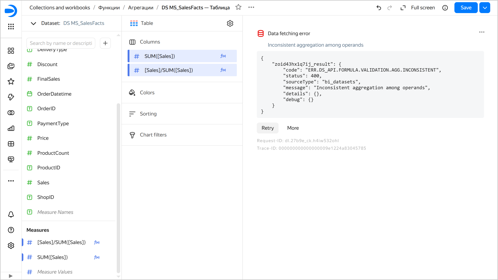
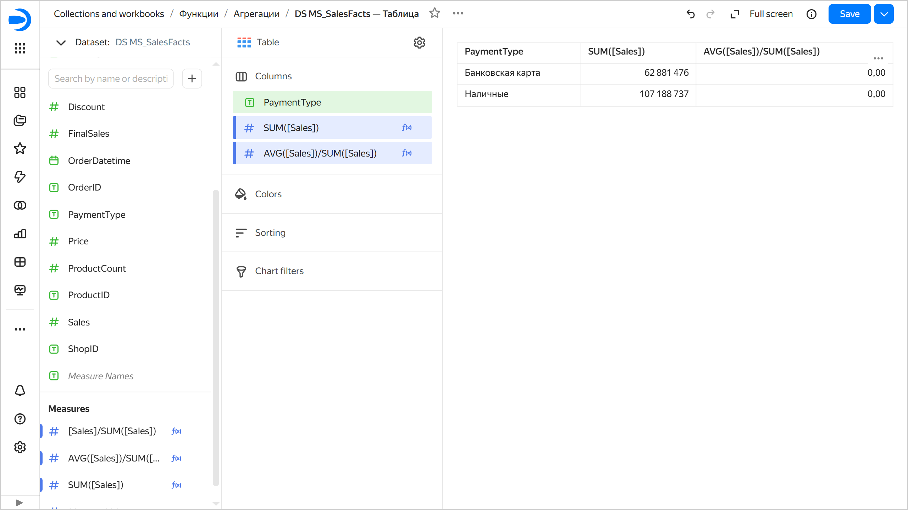

# [{{ datalens-full-name }}] Inconsistent aggregation among operands

`ERR.DS_API.FORMULA.VALIDATION.AGG.INCONSISTENT`

This occurs when a single function (or a single operator) uses an aggregated and an unaggregated expression as arguments (operands).

When computing an aggregate value, a large set of strings is converted into a single value. Special [aggregate functions](../../../datalens/function-ref/aggregation-functions.md) are used for this. The most common functions are `SUM`, `MIN`, `MAX`, `AVG`, and `COUNT`. The aggregate functions calculate and return one resulting value for all strings of the query. If data grouping is used, values are calculated and returned separately for each one of the groups the query result is broken down into.

In {{ datalens-short-name }}, you cannot use aggregated and non-aggregated values in the same expression. You cannot use [measures](../../dataset/data-model.md#field) (blue in the dataset and wizard) and [dimensions](../../dataset/data-model.md#field) (green in the dataset and wizard) in the same expression.

Another error is likely to occur when the window function in the `WITHIN` section has fields that are neither an aggregation nor a dimension in the chart.

## How to fix the error {#fix-error}

To fix this error:

* Apply aggregation to all fields in the expression.
* Break the expression down into individual measures.
* Use [LOD expressions](../../../datalens/function-ref/aggregation-functions.md#syntax-lod) to create nested aggregations as well as aggregations over all data or groups that are different from the chart-level grouping.

## Examples {#examples}

**Example 1. Dividing a field by an aggregated sum**

* Incorrect formula: `[Sales] / SUM([Sales])`.
* Issue: The field `Sales` is non-aggregated, while `SUM([Sales])` is aggregated. The `Sales` field is neither an aggregation nor a dimension within the group. It does not have a fixed value and may vary from string to string. Therefore, it is impossible to determine what specific value of the `Sales` field needs to be selected to calculate the `[Sales] / SUM([Sales])` expression. It is impossible to compute this expression.
* Solution: Use aggregation for the `Sales` field. In which case this field will become a measure.
* Correct formula: `AVG([Sales]) / SUM([Sales])`.



For better visualization, follow this scenario:

1. Create a [connection](../../quickstart.md#create-connection) to the demo database and a dataset based on the `MS_SalesFacts` table.
1. Create a [Table](../../visualization-ref/table-chart.md) chart based on the dataset.
1. Drag the `Sales` field from `Dimensions` to **Columns**. No aggregation function is applied to the field; it is a dimension. In the interface, dimensions are displayed in green. They set grouping in charts.
1. [Create a field](../../concepts/calculations/index.md#how-to-create-calculated-field) named `SUM([Sales])` with the `SUM([Sales])` formula and drag it from `Dimensions` into the **Columns** section. In the field's formula, an aggregation function is applied to the numerical value; it is a measure. In the interface, measures are displayed in blue. The aggregation function calculates and returns a single resulting value for each one of the groups the query result is broken down into, i.e., one `SUM([Sales])` value is calculated for each `Sales` group.
1. Create a field named `[Sales]/SUM([Sales])` with the `[Sales]/SUM([Sales])` formula and drag it from `Dimensions` into the **Columns** section. It is a measure as well. The `Sales` dimension is used to build the chart and sets grouping for the calculation of measures. Therefore, to calculate each `[Sales]/SUM([Sales])` value, one particular `Sales` value is used, and no error occurs.

   

   

   

1. Delete the `Sales` measure from the **Columns** section. Now there is no dimension to define the chart's grouping, and the aggregate functions calculate and return one resulting value for all strings of the query. However, the `[Sales]/SUM([Sales])` formula contains the `Sales` field without aggregation, which is not used to build the chart and has no fixed value. Therefore, it is unclear which `Sales` field value to use to calculate the expression. This results in an error.

   

   

   

1. Drag the `PaymentType` field from `Dimensions` to the **Columns** section. Now, the chart's grouping is defined by the `PaymentType` dimension, and the aggregation function calculates and returns one resulting value for each group. However, within each `PaymentType` group, there are many records with different `Sales` values, so it is unclear which `Sales` field value to use to calculate the `[Sales] / SUM([Sales])` expression. This also results in an error.
1. Create a field named `AVG([Sales])/SUM([Sales])` with the `AVG([Sales])/SUM([Sales])` formula and use it to replace the `[Sales]/SUM([Sales])` measure in the **Columns** section. Now, for each `PaymentType` group, the resulting `AVG([Sales])` and `SUM([Sales])` values are calculated, which are used to calculate the `AVG([Sales])/SUM([Sales])` expression. No error occurs.

   

   

   



**Example 2. Subtracting a non-aggregated field from an aggregated one**

* Incorrect formula: `[Total Sales] - [Profit]`.
* Issue: The `Total Sales` field is aggregated, whereas `Profit` is non-aggregated. `[Total Sales]` is the result of combining all the group's records, whereas the `[Profit]` expression has a different value for each record, and it is not clear for the group which value to use. An expression like this does not make sense and is impossible to calculate.
* Solution: Apply aggregation to the `Profit` field.
* Correct formula: `[Total Sales] - SUM([Profit])`.
