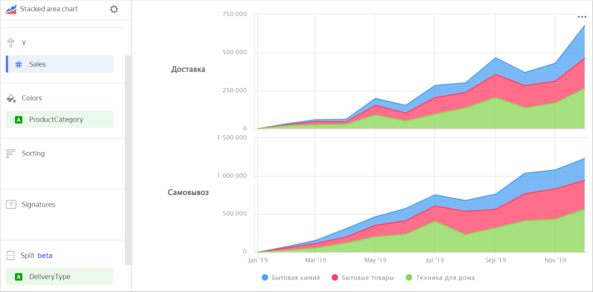

# Stacked area chart 

This chart shows how a measure changed over time. The area between the axis and the line is filled with colors, which shows the volume. If multiple data categories are displayed, they overlap. The top line represents all data.

It is handy to use this type of chart when it is important to see totals by category, e.g., total sales broken down by product categories.



| Year | Home appliances | Household goods | Household cleaners |
----- | ---------| ---------- | ----------
| January 2019 | 128K | 55K | 26K |
| February 2019 | 97K | 79K | 18K |
| March 2019 | 187K | 105K | 41K |
| April 2019 | 188K | 137K | 34K |
| May 2019 | 230K | 121K | 43K |
| June 2019 | 256K | 162K | 59K |
| July 2019 | 284K | 206K | 67K |
| August 2019 | 409K | 204K | 72K |
| September 2019 | 314K | 209K | 86K |
| October 2019 | 324K | 262K | 79K |
| November 2019 | 385K | 238K | 101K |
| December 2019 | 451K | 307K | 111K |



When building a chart, make sure to select measures carefully. For example, do not add the number of customers to the sales amount, or the purchase amount to the sales amount.

## Sections in the wizard {#wizard-sections}

| Section  in the wizard | Description |
----- | ----
| X | Dimension. You can only specify one field here. This dimension is usually a date. If this is the case, make sure to specify the `Date` data type for this field in the dataset. This is required for correct sorting and signature display. For better visualization, you can group dates into weeks, months, and years. For more information, see [{#T}](../concepts/chart/settings.md#field-settings). |
| Y | Measure. You can specify multiple measures. If you add more than one measure to a section, the **Colors** section will contain a dimension named [Measure Names](../concepts/chart/measure-values.md). |
| Colors | Dimension or the [Measure Names](../concepts/chart/measure-values.md) field. Affects the color of lines. To remove [Measure Names](../concepts/chart/measure-values.md), delete measures from the Y axis. |
| Sorting | Dimension or measure. You can use a dimension from the **X** and **Colors** sections or a measure from the Y axis. This section affects the sorting of values on the X axis or areas along the Y axis. The sorting direction is marked with an icon next to the field:  ascending or  descending. To change the sorting direction, click the icon. |
| Signatures | Measure. Displays measure values on the chart. If multiple measures are added to the **Y** section, drag [Measure Values](../concepts/chart/measure-values.md) to this section. |
| Split | Dimension. Splits a chart horizontally by the selected dimension's values. The maximum number of splits per chart is 25. |
| Filters | Dimension or measure. Used as a filter. |

## Creating an area chart {#create-diagram}

To create an area chart:

1. On the {{ datalens-full-name }} [home page]({{ link-datalens-main }}), click **Create chart**.
1. Under **Dataset**, select a dataset for visualization.
1. Select **Stacked area chart** as the chart type.
1. Drag a dimension from the dataset to the **X** section. The values are displayed in the lower part of the chart on the X axis.
1. Drag one or more measures from the dataset to the **Y** section. The values are displayed as areas along the Y axis.

### Configuring the display of `null` values {#null-settings}



## Recommendations {#recomendations}

* 
* Do not display more than three to five areas on the chart.
* To make it easier to track the dynamics, place the largest or most important categories closer to the chart base. To do this, drag the desired measure to the **Sorting** section or set up their order in the **Y** section. For example, you can do so to track sales dynamics in, say, the `Household cleaners` category.

  

  

  

* You can split a chart by dimension into a number of small charts that are convenient to compare to one another. To do this, drag a dimension from the dataset to the **Split** section.

  

  

  
