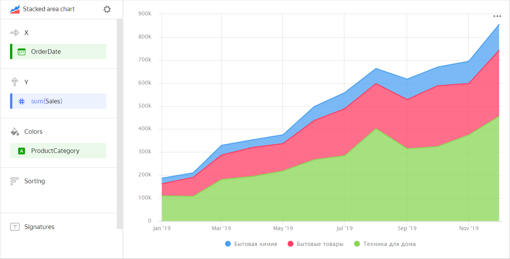
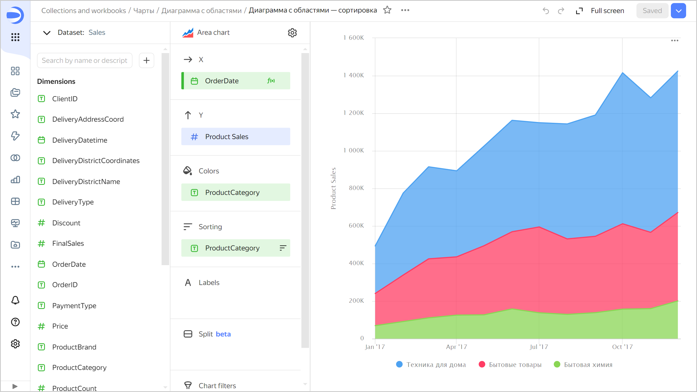

# Stacked area chart 

This chart shows how a measure changed over time. The area between the axis and the line is filled with colors to indicate the volume. If multiple data categories are displayed, they overlap. The top line represents the sum of all data.

This type of chart is used when it's important to see totals by category. For example, the total of sales broken down by product category.



| Year | Home appliances | Household goods | Household cleaners |
----- | ---------| ---------- | ---------- 
| January 2019 | 128K | 55K | 26K |
| February 2019 | 97K | 79K | 18K |
| March 2019 | 187K | 105K | 41K |
| April 2019 | 188K | 137K | 34K |
| May 2019 | 230K | 121K | 43K |
| June 2019 | 256K | 162K | 59K |
| July 2019 | 284K | 206K | 67K |
| August 2019 | 409K | 204K | 72K |
| September 2019 | 314K | 209K | 86K |
| October 2019 | 324K | 262K | 79K |
| November 2019 | 385K | 238K | 101K |
| December 2019 | 451K | 307K | 111K |



Carefully select measures to build a chart. For example, it's not correct to add the number of customers to the sales amount or the purchase and sales amounts.

## Sections in the wizard {#wizard-sections}

| Section  in the wizard | Description |
----- | ----
| X | Dimension. Only one field can be specified. This dimension is usually a date. In this case, make sure that the `Date` data type is specified for this field in the dataset. This is required for correct sorting and signature display. For better visualization, you can group dates into weeks, months, and years (to learn more, see [{#T}](../concepts/chart/settings.md#field-settings)). |
| Y | Measure. You can specify multiple measures. If you add more than one measure to a section, the **Colors** section contains a dimension named [Measure Names](../concepts/chart/measure-values.md). |
| Colors | Dimension or the [Measure Names](../concepts/chart/measure-values.md) field. Affects the color of lines. [Measure Names](../concepts/chart/measure-values.md) is removed by deleting measures from the Y-axis. |
| Sorting | Dimension or measure. A dimension from the **X** and **Colors** sections or a measure from the Y-axis can be used. Affects the sorting of values on the X-axis or areas along the Y-axis. |
| Signatures | Measure. Displays measure values on the chart. If multiple measures are added to the **Y** section, drag [Measure Values](../concepts/chart/measure-values.md) to this section. |
| Chart filters | Dimension or measure. Used as a filter. |

## Creating an area chart {#create-diagram}

To create an area chart:

1. On the {{ datalens-full-name }} [home page]({{ link-datalens-main }}), click **Create chart**.
1. Under **Dataset**, select a dataset for visualization.
1. Select **Stacked area chart** as the chart type.
1. Drag a dimension from the dataset to the **X** section. The values are displayed in the lower part of the chart on the X-axis.
1. Drag one or more measures from the dataset to the **Y** section. The values are displayed as areas along the Y-axis.

### Configuring the display of `null` values {#null-settings}



## Recommendations {#recomendations}

* 
* Don't display more than 3-5 areas on the chart.
* To make it easier to track the dynamics, place the largest or most important categories closer to the chart base. To do this, drag the desired measure to the **Sorting** section or set up their order in the **Y** section. For example, to track sales dynamics in the `Household cleaners` category.

  

  

  
