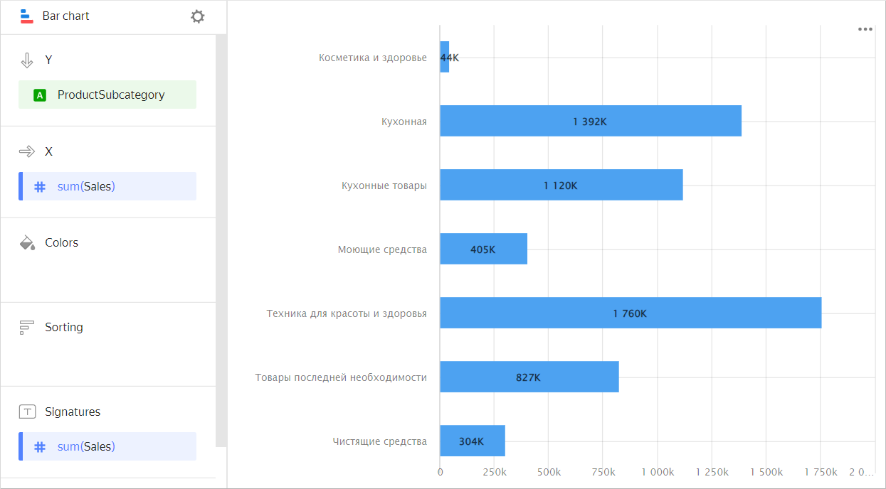
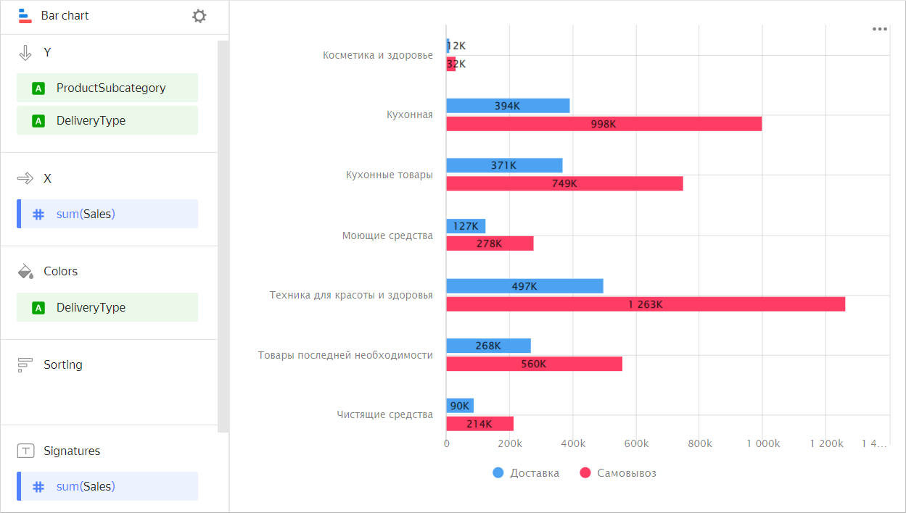
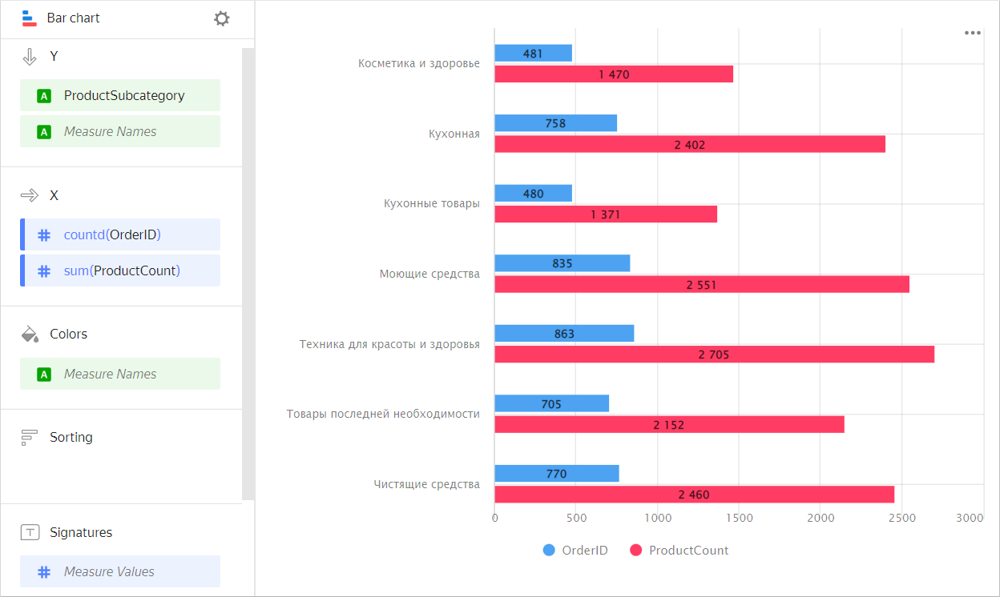
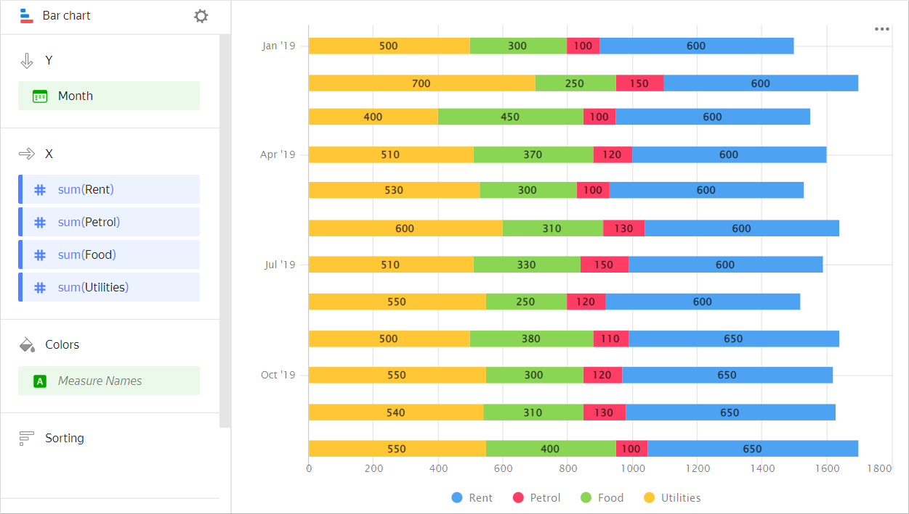
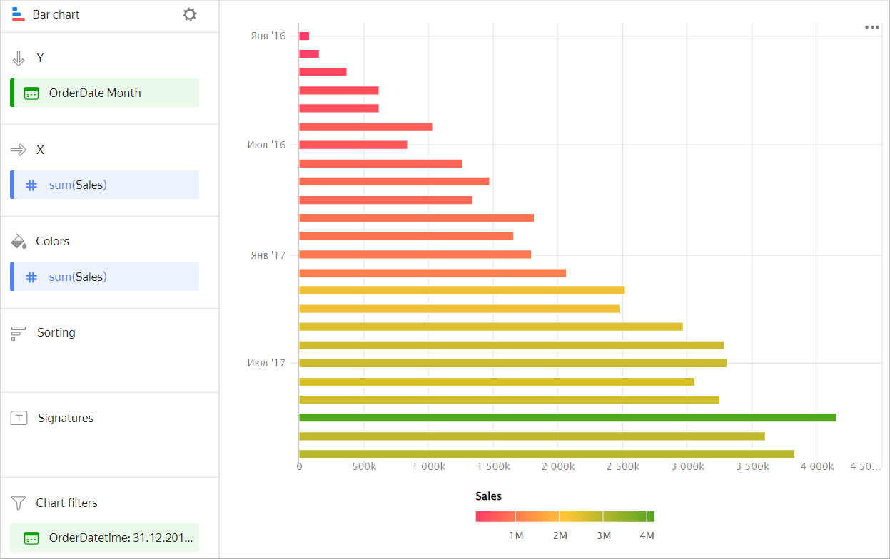
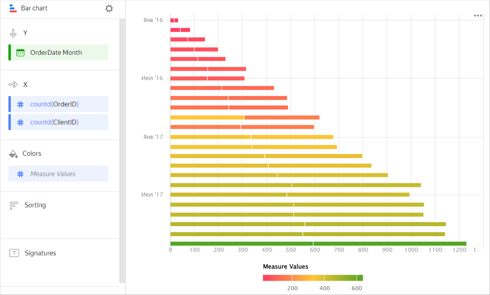

# Bar chart 

This chart displays the values of one or more measures by each category, using horizontal bars. The length of a bar determines the measure value: the longer the bar, the larger the value. For example, you can compare sales of products by their subcategory.



| Subcategory | Sales |
-------------|---------
| Beauty and health products | 44K |
| Kitchenware | 1392K |
| Kitchen products | 1120K |
| Detergents | 405K |
| Health and beauty equipment | 1760K |
| Non-essential goods | 827K |
| Cleaners | 304K |



## Types of bar charts {#types}

* [Grouped](#groupped)
* [Stacked](#stacked)

### With grouping {#groupped}

A chart with grouping by dimension lets you compare two or more categories by a single measure. For example, grouping by delivery type allows you to compare the cost of products delivered by courier and picked up. Categories are highlighted in different colors and the length of the bar indicates the measure value.



| Subcategory | Delivery | Pickup |
-------------|---------| ----------|
| Beauty and health products | 12K | 32K |
| Kitchenware | 394K | 998K |
| Kitchen products | 371K | 749K |
| Detergents | 127K | 278K |
| Health and beauty equipment | 497K | 1263K |
| Non-essential goods | 268K | 560K |



Use a chart with grouping to compare two or more measures, such as the number of orders and the number of products. The bar length corresponds to the measure value.



| Subcategory | Orders | Number of products |
-------------|---------| ----------|
| Beauty and health products | 481 | 1470 |
| Kitchenware | 758 | 2402 |
| Kitchen products | 480 | 1371 |
| Detergents | 835 | 2551 |
| Health and beauty equipment | 863 | 2705 |
| Non-essential goods | 705 | 2152 |
| Cleaners | 770 | 2460 |



### Stacked {#stacked}

A stacked chart shows a ratio of internal segments to the total value. Segments are placed one after another: the beginning of each subsequent segment is the outermost boundary of the previous one.
This type of chart is used to see the contribution of each measure to the total value by period or category. For example, to view the percentage of different expenses in the total budget amount.



| Month | Gasoline | Rent | Food | Utility bills |
----- | ---------| ---------- | ---------- | ----------
| January 2019 | 100 | 600 | 300 | 500 |
| February 2019 | 150 | 600 | 250 | 700 |
| March 2019 | 100 | 600 | 450 | 400 |
| April 2019 | 120 | 600 | 370 | 510 |
| May 2019 | 100 | 600 | 300 | 530 |
| June 2019 | 130 | 600 | 310 | 600 |
| July 2019 | 150 | 600 | 330 | 510 |
| August 2019 | 120 | 600 | 250 | 550 |
| September 2019 | 110 | 650 | 380 | 500 |
| October 2019 | 120 | 650 | 300 | 550 |
| November 2019 | 130 | 650 | 310 | 540 |
| December 2019 | 100 | 650 | 400 | 550 |



## Sections in the wizard {#wizard-sections}

| Wizard section | Description |
----- | ----
| Y | Dimensions. You can specify one or two dimensions. |
| X | Measure. You can specify multiple measures. If you add more than one measure to a section, the **Colors** section will contain a dimension named [Measure Names](../concepts/chart/measure-values.md). You can move [Measure Names](../concepts/chart/measure-values.md) to the Y axis. |
| Colors | [Measure Names](../concepts/chart/measure-values.md) dimension or field. Affects the column color. To delete [Measure Names](../concepts/chart/measure-values.md), click the cross icon or remove measures from the X axis. |
| Sorting | Dimension or measure. Affects the column sorting. The sorting direction is marked with an icon next to the field:  for ascending or  for descending. To change the sorting direction, click the icon. |
| Labels | Measure. Displays measure values on the chart. If multiple measures are added to the **Y** section, drag [Measure Values](../concepts/chart/measure-values.md) to this section. |
| Filters | Dimension or measure. Used as a filter. |

## Creating a bar chart {#create-diagram}

To create a bar chart:

1. On the {{ datalens-full-name }} [home page]({{ link-datalens-main }}), click **Create chart**.
1. Under **Dataset**, select a dataset for visualization.
1. Select **Line chart** as the chart type.
1. Drag one or more dimensions from the dataset to the **Y** section. The values will be displayed on the Y axis.
1. Drag one or more measures from the dataset to the **X** section.
1. Drag a dimension from the dataset or the [Measure Names](../concepts/chart/measure-values.md) field to the **Color** section.

A stacked column chart is displayed by default.

### Creating a grouped bar chart {#grouped-bar-chart}

To display an Y-axis grouped bar chart:

1. Go to the bar chart that you created.
1. Depending on the number of measures in the **X** section, follow these steps:

   

   - Single measure {#one}

      1. Check if there is a dimension in the **Colors** section.
      1. Duplicate this dimension in the **Y** section. The sequence of dimensions affects the grouping order.

   - Two or more measures {#more}

      1. Drag the [Measure Names](../concepts/chart/measure-values.md) dimension to the **Colors** section.
      1. Drag the [Measure Names](../concepts/chart/measure-values.md) dimension to the **Y** section. The sequence of dimensions affects the grouping order.

   

### Adding a bar color based on a measure {#column-colors}

To color columns in a chart based on the value of a measure:

1. Go to the column chart that you created.
1. Depending on the number of measures in the **X** section, follow the steps below:

   

   - Single measure {#one}

      Copy the measure from the **X** section to the **Colors** section.

      Columns in the chart will take on colors as a function of the measure values.

      

   - Two or more measures {#more}

      Drag the [Measure Values](../concepts/chart/measure-values.md) measure to the **Colors** section.

      The columns on the chart will take on colors depending on the values of all the measures listed in section **X**.

      

   

1. Configure a color gradient for the measure as well. To do this, in the top right-hand corner of the **Colors** section, click  (the icon is displayed when you mouse over the section).
1. In the color settings, specify:

   * **Gradient type**: Select two or three colors.
   * Gradient color: Select a color palette for the gradient from the list.
   * Gradient direction: Change the gradient direction using the  icon.
   * **Set threshold values**: Set numeric thresholds for each color. Works if the **X** section contains a single value.

### Configuring the display of `null` values {#null-settings}



## Recommendations {#recomendations}

* 
* Place segments inside bars so that the largest or most important categories are located to the left, closer to the chart's Y-axis. This makes it easier to compare the values.
* When visualizing multiple measures, select colors carefully. They should be distinguishable and contrasting. We recommend using no more than 3-5 colors per chart. If you want to emphasize one certain measure above the others, highlight it in some bright color.
