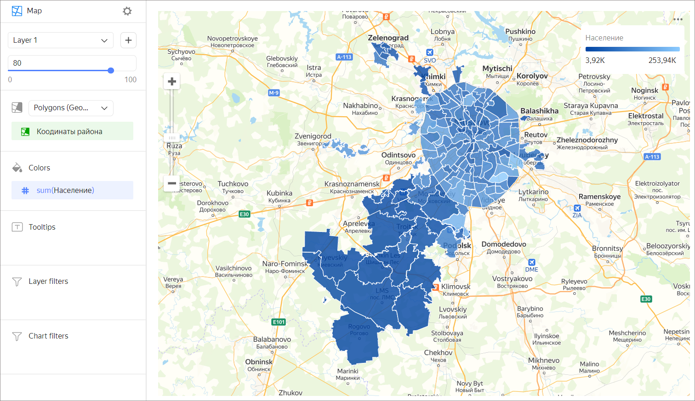

# Choropleth map 

A choropleth map uses different colors or shades to display entire areas and regions. Areas on a map are set using geopolygons. A geopolygon is an element that consists of an area bounded by a close line and the line itself. The value of a measure is indicated through the intensity of color or its shade.

To show polygons on a map, add a [Geopolygon](../concepts/data-types.md#geopolygon) type field to your dataset:

* Create a text field with data like `[[[55.60807, 37.5698], [55.60847, 37.56992], [55.60851, 37.57095]]]`, with polygon point coordinates enclosed in square brackets. You can first prepare data in a database and set the [Geopolygon](../concepts/data-types.md#geopolygon) data type in the dataset description interface.
* Use the `GEOPOLYGON(polygon_string)` [function](../function-ref/GEOPOLYGON.md) to create a calculated field with the [Geopolygon](../concepts/data-types.md#geopolygon) data type.
If your data contains a field with a city, region, or country name, use the [geopoint/geopolygon reference](https://geointellect.com/files/geo_for_datalens.zip) from Geointellect, a partner of Yandex.

Follow [this link](https://{{ s3-storage-host }}/doc-files/Regions.csv) to download a sample CSV file with Russian region polygons.

A choropleth map is used for estimating the value of a measure within a territorial unit. For example, you can use a choropleth map to show the population density of individual districts.

## Sections in the wizard {#wizard-sections}

| Section  in the wizard | Description |
----- | ----
| Polygons (Geopolygons) | Measure with the type [Geopolygon](../concepts/data-types.md#geopolygon). |
| Colors | Dimension or measure. Affects the color and intensity of area fill. |
| Tooltips | Dimension or measure. A tooltip that appears when you hover over an area. |
| Layer filters | Dimension or measure. Used as a filter for the current layer. |
| Filters | Dimension or measure. Used as a filter for the entire chart. |

## Creating a choropleth map {#create-diagram}

1. On the {{ datalens-full-name }} [home page]({{ link-datalens-main }}), click **Create chart**.
1. Under **Dataset**, select a dataset for visualization. If you don't have a dataset, [create one](../operations/dataset/create.md).
1. Select the **Map** chart type.
1. Select **Polygons (Geopolygons)** as the layer type.
1. Drag a dimension with the [Geopolygon](../concepts/data-types.md#geopolygon) type from the dataset to the layer type selection section.
1. Color the polygons on the map. Move the measure or dimension to the **Colors** section.
1. Add tooltips to show the dimension and measure values when hovering over a polygon.

You can also:

* Add, rename, and delete a layer.
* Apply a filter to the whole chart or one layer.

## Recommendations {#recomendations}

* Don't use a choropleth map to precisely compare some values.
* To make it more precise, add data signatures or pop-up hints with information to the map.
