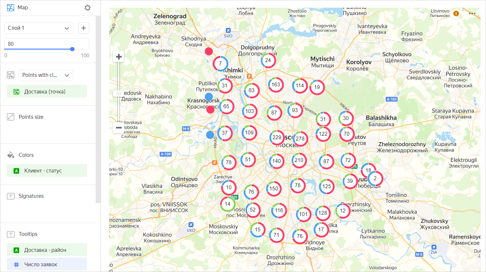

# Point map with clusters 

A point map with clusters differs from a [regular point map](point-map-chart.md) in clustering adjacent points. On the map, a cluster is represented as a donut chart with the number of points displayed in the center.



The cluster center only displays the number of points entering this cluster. You cannot choose a different metric, e.g., the sum of values across all points.



The behavior of points varies depending on the map scale:

* When scaling down, points are clustered.
* When scaling up, the distance between points increases and a cluster is automatically split into smaller clusters and/or individual points.

If a map with the selected scale only contains a single point, it's not clustered. In this case, instead of a donut chart, you will see a point just like in a regular point map.

Clustering on a map improves visualization when there is a large number of points. For example, if you want to show the location of all stores in a city on a map with clustering, points on the map will not overlap.

## Wizard sections {#wizard-sections}

Limitations:

* The **Point size**, **Tooltips**, and **Signatures** sections only apply to individual points.
* You can only add a dimension to the **Color** section.

Section  section| Description
----- | ----
Points with clusters (Geopoints) | Measure of the [Geopoint](../dataset/data-types#geopoint) type
Point size | Measure. Sets point size depending on the measure value.
Colors | Dimension. Sets cluster chart segmentation.
Labels | Measure. Displayed as text on a point. When used, point size control is blocked.
Tooltips | Dimension or measure. A tooltip that appears when you hover over a point. For `String` type fields, you can configure using basic [{#T}](../dashboard/markdown.md) syntax: click the icon before the field name and enable **Markdown**.
Layer filters | Dimension or measure. Used as a filter for the current layer.
Filters | Dimension or measure. Used as a filter for the entire chart.

## Creating a point map with clusters {#create-diagram}



1. Go to the {{ datalens-short-name }} [home page]({{ link-datalens-main }}).
1. In the left-hand panel, select  **Charts**.
1. Click **Create chart** → **Chart**.
1. At the top left, click  **Select dataset** and specify the dataset to visualize. If you do not have a dataset, [create one](../dataset/create-dataset.md#create).
1. Select **Map** for chart type.
1. Select the **Points with clusters (Geopoints)** layer type.
1. Drag a dimension of the [Geopoint](../dataset/data-types#geopoint) type from the dataset to the layer type selection section.
1. Set the size of the points displayed on the point map. Drag a measure to the **Point size** section or click  in the line with the section name.
1. Color the points on the map. Drag a dimension to the **Color** section.
1. Add tooltips to show the dimension and measure values when hovering over a point.

You can also:

* Add, rename, and delete a layer.
* Reorder the layers within a layer type.
* Apply a filter to the whole chart or one layer.

## Recommendations {#recomendations}

* Use color palettes corresponding to the goals and objectives of visualization.
