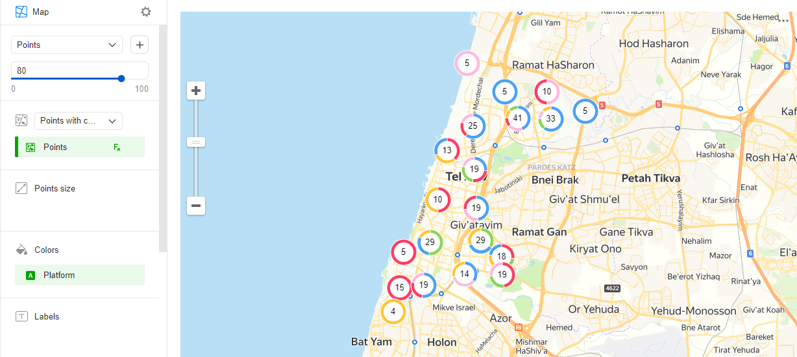

# Point map with clusters 

A point map with clusters differs from a [regular point map](point-map-chart.md) in clustering adjacent points. On the map, a cluster is represented as a donut chart with the number of points displayed in the center.

The behavior of points varies depending on the map scale:

* When scaling down, points are clustered.
* When scaling up, the distance between points increases and a cluster is automatically split into smaller clusters and/or individual points.

If a map with the selected scale only contains a single point, it's not clustered. In this case, instead of a donut chart, you'll see a point just like in a regular scatter chart.

Clustering on a map improves visualization when there is a large number of points. For example, if you want to show the location of all stores in a city on a map with clustering, points on the map won't overlap.





## Sections in the wizard {#wizard-sections}

Restrictions:

* The **Points size**, **Tooltips**, and **Signatures** sections only apply to individual points.
* The **Colors** section only lets you add a dimension.

| Section  in the wizard | Description |
----- | ----
| Points with clusters (Geopoints) | Measure with the type [Geopoint](../concepts/data-types#geopoint). |
| Points size | Measure. Sets a point size depending on the measure value. |
| Colors | Dimension. Affects the intensity of point fill. |
| Signatures | Measure. Displayed as text on a point. When used, points size control is blocked. |
| Tooltips | Dimension or measure. A tooltip that appears when you hover over a point. |
| Layer filters | Dimension or measure. Used as a filter for the current layer. |
| Chart filters | Dimension or measure. Used as a filter for the entire chart. |

## Creating a point map with clusters {#create-diagram}

1. On the {{ datalens-full-name }} [home page]({{ link-datalens-main }}), click **Create chart**.
1. Under **Dataset**, select a dataset for visualization. If you don't have a dataset, [create one](../operations/dataset/create.md).
1. Select the **Map** chart type.
1. Select the **Points with clusters (Geopoints)** layer type.
1. Drag a dimension with the [Geopoint](../concepts/data-types#geopoint) type from the dataset to the layer type selection section.
1. Set the size of the points displayed on the point map. Drag a measure to the **Points size** section or click  in the line with the section name.
1. Colors the points on the map. Drag a dimension to the **Colors** section.
1. Add tooltips to show the dimension and measure values when hovering over a point.

You can also:

* Add, rename, and delete a layer.
* Reorder the layers within a layer type.
* Apply a filter to the whole chart or one layer.

## Recommendations {#recomendations}

* Use color palettes corresponding to visualization aims and objectives.
