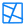

# Point map with clusters  in {{ datalens-full-name }}

A point map with clusters differs from a [regular point map](point-map-chart.md) in clustering adjacent points. On the map, a cluster looks like a donut chart with the number of points displayed in the center.



The number in the center only indicates the number of cluster points. You cannot select a different measure, e.g., the total of values across all points.



The behavior of points varies depending on the map scale:

* When scaling down, points merge into clusters.
* When scaling up, the distance between points increases and the cluster automatically splits into smaller clusters and/or individual points.

If the map has only one point in the selected scale, this point will not be clustered. In this case, instead of a donut chart, you will see a point just like in a regular point map.

Clustering on a map improves visualization when there is a large number of points. For example, if you want to show the location of all stores in a city on a map with clustering, points on the map will not overlap.



## Wizard sections {#wizard-sections}

The following limitations apply:

* The **Point size**, **Tooltips**, and **Labels** sections only apply to individual points.
* You can only add a dimension to the **Colors** section.

Wizard  section| Description
----- | ----
Points with clusters (Geopoints) | Dimension of the [Geopoint](../dataset/data-types.md#geopoint) type.
Point size | Measure. Sets the point size depending on the measure value.
Colors | Dimension. Sets cluster chart segmentation.
Labels | Measure. Displayed as text on a point. When using labels, you cannot manage the point size.
Tooltips | Dimension or measure. A tooltip that appears when you hover over a point. For `String` type fields, you can configure using the basic [Markdown](../dashboard/markdown.md) syntax: click the icon before the field name and enable **Markdown**.
Layer filters | Dimension or measure. It is used as a filter for the current layer.
Filters | Dimension or measure. It is used as a filter for the entire chart.

## Creating a point map with clusters {#create-diagram}



1. 
1. 
1. 
1. 
1. 
1. Select the **Points with clusters (Geopoints)** layer type.
1. Drag a dimension of the [Geopoint](../dataset/data-types.md#geopoint) type from the dataset to the layer type selection section.
1. Set the point size for the point map. Drag a measure to the **Point size** section or click  in the line with the section name.
1. Color the points on the map. Drag a dimension to the **Colors** section.
1. Add tooltips to show the dimension and measure values when hovering over a point.





## Recommendations {#recomendations}

* Use color palettes suitable for the goals and objectives of visualization.

