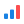
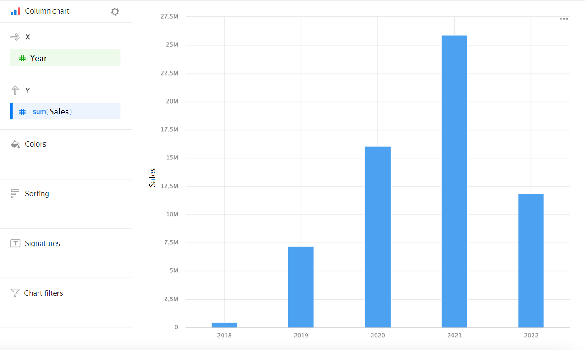
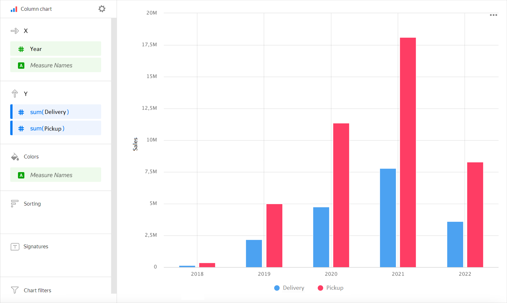
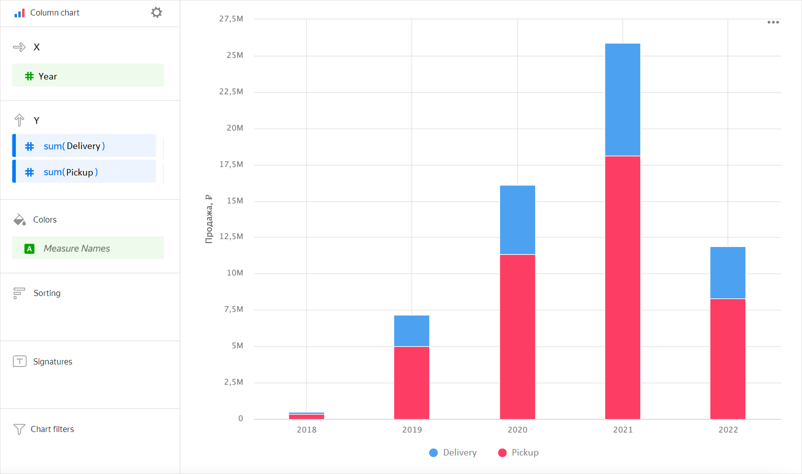
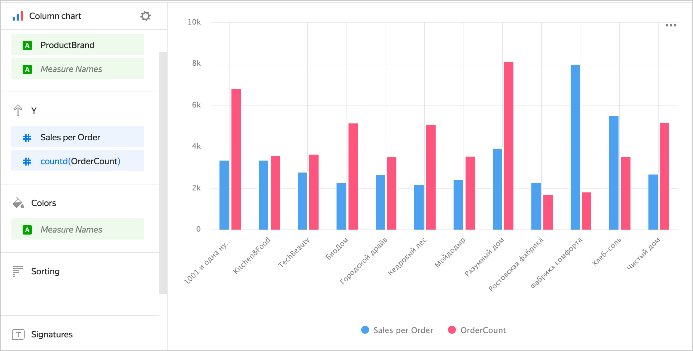
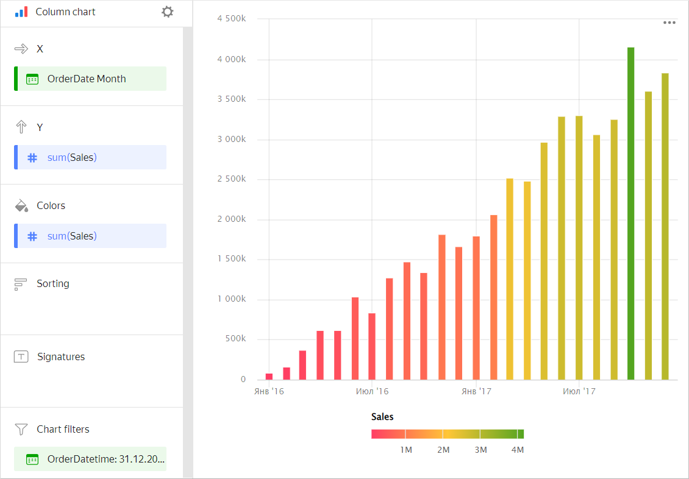
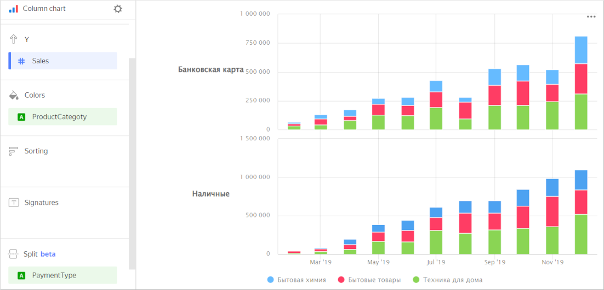

# Column chart 

This chart displays the values of one or more measures by period or category. The height of a column determines the measure value: the higher the column, the larger the value.
Unlike line charts, this type of chart assumes that different periods are compared directly and an emphasis is made on a measure's individual value rather than its general trend.



| Year | Sales |
-----|---------|
| 2022 | 6M |
| 2021 | 28M |
| 2020 | 18M |
| 2019 | 9M |
| 2018 | 1M |



## Types of column charts {#types}

* [Grouped](#groupped)
* [Stacked](#stacked)

### With grouping {#groupped}

A chart with grouping lets you compare two or more measures: for example, the number of products delivered and the number picked up. The column height corresponds to the measure value.



| Year | Delivery | Pickup |
-----|---------| ----------|
| 2022 | 2M | 4M |
| 2021 | 8M | 19M |
| 2020 | 5M | 13M |
| 2019 | 3M | 6M |
| 2018 | 331K | 918K |



### Stacked {#stacked}

This chart shows the ratio of internal segments by period. Segments are placed one above the other: the base of each subsequent segment is the outermost boundary of the previous one.
Since the sum of all segments is equal to the total length of a column, when column totals are important this type of chart is used.



| Year | Delivery | Pickup |
-----|---------| ----------|
| 2022 | 2M | 4M |
| 2021 | 8M | 19M |
| 2020 | 5M | 13M |
| 2019 | 3M | 6M |
| 2018 | 331K | 918K |



## Sections in the wizard {#wizard-sections}

| Wizard section | Description |
----- | ----
| X | Dimensions. You can specify one or two dimensions. Affects X-axis value grouping. The order of specified dimensions affects the order of value grouping on the X-axis. For the `Date` and `Date and time` types, you can set grouping by time: minutes, hours, weeks, and so on. |
| Y | Measure. You can specify multiple measures. If you add more than one measure to a section, the **Colors** section will contain a dimension named [Measure Names](../concepts/chart/measure-values.md). |
| Colors | [Measure Names](../concepts/chart/measure-values.md) dimension or field that affects the color of columns. To delete [Measure Names](../concepts/chart/measure-values.md), click the cross icon or remove measures from the Y axis. |
| Sorting | Dimension or measure that affects column sorting. Sorting only applies to dimensions used when building a chart. The sorting direction is marked with an icon next to the field:  ascending or  descending. To change the sorting direction, click the icon. |
| Labels | Measure. Displays measure values on the chart. When using multiple measures for a signature, add [Measure Values](../concepts/chart/measure-values.md). |
| Split | Dimension. Splits a chart horizontally by the selected dimension's values. The maximum number of splits per chart is 25. |
| Filters | Dimension or measure. Used as a filter. A filter can be overridden by a dashboard selector if the selector is based on the same field. |

## Creating a column chart {#create-diagram}

To create a bar chart:

1. On the {{ datalens-full-name }} homepage, click **Create chart**.
1. Under **Dataset**, select a dataset for visualization.
1. Select **Bar chart** as the chart type.
1. Drag a dimension from the dataset to the **X** section. The values will be displayed in the lower part of the chart on the X axis.
1. Drag one or more measures from the dataset to the **Y** section. The values are displayed as columns on the Y-axis.

By default, a stacked chart is displayed if you have multiple measures.

### Creating a grouped column chart {#grouped-column-chart}

To display an X-axis grouped column chart:

1. Go to the column chart that you created.
1. Depending on the number of measures in the **Y** section, follow these steps:

   

   - One measure

      1. Check if there is a dimension in the **Colors** section.
      1. Duplicate this dimension in the **X** section. The sequence of dimensions affects the grouping order.

      

   - Two or more measures

      1. Drag the [Measure Names](../concepts/chart/measure-values.md) dimension to the **Colors** section.
      1. Drag the [Measure Names](../concepts/chart/measure-values.md) dimension to the **X** section. The sequence of dimensions affects the grouping order.

      

   

### Adding a column color based on a measure {#column-colors}

To color columns in a chart based on the value of a measure:

1. Go to the column chart that you created.
1. Depending on the number of measures in the **Y** section, follow the steps below:

   

   - One measure

      Copy the measure from the **Y** section to the **Colors** section.

      Columns in the chart will take on colors as a function of the measure values.

      

   - Two or more measures

      Drag the [Measure Values](../concepts/chart/measure-values.md) measure to the **Colors** section.

      The columns in the chart will take on colors depending on the values of all the measures listed in the **Y** section.

      

   

1. Configure a color gradient for the measure as well. To do this, in the top right-hand corner of the **Colors** section, click  (the icon is displayed when you mouse over the section).
1. In the color settings, specify:

   * **Gradient type**: Select 2 or 3 colors.
   * Gradient color: Select a color palette for the gradient from the list.
   * Gradient direction: Change the gradient direction using the  icon.
   * **Set threshold values**: Set numeric thresholds for each color. Works if the **Y** section contains a single value.

### Configuring the display of `null` values {#null-settings}



## Recommendations {#recomentations}

* If category values contain a lot of text, try to make it shorter so that chart signatures look neater. You can use string functions or the `CASE` conditional statement in calculated fields.
* If each column is a category rather than a time value, consider sorting the columns in ascending or descending order of the measure. This will make your chart look better and more informative. Sorting may also be helpful inside each column's subcategories.
* We recommend using a column chart to display changes to a measure or measures over time. In this case, be careful when sorting values on the X-axis, because the user usually expects to see changes over time on the X-axis.
* When visualizing multiple measures, select colors carefully. They should be distinguishable and contrasting. We recommend using no more than 3-5 colors per chart. If you want to emphasize one certain measure above the others, highlight it in some bright color.
* You can split a chart by dimension into a number of small charts that are convenient to compare to one another. To do this, drag a dimension from the dataset to the **Split** section.

   

   

   
