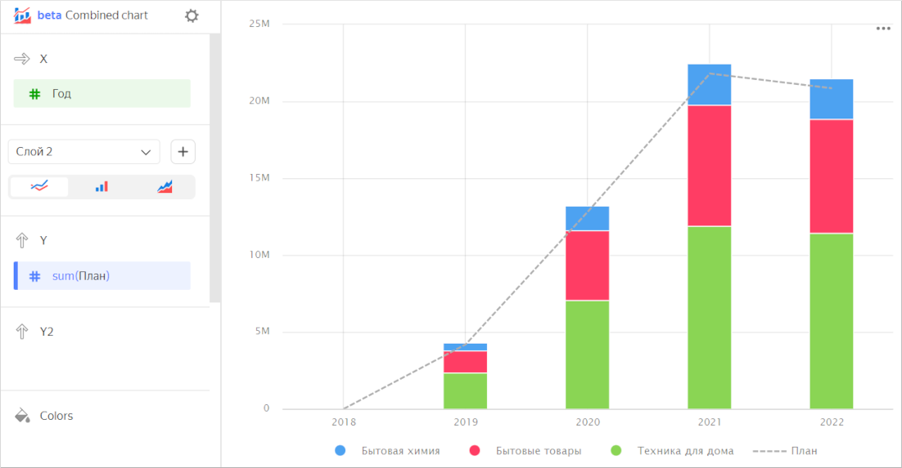
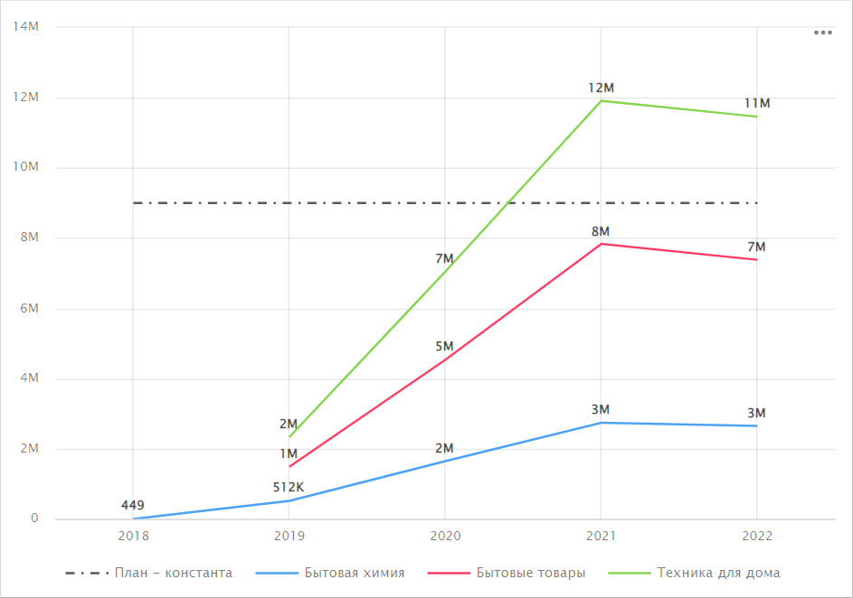
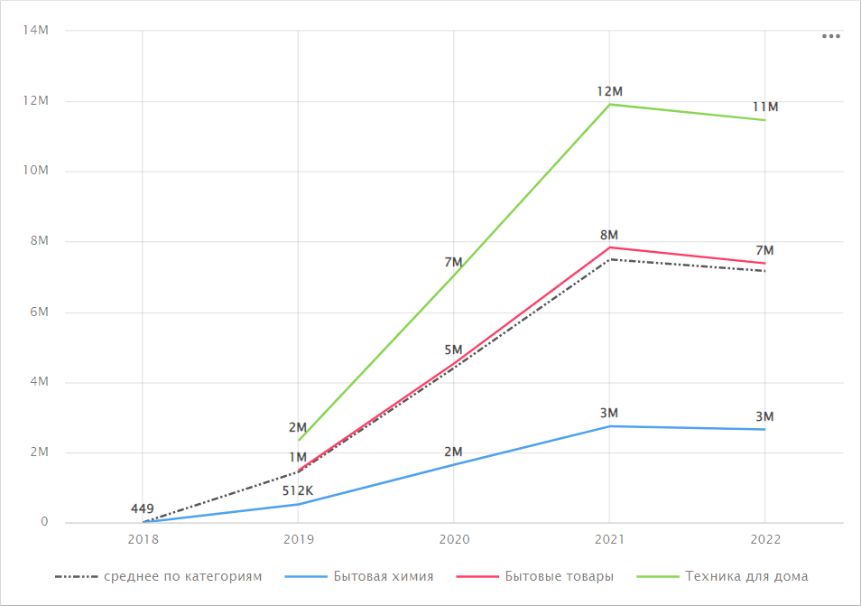

# Combined chart 

Combined chart is a separate type of visualization consisting of layers. Each layer is represented by a chart type of its own. You can combine [line charts](line-chart.md), [column charts](column-chart.md), and [area charts](area-chart.md).

Features:

* The **X**, **Sort**, and **Filters** sections are the same for all layers.
* You can add, delete, reorder and rename layers.
* Each layer is executed with a separate query in the database.
* The maximum number of layers is 5.



* There is no color fill by measure in column charts.
* In a combined chart, sorting only applies to the layers it is supported for.



A combined chart is often used for plan/actual comparison. You can show the plan as a dashed line on the line chart layer, while presenting the actual values broken down into categories on the column chart layer.



| Year | Category | Plan | Sales |
|-----|-----|-----|-----|
| 2018 | Household cleaners | 435.53 | 449 |
| 2018 | Household goods | null | null |
| 2018 | Home appliances | null | null |
| 2019 | Household cleaners | 503255 | 512282 |
| 2019 | Household goods | 1457502 | 1483733 |
| 2019 | Home appliances | 2237228.4 | 2331805 |
| 2020 | Household cleaners | 1623124 | 1644668 |
| 2020 | Household goods | 4495448 | 4535567 |
| 2020 | Home appliances | 6711462.8 | 7046605 |
| 2021 | Household cleaners | 2686134 | 2737436 |
| 2021 | Household goods | 7794310 | 7836228 |
| 2021 | Home appliances | 11329663.6 | 11910983 |
| 2022 | Household cleaners | 2512031 | 2652918 |
| 2022 | Household goods | 7013145 | 7382385 |
| 2022 | Home appliances | 11327092 | 11461881 |



It's sometimes convenient to use a combined chart for same-type layers. For example, when one layer represents sales by category and another one shows the plan constant.

You can display additional lines calculated using [window functions](../../datalens/function-ref/window-functions.md) or [LOD functions](../../datalens/function-ref/aggregation-functions.md#syntax-lod). For example, to calculate an average by category, use this formula: `avg(SUM([Sales] INCLUDE [Category]))`.

## Sections in the wizard {#wizard-sections}

| Wizard section | Description |
----- | ----
| X | Dimension. You can only specify one field here. This dimension is usually a date. If this is the case, make sure to specify the `Date` data type for this field in the dataset. This is required for correct sorting and signature display. For better visualization, you can group dates into weeks, months, and years. For more information, see [{#T}](../concepts/chart/settings.md#field-settings). The **X** section is common for all layers. |
| Layer section | Allows you to add, delete, reorder and rename layers. You can select a chart type for a layer: [line chart](line-chart.md), [column chart](column-chart.md), or [area chart](area-chart.md). The list of other sections depends on the layer chart type you select. |

## Creating a combined chart {#create-diagram}

To create a combined chart:

1. On the {{ datalens-full-name }} [home page]({{ link-datalens-main }}), click **Create chart**.
1. Under **Dataset**, select a dataset for visualization.
1. Select **Combined chart** as your chart type.

1. Drag a dimension from the dataset to the **X** section. The values will be displayed in the lower part of the chart on the X axis.
1. Select a layer chart type: line chart , column chart , or area chart . Rename the layer, if required.
1. Create a chart of the appropriate type:

   * [{#T}](line-chart.md#create-diagram)
   * [{#T}](column-chart.md#create-diagram)
   * [{#T}](area-chart.md#create-diagram)

1. Add a new layer. To do this, click  to the right of the layer name.
