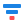

# Funnel  in {{ datalens-full-name }}

A funnel chart visualizes the sequential decrease in measure values across stages. Each stage of the funnel is represented by a segment whose width is proportional to the measure value.

This visualization type is well-suited for analysis of processes where data goes through several successive stages. For example, it is widely used to represent the sales funnel from a product view to purchase or to track user conversion rates during a multi-step registration flow.





- Visualization

  

- Source table

  Year  | Sales
  -----|--------
  2022 | 6M
  2021 | 28M
  2020 | 18M
  2019 | 9M
  2018 | 1M





## Wizard sections {#wizard-sections}

Wizard  section | Description
----- | ----
Categories | Dimension. You can specify only one field here. Your data will be grouped by this field.
Measures | Measure. You can specify one or multiple fields. If you add more than one measure to a section, the **Categories** section will contain the [Measure Names](../concepts/chart/measure-values.md) dimension.
Color | Dimension or measure. You can specify a dimension from the **Categories** section or any measure. Affects the color of the funnel segments.
Sorting | Dimension or measure. Affects the order of funnel stages. The sorting direction is marked with an icon next to the field:  for ascending or  for descending. To change the sorting direction, click the icon.
Labels | Measure. You can specify one or multiple fields. Displays measure values on the funnel segments. To display both absolute values and percentages for each segment, add multiple [Measure Values](../concepts/chart/measure-values.md) fields and set their format. [Markup functions](../function-ref/markup-functions.md) are supported.
Filters | Dimension or measure. It is used as a filter.

## Creating a funnel {#create-diagram}

To create a funnel:



1. 
1. 
1. 
1. 
1. Select **Funnel** for the chart type.
1. Drag a dimension from the dataset to the **Categories** section.
1. Drag one or more measures from the dataset to the **Measures** section.
1. Drag a dimension from the dataset or the [Measure Names](../concepts/chart/measure-values.md) field to the **Colors** section.
1. Drag a measure from the dataset to the **Signatures** section.

## Chart settings {#chart-settings}

You can configure the following chart settings:

* **Percentage calculation stage**: Baseline stage for calculating percentages displayed in chart tooltips:
  * Initial stage (default).
  * Previous stage.
* **Distance between segments**: Gap size between funnel segments.
* **Shape**: Shape of the funnel segments:
  * Rectangle (default).
  * Trapezoid.

## Recommendations {#recommendations}

* **Funnel stages**: Arrange funnel stages in a logical sequence from initial to final. Use the **Sorting** section to configure this order.
* **Number of stages**: Avoid overloading your funnel with stages: 3 to 7 stages work best. A funnel with too many stages is hard to read.
* **Colors**: Use the **Colors** section to highlight important stages or group related stages together.
* **Labels**: Add labels with both absolute values and percentages to make your data easier to interpret. To do this, drag multiple [Measure Values](../concepts/chart/measure-values.md) fields with different formats to the **Labels** section.


