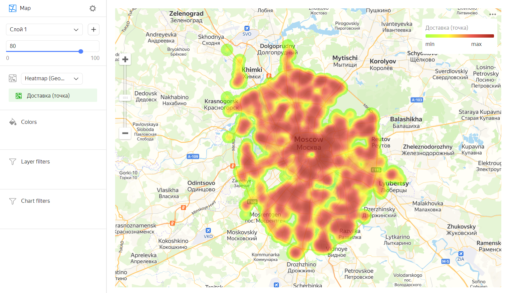

# Heat map 

A heat map shows the density of point distribution. Map areas are colored with a gradient ranging from green to red: the more points are grouped in an area, the closer its color is to red. Heat maps are used to display concentrations of a large number of points.

A heat map is most effective when working with a dataset that contains a lot of points located within a small geographic area. If there are few points on a map, their fill intensity can be indicated by a measure value: the higher the value, the closer the point color to red.

A heat map helps find dependencies that can be hidden due to overlapping map points (like on a [point](point-map-chart.md) map). For example, you can use a heat map to determine the districts where customers order for delivery most often.

## Sections in the wizard {#wizard-sections}

| Section  in the wizard | Description |
----- | ----
| Heatmap (Geopoints) | Measure with the type [Geopoint](../concepts/data-types.md#geopoint). |
| Colors | Dimension or measure. Affects the intensity of point fill. |
| Layer filters | Dimension or measure. Used as a filter for the current layer. |
| Chart filters | Dimension or measure. Used as a filter for the entire chart. |

## Creating a heat map {#create-diagram}

1. On the {{ datalens-full-name }} [home page]({{ link-datalens-main }}), click **Create chart**.
1. Under **Dataset**, select a dataset for visualization. If you don't have a dataset, [create one](../operations/dataset/create.md).
1. Select the **Map** chart type.
1. Select the **Heatmap (Geopoints)** layer type.
1. Drag a dimension with the [Geopoint](../concepts/data-types.md#geopoint) type from the dataset to the layer type selection section.
1. Change the weight of the points on the heat map. To do this, drag the measure to the **Colors** section.

You can also:

* Add, rename, and delete a layer.
* Apply a filter to the whole chart or one layer.

## Recommendations {#recomendations}

* Use a heat map if there are a lot of points in your dataset. If there are few points, using this type of map may distort the detected dependencies.
* The intensity of point and area fill on a heat map varies depending on the map's scale. Please keep this in mind.
