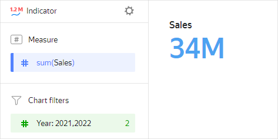
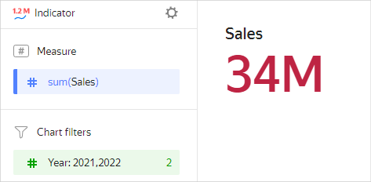
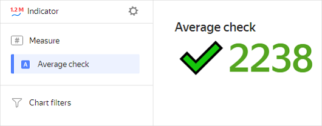
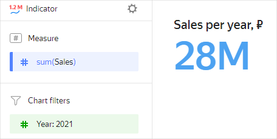

# Indicator 

An indicator reflects the value of a single key measure. It is used when a dashboard contains values that need to be monitored on a regular basis to understand the overall situation. These can be the number of incidents for the past day, plan performance, or a YoY increase in sales. Indicators are most often placed at the top or on the right side of a dashboard. Make sure there are no more than six indicators per screen so that they do not lose their urgency or confuse users. Using indicators of different sizes, you can build a hierarchy of the various metrics according to significance.

You can set up the size and color of an indicator.



| Year | Sales |
-----|---------|
| 2022 | 6M |
| 2021 | 28M |
| 2020 | 18M |
| 2019 | 9M |
| 2018 | 1M |



## Sections in the wizard {#wizard-sections}

| Wizard section | Description |
----- | ----
| Measure | Measure. One measure that determines the indicator value. |
| Filters | Dimension or measure. Used as a filter. |

## Creating an indicator {#create-diagram}

To create an indicator:

1. On the {{ datalens-full-name }} [home page]({{ link-datalens-main }}), click **Create chart**.
1. Under **Dataset**, select a dataset for visualization.
1. Select the **Indicator** chart type.
1. Drag a dimension or measure from the dataset to the **Measure** section. The value is displayed as a number.

You can also change the size and color of the indicator:

1. In the **Measure** section, click .
1. In the **Indicator settings** window, select the size and color and click **Apply**.

## Recommendations {#recommendations}

* Use emojis when calculating indicator values to make them more informative.

   

   This indicator chart uses a calculated field with the following formula: `IF([Average spend]>2200, CONCAT("✔️",STR(ROUND([Average spend]))),CONCAT("🔻",STR(round([Average spend]))))`.

* Describe the context to make it clear what indicators mean.

   
