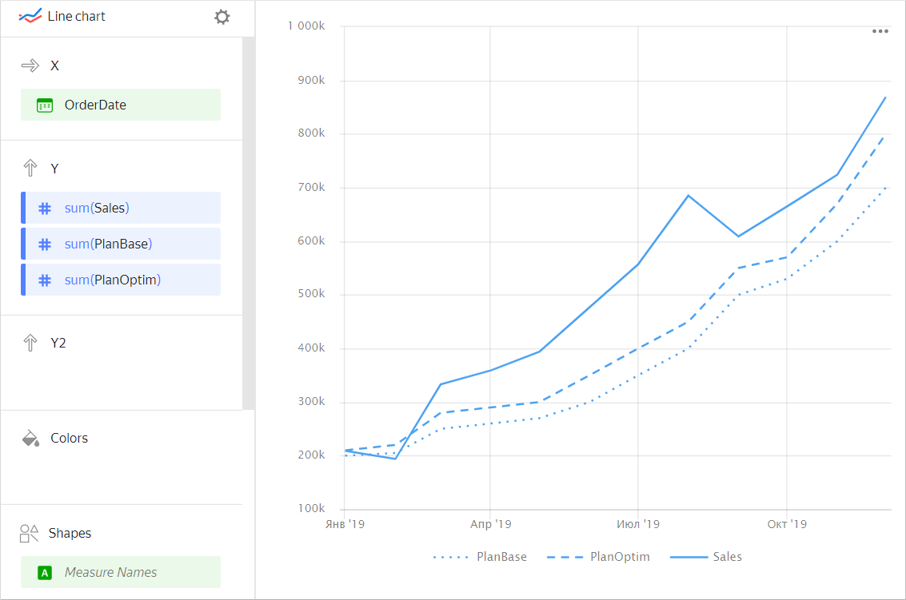
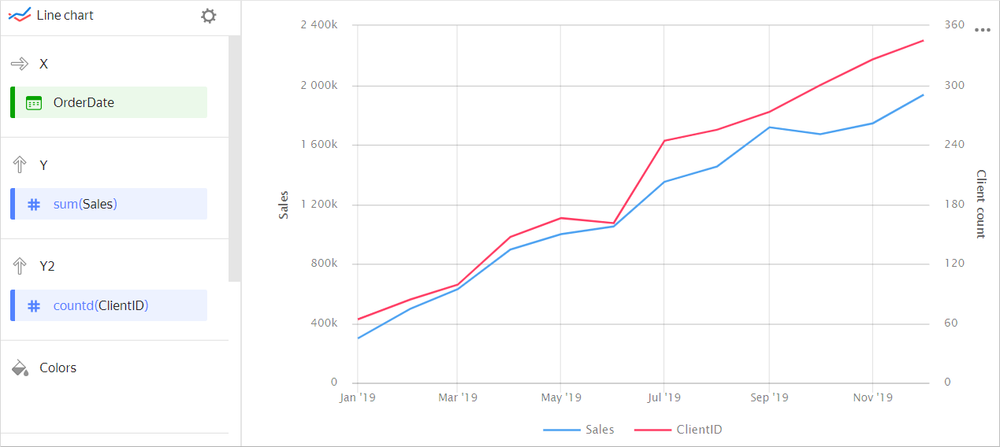
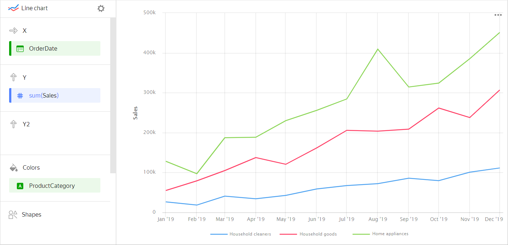
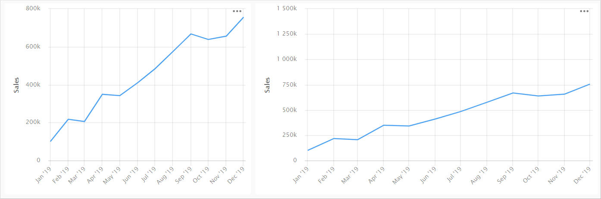
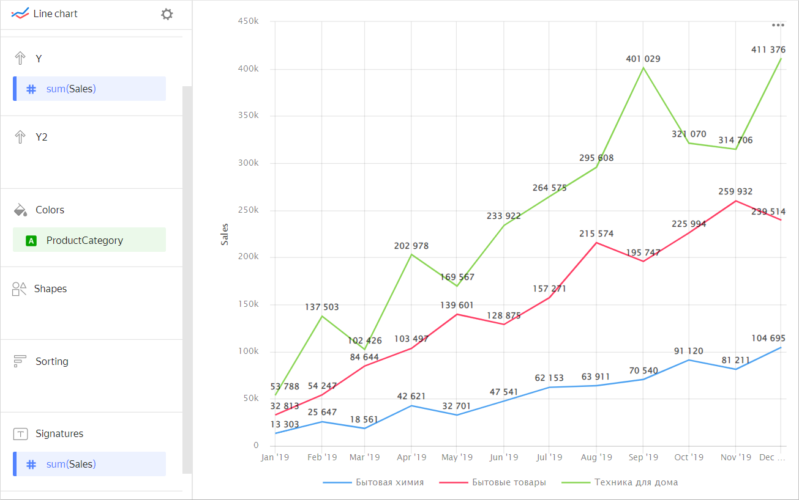
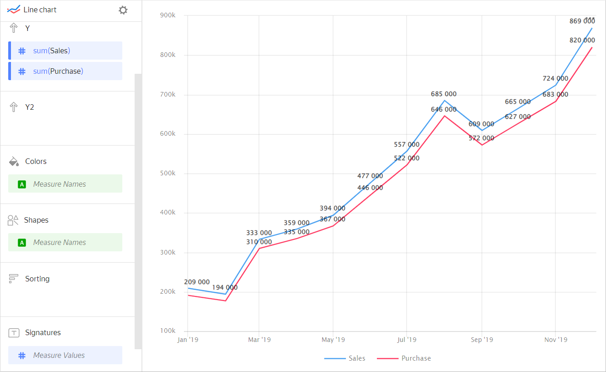
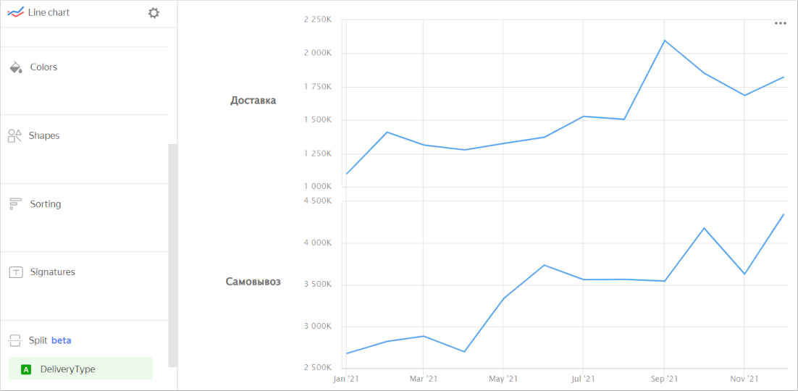
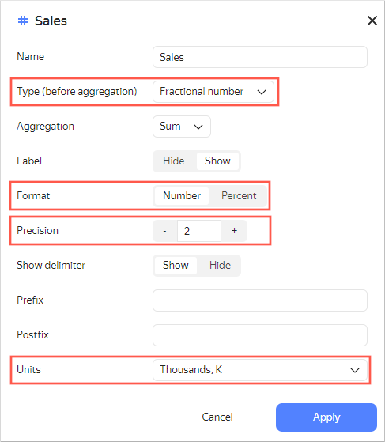

# Line chart 

This chart displays a change to one or more measures over a time interval. It indicates trends, seasonality, dynamics, and a ratio of multiple measures in a single point in time. A chart is built using points with (X, Y) coordinates that are then connected by a line.

It can show multiple measures with different lines. For example, the basic sales targets, optimistic sales targets, and actual sales can be represented as a dotted, dashed, and solid line, respectively.



Year |	Sales |	Basic targets |	Optimistic targets
----- | --------- | --------- | --------- 
January 2019|	209К |	200К |	210К
February 2019|	194К |	205К |	220К
March 2019|	333К |	250К |	280К
April 2019|	359К | 260К |	290К
May 2019|	394К |	270К |	300К
June 2019|	477К |	300К |	350К
July 2019|	557К |	350К |	400К
August 2019|	685К |	400К |	450К
September 2019|	609К |	500К |	550К
October 2019|	665К |	530К |	570К
November 2019|	724К |	600К |	670К
December 2019|	869К |	700К |	800К



If measure values differ significantly, you can place them on different Y axes. In this case, the values of each measure will be plotted on their own axis. For example, a chart for sales and customer count.

  



| Year | Sales | Number of customers |
| ----- | ----- | ----- |
| January 2019 | 298450 | 64 |
| February 2019 | 498052 | 84 |
| March 2019 | 629201 | 99 |
| April 2019 | 895075 | 147 |
| May 2019 | 998557 | 166 |
| June 2019 | 1050330 | 161 |
| July 2019 | 1350246 | 244 |
| August 2019 | 1452550 | 255 |
| September 2019 | 1716182 | 273 |
| October 2019 | 1670980 | 300 |
| November 2019 | 1743450 | 326 |
| December 2019 | 1935377 | 345 |



This chart lets you compare multiple categories by a single measure. Each category's line has its own color and form. For example, the sales amount for different product categories.



Year |	Home appliances |	Household goods  | Household cleaners
----- | ---------| ---------- | ---------- 
January 2019|	128К |	55К | 26К
February 2019|	97К |	79К | 18К
March 2019|	187К |	105К | 41К
April 2019|	188К | 137К | 34К
May 2019|	230К |	121К | 43К
June 2019|	256К |	162К | 59К
July 2019|	284К |	206К | 67К	
August 2019|	409К |	204К | 72К
September 2019|	314К |	209К | 86К
October 2019|	324К |	262К | 79К
November 2019|	385К |	238К | 101К
December 2019|	451К |	307К | 111К



## Wizard sections {#wizard-sections}

Wizard  section| Description
----- | ----
X | Dimension. You can only specify one field here. This dimension is usually a date. If this is the case, make sure to specify the `Date` data type for this field in the dataset. This is required for correct sorting and signature display. For better visualization, you can group dates into weeks, months, and years. For more information, see [{#T}](../concepts/chart/settings.md#field-settings).
Y | Measure. You can specify multiple measures. If you add more than one measure to a section, the **Colors** section will contain a dimension named [Measure Names](../concepts/chart/measure-values.md).
Y2 | Measure. Use it to add a second Y axis to a chart. You can specify multiple measures. If you add more than one measure to a section, the **Colors** section will contain a dimension named [Measure Names](../concepts/chart/measure-values.md).
Colors | [Measure Names](../concepts/chart/measure-values.md) dimension or field. Affects the color of lines. To delete [Measure Names](../concepts/chart/measure-values.md), click the cross icon or remove measures from the Y axis.
Forms | [Measure Names](../concepts/chart/measure-values.md) dimension or field. Affects the shape of lines.
Sorting | Dimension. You can use only one X axis dimension. Affects the sorting of the X axis. The sorting direction is marked with an icon next to the field:  for ascending or  for descending. To change the sorting direction, click the icon.
Labels | Measure. Displays measure values on the chart. If multiple measures are added to the **Y** or **Y2** section, drag [Measure Values](../concepts/chart/measure-values.md) to this section. [Markup functions](../function-ref/markup-functions.md) are supported. For `String` type fields, you can configure using basic [{#T}](../dashboard/markdown.md) syntax: click the icon before the field name and enable **Markdown**.
Split | Dimension. Splits a chart horizontally by the selected dimension's values. The maximum number of splits per chart is 25.
Filters | Dimension or measure. Used as a filter.

## Creating a line chart {#create-diagram}

To create a line chart:



1. Go to the {{ datalens-short-name }} [home page]({{ link-datalens-main }}).
1. In the left-hand panel, select  **Charts**.
1. Click **Create chart** → **Chart**.
1. At the top left, click  **Select dataset** and specify the dataset to visualize.
1. Select **Line chart** as your chart type.
1. Drag a dimension from the dataset to the **X** section. The values will be displayed in the lower part of the chart on the X axis.
1. Drag one or more measures from the dataset to the **Y** section. The values will be displayed as a chart on the Y axis.
1. Drag one or more measures from the dataset to the **Y2** section. The values will be displayed as a chart on the second Y axis.
1. Drag a dimension to the **Color** section. The measure value is divided by color depending on the selected dimension.
1. Drag a dimension or measure from the dataset to the **Filters** section. The field can be empty. In this case, no filters are applied.

### Configuring display of `null` values {#null-settings}



## Recommendations {#recomendations}

* The perception of data on a line chart depends on its proportions. An upward or downward trend may intensify if the chart is contracted and be less evident if it's spread.
  
  
  
  

  
  
* 
* When visualizing multiple measures, select colors carefully. They should be distinguishable and contrasting. We recommend using no more than 3-5 colors per chart. If you want to emphasize one certain measure above the others, highlight it in some bright color.
* Disable the **Sum in tooltips** option in the [chart settings](../concepts/chart/settings.md#common-settings) if the chart lines represent different entities. For example, the sales amount and the number of customers.
* Sign measure values on the chart. To do this, drag a measure from the dataset to the **Signatures** section. The chart will display its values.

  

  

  

  If multiple measures are added to the **Y** or **Y2** section, drag [Measure Values](../concepts/chart/measure-values.md) to this section.

  

  

  

  You can also sign only the last value on the chart by adding a calculated field with the `MAX` function. For more information, see [Demo dashboard](https://datalens.yandex/9fms9uae7ip02?tab=Are).
  
* You can split a chart by dimension into a number of small charts that are convenient to compare to one another. To do this, drag a dimension from the dataset to the **Split** section.

  

  

  

* For better visualization, use formatting in the [dimension](../concepts/chart/settings.md#measure-settings) and [measure](../concepts/chart/settings.md#indicator-settings) setup window. Check the data type for correct sorting and comparison of values. Specify additional parameters. For example, the format and units for numeric data and the number of decimal places for fractions.
  
  
  
  

  

