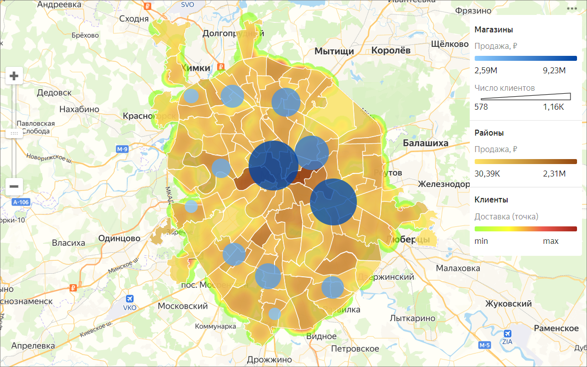

# Map

Maps are used for geoanalytics: displaying and analyzing business indicators on a map. These indicators may include population and population density, the number of commercial facilities and their profit, and other parameters that may affect the efficiency of a business.

You can use a map to display layers of different types:

* Areas. A layer indicates entire areas or regions. Measure values are represented using colors or color shades. It's a good practice to add pop-up hints with area names or measures to a map.
* Points. Points can be used to display individual objects like cities, stores, order pickup points, or customer addresses. Measure values can be indicated in two ways: through a point color and its size.
* Lines. Lines are used to show links between objects in the area. For example, airline flights or cargo transportation routes.
* Heatmap. Shows the density of points on a map. It's helpful when you need to display a large number of points and their concentration areas.

To create maps, make sure the data source contains either [Geopoint](../concepts/data-types.md#geopoint) coordinates or [Geopolygon](../concepts/data-types.md#geopolygon) areas.

You can place no more than 5 layers with any visualization type on a map. Layers in the **Map** chart are called geolayers.

_Geolayers_ visualize indicators using points or polygons on the map.

You can do the following operations with geolayers:

* Change name.
* Set the transparency level using the slider.
* Reorder the layers inside a visualization type. However, you can't change the order of visualization types (top-to-bottom: point map, polyline map, choropleth map, and heat map).

You can purchase pre-calculated geolayers from partners in {{ marketplace-name }}.



You can't create maps in [QL charts](../concepts/chart/index.md#sql-charts).


