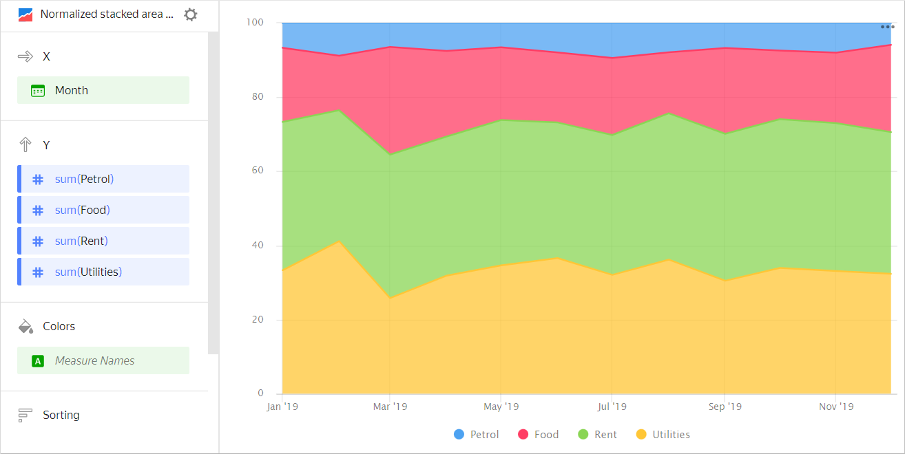
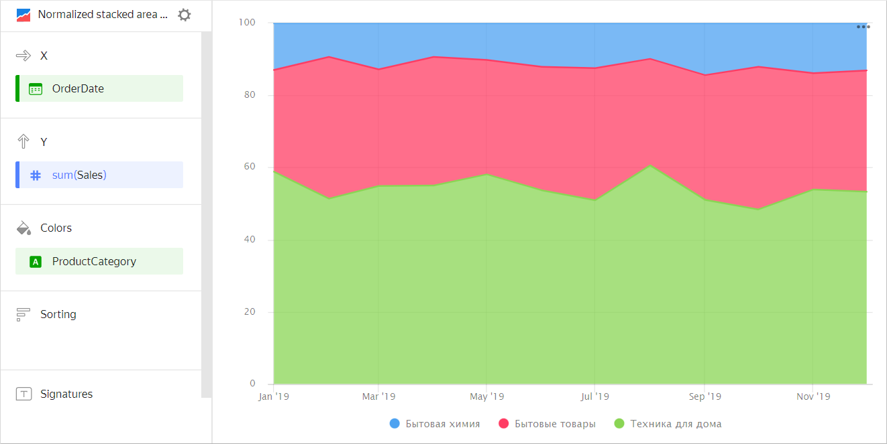
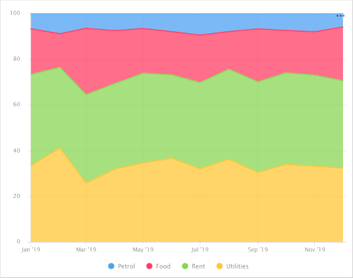
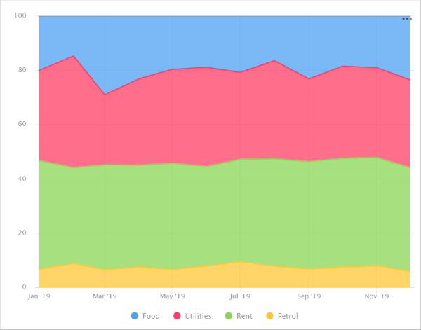
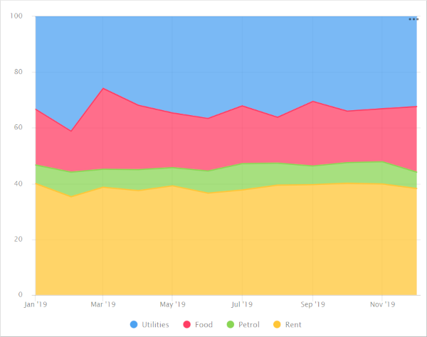
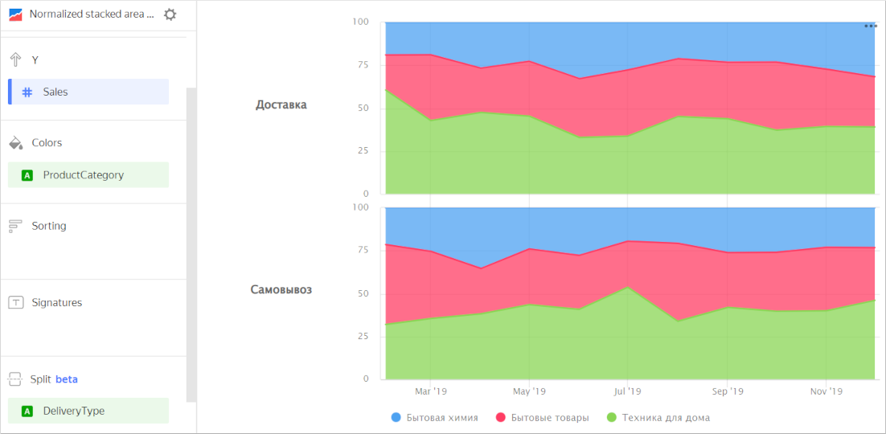

# Normalized area chart 

A normalized area chart shows changes to the contribution of each category in a measure value over a time interval. Areas are highlighted in different colors and located above each other. The chart shows the percentage of areas and not their absolute value. The width of an area indicates its ratio to the total amount represented as 100%. For example, the percentage of different expenses in the total budget amount.



| Month | Gasoline | Rent | Food | Utility bills |
----- | ---------| ---------- | ---------- | ----------
| January 2019 | 100 | 600 | 300 | 500 |
| February 2019 | 150 | 600 | 250 | 700 |
| March 2019 | 100 | 600 | 450 | 400 |
| April 2019 | 120 | 600 | 370 | 510 |
| May 2019 | 100 | 600 | 300 | 530 |
| June 2019 | 130 | 600 | 310 | 600 |
| July 2019 | 150 | 600 | 330 | 510 |
| August 2019 | 120 | 600 | 250 | 550 |
| September 2019 | 110 | 650 | 380 | 500 |
| October 2019 | 120 | 650 | 300 | 550 |
| November 2019 | 130 | 650 | 310 | 540 |
| December 2019 | 100 | 650 | 400 | 550 |



This type of chart is used to show a change to the proportion of categories, while their totals are not critical. For example, to show how the percentage of product categories changes in the total sales amount.



| Month | Home appliances | Household goods | Household cleaners |
----- | ---------| ---------- | ----------
| January 2019 | 128K | 55K | 26K |
| February 2019 | 97K | 79K | 18K |
| March 2019 | 187K | 105K | 41K |
| April 2019 | 188K | 137K | 34K |
| May 2019 | 230K | 121K | 43K |
| June 2019 | 256K | 162K | 59K |
| July 2019 | 284K | 206K | 67K |
| August 2019 | 409K | 204K | 72K |
| September 2019 | 314K | 209K | 86K |
| October 2019 | 324K | 262K | 79K |
| November 2019 | 385K | 238K | 101K |
| December 2019 | 451K | 307K | 111K |



## Sections in the wizard {#wizard-sections}

| Wizard section | Description |
----- | ----
| X | Dimension. You can only specify one field here. This dimension is usually a date. If this is the case, make sure to specify the `Date` data type for this field in the dataset. This is required for correct sorting and signature display. For better visualization, you can group dates into weeks, months, and years. For more information, see [{#T}](../concepts/chart/settings.md#field-settings). |
| Y | Measure. You can specify multiple measures. If you add more than one measure to a section, the **Colors** section will contain a dimension named [Measure Names](../concepts/chart/measure-values.md). |
| Colors | [Measure Names](../concepts/chart/measure-values.md) dimension or field that affects the color of lines. To remove [Measure Names](../concepts/chart/measure-values.md), delete measures from the Y axis. |
| Sorting | Dimension or measure. You can use a dimension from the **X** and **Color** sections or a measure from the Y axis. This section affects the sorting of values on the X axis or areas along the Y axis. The sorting direction is marked with an icon next to the field:  ascending or  descending. To change the sorting direction, click the icon. |
| Labels | Measure. Displays measure values on the chart. If multiple measures are added to the **Y** section, drag [Measure Values](../concepts/chart/measure-values.md) to this section. |
| Split | Dimension. Splits a chart horizontally by the selected dimension's values. The maximum number of splits per chart is 25. |
| Filters | Dimension or measure. Used as a filter. |

## Creating a normalized area chart {#create-diagram}

To create a normalized area chart:

1. On the {{ datalens-full-name }} [home page]({{ link-datalens-main }}), click **Create chart**.
1. Under **Dataset**, select a dataset for visualization.
1. Select **Normalized area chart** as the chart type.
1. Drag a dimension from the dataset to the **X** section. The values will be displayed in the lower part of the chart on the X axis.
1. Drag one or more measures from the dataset to the **Y** section. The values are displayed as areas along the Y axis.
1. Drag a dimension from the dataset to the **Color** section. Colored areas will indicate the share of an individual category in the total measure value.

## Recommendations {#recomendations}

* 
* Do not display more than three to five areas on the chart.
* To make it easier to track the dynamics, place the largest or most important categories closer to the chart base. To do this, drag the measure to the **Sorting** section or set up their order in the **Y** section. For example, when comparing budget expenses.

   

   

   

   To monitor the budget spending dynamics by the `Gasoline` category, place it close to the chart base.

   

   

   

   If there is another important category, place it by the upper boundary of the chart. This way the areas will have clear boundaries to help visually compare their values. For example, to compare `Utility bills` and `Rent`.

   

   

   

* You can split a chart by dimension into a number of small charts that are convenient to compare to one another. To do this, drag a dimension from the dataset to the **Split** section.

   

   

   

* To display the absolute values of variables, use a [stacked area chart](area-chart.md).
