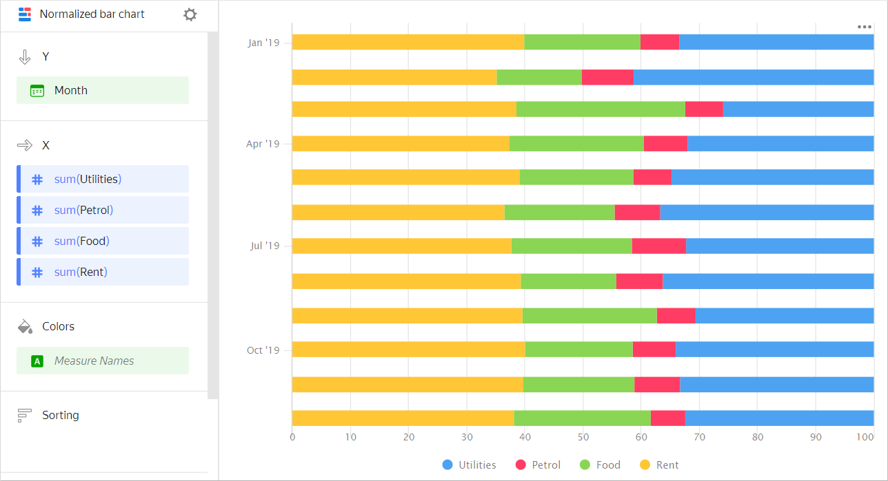
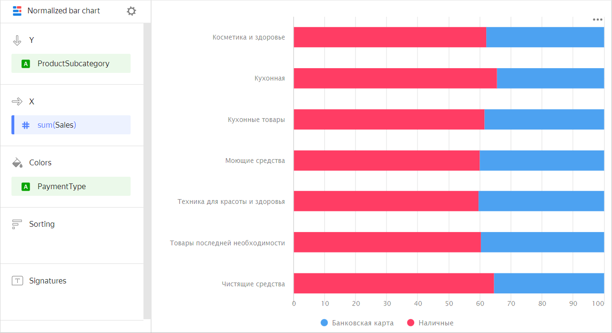
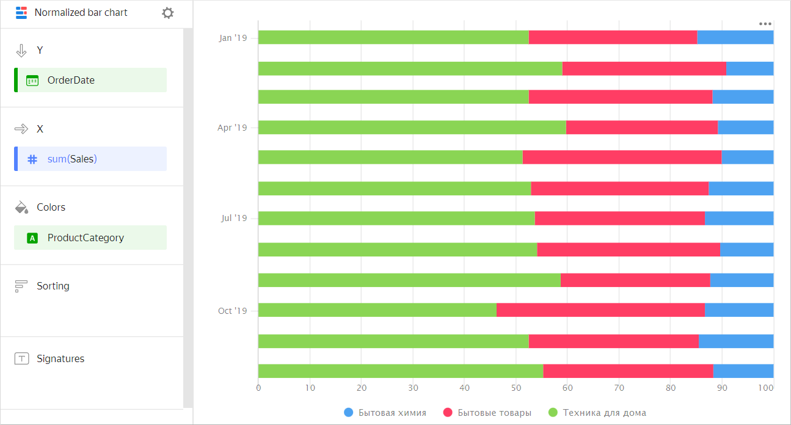

# Normalized bar chart 

A normalized bar chart shows the contribution, as a percentage, of multiple measures in the total amount by period or category. Unlike a [stacked bar chart](bar-chart.md##stacked), the proportion of segment ratios and not the total bar length is important for this type of chart. Segments are highlighted in different colors and located one after the other. The length of a segment indicates its ratio to the total amount represented as 100%. For example, the percentage of expenses in the annual budget.



| Month | Gasoline | Rent | Food | Utility bills |
----- | ---------| ---------- | ---------- | ----------
| January 2019 | 100 | 600 | 300 | 500 |
| February 2019 | 150 | 600 | 250 | 700 |
| March 2019 | 100 | 600 | 450 | 400 |
| April 2019 | 120 | 600 | 370 | 510 |
| May 2019 | 100 | 600 | 300 | 530 |
| June 2019 | 130 | 600 | 310 | 600 |
| July 2019 | 150 | 600 | 330 | 510 |
| August 2019 | 120 | 600 | 250 | 550 |
| September 2019 | 110 | 650 | 380 | 500 |
| October 2019 | 120 | 650 | 300 | 550 |
| November 2019 | 130 | 650 | 310 | 540 |
| December 2019 | 100 | 650 | 400 | 550 |



Or the percentage distribution of payment types across product subcategories.



| Subcategory | Delivery | Pickup |
-------------|---------| ----------|
| Beauty and health products | 615K | 373K |
| Kitchenware | 1929K | 1005K |
| Kitchen products | 1217K | 759K |
| Detergents | 1210K | 803K |
| Health and beauty equipment | 2046K | 1380K |
| Non-essential goods | 1368K | 894K |
| Cleaners | 1237K | 673K |



A normalized bar chart shows the contribution, as a percentage, of each category in the total measure value over a time interval. For example, the percentage of sales for different product categories.



| Month | Home appliances | Household goods | Household cleaners |
----- | ---------| ---------- | ----------
| January 2019 | 128K | 55K | 26K |
| February 2019 | 97K | 79K | 18K |
| March 2019 | 187K | 105K | 41K |
| April 2019 | 188K | 137K | 34K |
| May 2019 | 230K | 121K | 43K |
| June 2019 | 256K | 162K | 59K |
| July 2019 | 284K | 206K | 67K |
| August 2019 | 409K | 204K | 72K |
| September 2019 | 314K | 209K | 86K |
| October 2019 | 324K | 262K | 79K |
| November 2019 | 385K | 238K | 101K |
| December 2019 | 451K | 307K | 111K |



## Wizard sections {#wizard-sections}

| Wizard  section | Description |
----- | ----
| Y | Dimensions. You can specify one or two dimensions. For the `Date` and `Date and time` types, you can set grouping by time: minutes, hours, weeks, and so on. |
| X | Measure. You can specify multiple measures. If you add more than one measure to a section, the **Colors** section will contain a dimension named [Measure Names](../concepts/chart/measure-values.md). You can move [Measure Names](../concepts/chart/measure-values.md) to the Y axis. |
| Colors | [Measure Names](../concepts/chart/measure-values.md) dimension or field that affects the color of lines. To remove [Measure Names](../concepts/chart/measure-values.md), delete measures from the Y-axis. |
| Sorting | Dimension or measure. Affects the column sorting. The sorting direction is marked with an icon next to the field:  for ascending or  for descending. To change the sorting direction, click the icon. |
| Labels | Measure. Displays measure values on the chart. If multiple measures are added to the **Y** section, drag [Measure Values](../concepts/chart/measure-values.md) to this section. |
| Filters | Dimension or measure. Used as a filter. |

## Creating a normalized bar chart {#create-diagram}

To create a normalized bar chart:



1. Go to the {{ datalens-short-name }} [home page]({{ link-datalens-main }}).
1. In the left-hand panel, select  **Charts**.
1. Click **Create chart** → **Chart**.
1. At the top left, click  **Select dataset** and specify the dataset to visualize.
1. Select **Normalized bar chart** as the chart type.
1. Drag one or more dimensions from the dataset to the **Y** section. The values will be displayed on the Y axis.
1. Drag one or more measures from the dataset to the **X** section.
1. Drag a dimension from the dataset or the [Measure Names](../concepts/chart/measure-values.md) field to the **Color** section.

## Recommendations {#recomendations}

* 
* Do not display more than three to five segments on the chart.
* When visualizing multiple measures, select colors carefully. They should be distinguishable and contrasting. We recommend using no more than 3-5 colors per chart. If you want to emphasize one certain measure above the others, highlight it in some bright color.
