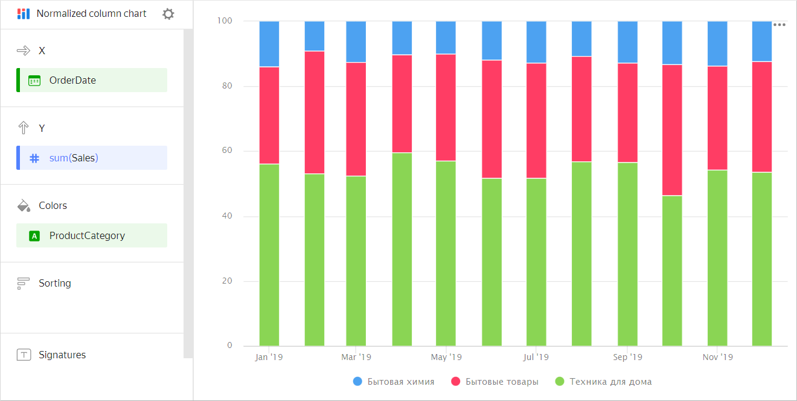
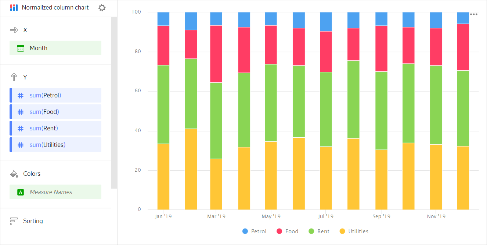

# Normalized column chart 

A normalized column chart shows the contribution of each measure or category to the total amount. Unlike a [stacked column chart](column-chart.md#stacked), the proportion of segment ratios and not the total column length is important for this type of chart. Segments are highlighted in different colors and located one above the other. The height of a segment indicates its ratio to the total amount represented as 100%. For example, the percentage of sales for different product categories.



| Month | Home appliances | Household goods | Household cleaners |
----- | ---------| ---------- | ----------
| January 2019 | 128K | 55K | 26K |
| February 2019 | 97K | 79K | 18K |
| March 2019 | 187K | 105K | 41K |
| April 2019 | 188K | 137K | 34K |
| May 2019 | 230K | 121K | 43K |
| June 2019 | 256K | 162K | 59K |
| July 2019 | 284K | 206K | 67K |
| August 2019 | 409K | 204K | 72K |
| September 2019 | 314K | 209K | 86K |
| October 2019 | 324K | 262K | 79K |
| November 2019 | 385K | 238K | 101K |
| December 2019 | 451K | 307K | 111K |



This type of chart is used to see the contribution of each measure to the total value by period or category. For example, to view the percentage of different expenses in the total budget amount.



| Month | Gasoline | Rent | Food | Utility bills |
----- | ---------| ---------- | ---------- | ----------
| January 2019 | 100 | 600 | 300 | 500 |
| February 2019 | 150 | 600 | 250 | 700 |
| March 2019 | 100 | 600 | 450 | 400 |
| April 2019 | 120 | 600 | 370 | 510 |
| May 2019 | 100 | 600 | 300 | 530 |
| June 2019 | 130 | 600 | 310 | 600 |
| July 2019 | 150 | 600 | 330 | 510 |
| August 2019 | 120 | 600 | 250 | 550 |
| September 2019 | 110 | 650 | 380 | 500 |
| October 2019 | 120 | 650 | 300 | 550 |
| November 2019 | 130 | 650 | 310 | 540 |
| December 2019 | 100 | 650 | 400 | 550 |



## Sections in the wizard {#wizard-sections}

| Section  in the wizard | Description |
----- | ----
| X | Dimensions. One or two dimensions can be specified. |
| Y | Measure. You can specify multiple measures. If you add more than one measure to a section, the **Colors** section contains a dimension named [Measure Names](../concepts/chart/measure-values.md). [Measure Names](../concepts/chart/measure-values.md) can be moved to the X-axis. |
| Colors | Dimension or the [Measure Names](../concepts/chart/measure-values.md) field. Affects the color of lines. [Measure Names](../concepts/chart/measure-values.md) is removed by deleting measures from the Y-axis. |
| Sorting | Dimension or measure. Affects the sorting of columns. |
| Signatures | Measure. Displays measure values on the chart. If multiple measures are added to the **Y** section, drag [Measure Values](../concepts/chart/measure-values.md) to this section. |
| Split | Dimension. Splits a chart horizontally by the selected dimension's values. The maximum number of splits per chart is 25. |
| Chart filters | Dimension or measure. Used as a filter. |

## Creating a normalized column chart {#create-diagram}

To create a normalized column chart:

1. On the {{ datalens-full-name }} [home page]({{ link-datalens-main }}), click **Create chart**.
1. Under **Dataset**, select a dataset for visualization.
1. Select **Normalized column chart** as the chart type.
1. Drag a dimension from the dataset to the **X** section. The values are displayed in the lower part of the chart on the X-axis.
1. Drag one or more measures from the dataset to the **Y** section. The values are displayed as columns on the Y-axis.
1. Drag a dimension from the dataset to the **Color** section. Columns are grouped into segments.

## Recommendations {#recomendations}

* 
* Don't display more than 3-5 segments on the chart.
* Place segments so that the largest or most important categories are located closer to the chart base. This makes it easier to compare the values.
* You can split a chart by dimension into a number of small charts that are convenient to compare to one another. To do this, drag a dimension from the dataset to the **Split** section.

  

  

  

* To display the absolute values of variables, use a [column chart](column-chart.md).
