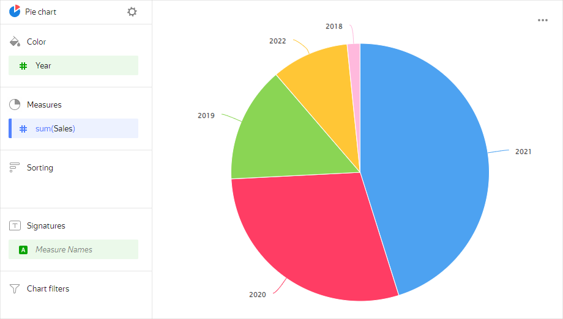
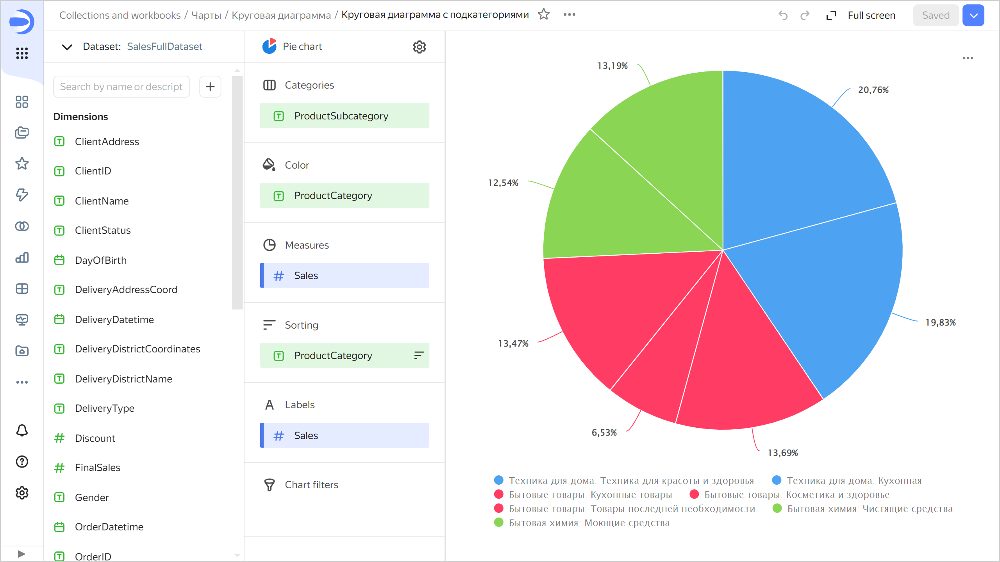
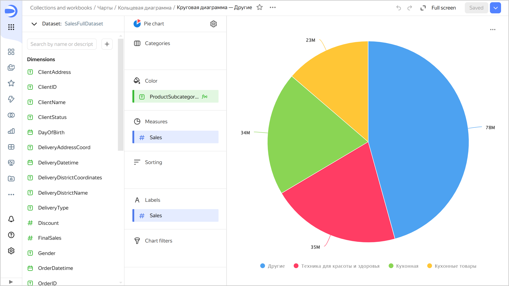

# Pie chart 

This chart shows a proportional relationship of different categories to a total using circle segments (sectors). The entire circle area is 100% and corresponds to the sum of all categories. The area of each segment corresponds to the percentage of a category in the total amount. Pie charts are a good choice for demonstrating proportions of a small number of segments.





Product categories | Sales |	
-----|---------| 
Home appliances | 69M |
Household goods | 57M |
Household cleaners | 44M |



You can highlight multiple small sectors belonging to a larger category with the same color.



## Wizard sections {#wizard-sections}

Wizard<br/> section| Description
----- | ----
Categories | Dimension. You can specify only one field here. Your data will be grouped by this field.
Color | Dimension. You can specify only one field here. Your charts segments will be colored according to it.
Measures | Measure. You can specify only one field here.
Sorting | Measure or dimension from the **Color** section. Affects area sorting. The sorting direction is marked with an icon next to the field:  for ascending or  for descending. To change the sorting direction, click the icon.
Labels | Measure. Displays measure values on the chart. To add callouts with category names to the chart, drag the [Measure Names](../concepts/chart/measure-values.md) dimension to this section. [Markup functions](../function-ref/markup-functions.md) are supported. For `String` type fields, you can configure using basic [{#T}](../dashboard/markdown.md) syntax: click the icon before the field name and enable **Markdown**.
Filters | Dimension or measure. Used as a filter.

## Creating a pie chart {#create-diagram}

To create a pie chart:





1. Go to the {{ datalens-short-name }} [home page]({{ link-datalens-main }}).
1. In the left-hand panel, select  **Charts**.
1. Click **Create chart** → **Chart**.
1. At the top left, click  **Select dataset** and specify the dataset to visualize.
1. Select **Pie chart** as the chart type.
1. Drag a dimension from the dataset to the **Categories** section.
1. Drag a dimension from the dataset to the **Color** section.
1. Drag a measure from the dataset to the **Measures** section. The values will be displayed as pie chart areas.

## Recommendations {#recommendations}

* If there are many segments, the chart looks cluttered and it becomes difficult to understand the data. If there are more than 4-6 segments in one chart, consider combining the smallest of them into one segment, e.g., `Other`. You can do this by processing the data, e.g., by creating a [calculated field](../concepts/calculations/index.md) in your dataset or chart.

  

  **Source table**

  ProductSubcategory | Sales |	
  -----|---------| 
  Beauty and health products | 11M |
  Kitchenware | 34M |
  Kitchen products | 23M |
  Detergents | 22.5M |
  Health and beauty equipment | 35M |
  Non-essential goods | 23M |
  Cleaners | 21.5M |

  To combine multiple segments by the `ProductSubcategory` field into a joined group:

  1. Add a new field to the chart with the following formula:

     ```
     CASE [ProductSubcategory]
         WHEN "Beauty and health equipment" THEN "Beauty and health equipment"
         WHEN "Kitchen" THEN "Kitchen"
         WHEN "Kitchenware" THEN "Kitchenware"
         ELSE "Other"
     END
     ```

  1. Drag the new field to the **Color** section.
  1. Drag the `Sales` field to the **Measures** and **Signatures** sections.

  The sales amount will be calculated separately for the `Beauty and health equipment`, `Kitchen`, and `Kitchenware` subcategories; for other subcategories, in the `Other` group.

  

  

* Combine small segments into larger groups:
  
  * Use the **Categories** section to highlight segments.
  * Use the **Color** section to highlight groups.

* You cannot display negative and null values on this type of chart.
* Do not use pie charts to show changes to proportions over time or for precisely comparing data by category.

#### See also {#see-also}

* [{#T}](../operations/dashboard/create.md)
* [{#T}](../operations/dashboard/add-chart.md)
* [{#T}](../operations/dashboard/add-selector.md)