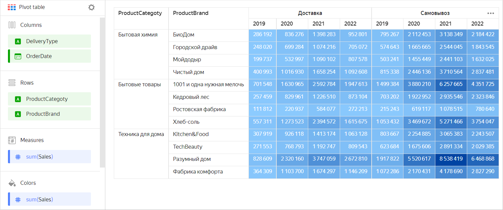
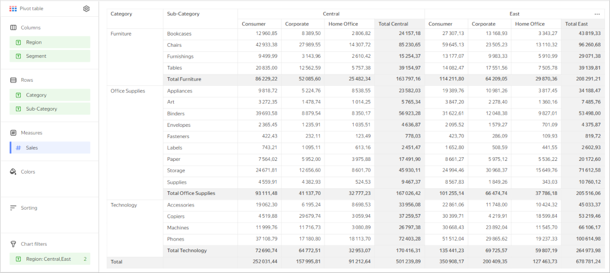
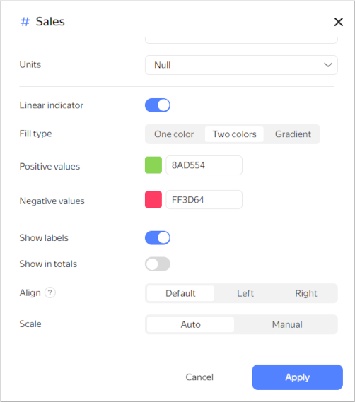
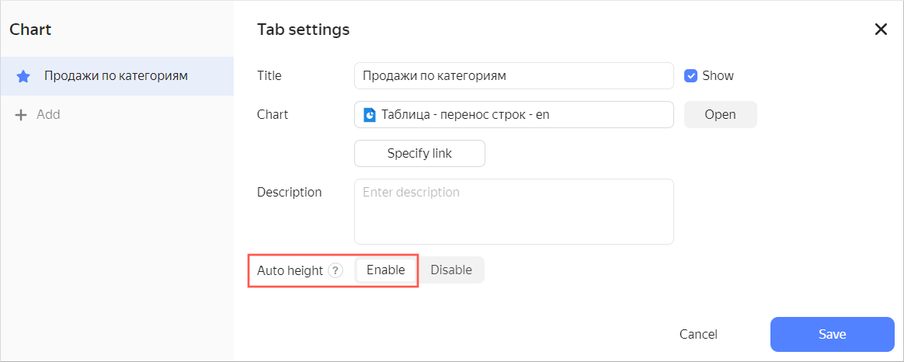
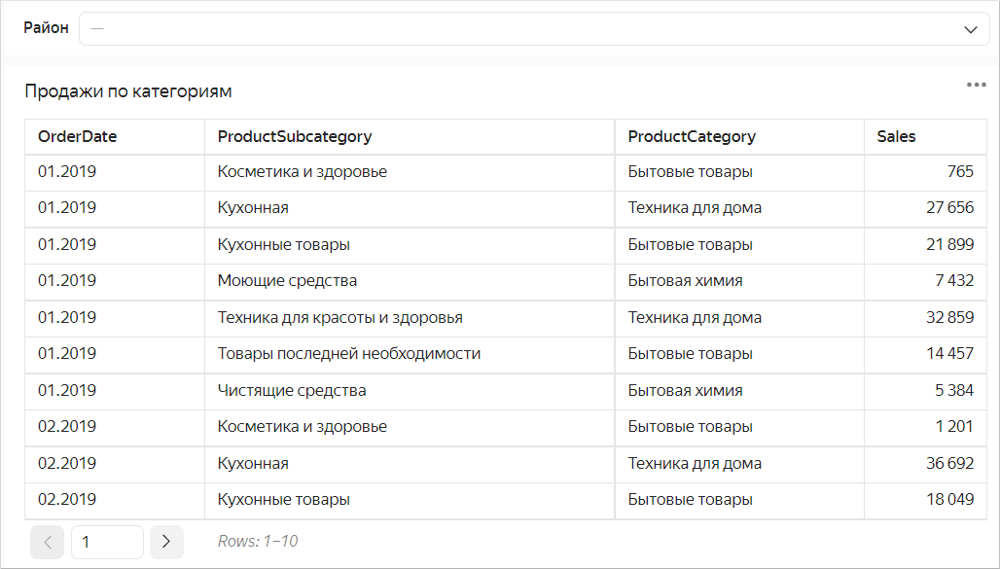
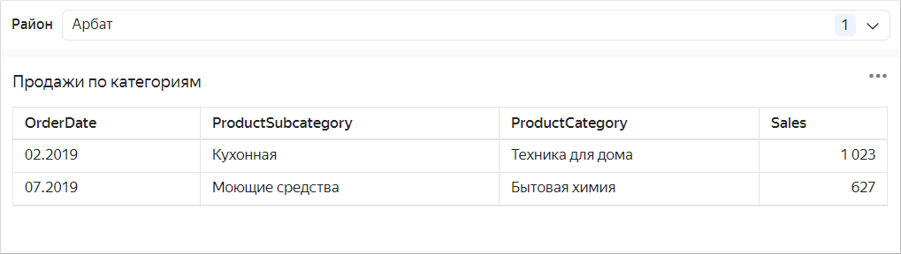
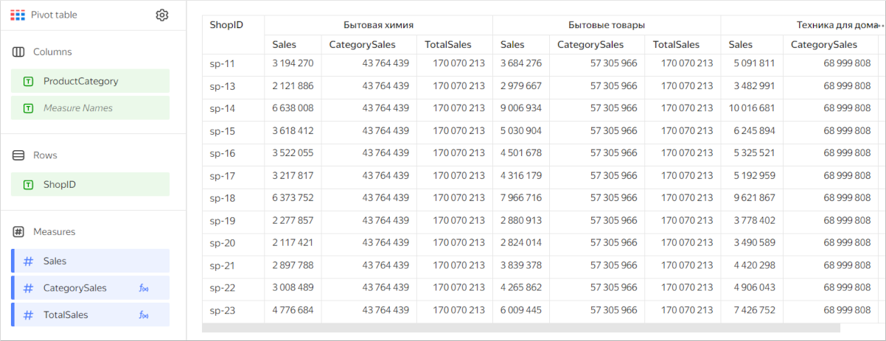
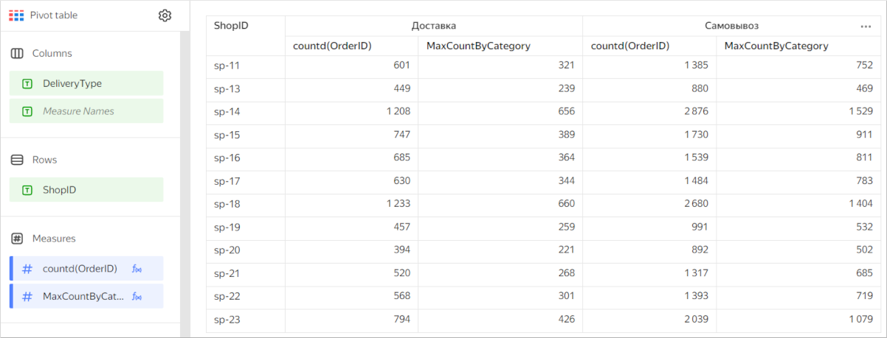

# Pivot table 

A table is a standard form of data representation with as many details as possible. Tables are most suitable for detailed analysis (a deep dive into figures) and problem detection. It is best to place tables at the end of a dashboard. Graphical representations are simpler for reading information, while tables take you deeper into the data and require more time to read.

Unlike a flat [table](table-chart.md), categories in a pivot table can be stored both in columns and rows. They may contain multiple categories, while cells at their intersection contain measure values.

Pivot tables make it easier to work with large amounts of data and let you analyze the relationship between different measures. For example, you can use this type of table to analyze product sales depending on the delivery type by brand and product category over a specific year.



| Categories | Product brand | Delivery type | 2019 | 2020 | 2021 | 2022 |
---------|---------|---------|---------|---------|---------|---------
| Household cleaners | BioDom | Delivery | 286192 | 836276 | 1398283 | 952801 |
| Household cleaners | City Driver | Delivery | 248020 | 699284 | 1074216 | 705072 |
| Household cleaners | Moydodyr | Delivery | 199737 | 532997 | 1090102 | 807578 |
| Household cleaners | Chistyy Dom | Delivery | 400993 | 1016930 | 1658254 | 1092608 |
| Household cleaners | BioDom | Pickup | 795267 | 2112453 | 3138349 | 2184422 |
| Household cleaners | City Driver | Pickup | 574643 | 1665665 | 2544045 | 1843545 |
| Household cleaners | Moydodyr | Pickup | 503241 | 1455449 | 2441103 | 1632025 |
| Household cleaners | Chistyy Dom | Pickup | 815338 | 2446136 | 3710564 | 2837481 |
| Household goods | 1001 necessary small things | Delivery | 701548 | 1630965 | 2592784 | 1947613 |
| Household goods | Cedar wood | Delivery | 257459 | 829961 | 1226510 | 873104 |
| Household goods | Rostov factory | Delivery | 111812 | 220937 | 584077 | 272213 |
| Household goods | Hleb-Sol | Delivery | 557311 | 1273523 | 2394572 | 1615675 |
| Household goods | 1001 necessary small things | Pickup | 1499384 | 3880210 | 6257665 | 4351725 |
| Household goods | Cedar wood | Pickup | 703202 | 1922952 | 2935546 | 2323846 |
| Household goods | Rostov factory | Pickup | 215243 | 619117 | 1078515 | 780640 |
| Household goods | Hleb-Sol | Pickup | 1053432 | 3469672 | 5271466 | 3754047 |
| Home appliances | Kitchen&Food | Delivery | 307919 | 926118 | 1413174 | 1063128 |
| Home appliances | TechBeauty | Delivery | 271553 | 768793 | 1192747 | 809543 |
| Home appliances | Razumnyy Dom | Delivery | 828609 | 2320160 | 3747059 | 2672810 |
| Home appliances | Fabrika Komforta | Delivery | 364309 | 1103700 | 1674297 | 1146209 |
| Home appliances | Kitchen&Food | Pickup | 803667 | 2254885 | 3065383 | 2243507 |
| Home appliances | TechBeauty | Pickup | 623684 | 1675606 | 2891334 | 2029385 |
| Home appliances | Razumnyy Dom | Pickup | 1917822 | 5520617 | 8538419 | 6468868 |
| Home appliances | Fabrika Komforta | Pickup | 1072286 | 2170431 | 4178690 | 2827290 |



## Wizard sections {#wizard-sections}

| Wizard  section | Description |
----- | ----
| Columns | Dimensions |
| Strings | Dimensions |
| Measures | Measures. If you add more than one measure to a section, the **Columns** section will contain the [Measure Names](../concepts/chart/measure-values.md) dimension that defines the location of the measure headers. [Measure Names](../concepts/chart/measure-values.md) can be moved to **Rows**. |
| Colors | Measure. Affects shading of all cells containing indicators. It may only contain one measure. |
| Sorting | Dimensions and measures specified in the **Columns** and **Rows** sections. You can use multiple dimensions and measures. The order of section fields affects the sorting order of table fields. The sorting direction is marked with an icon next to the field:  for ascending or  for descending. To change the sorting direction, click the icon. Sorting by measure only impacts a request to the source and does not affect the pivot table. |
| Filters | Dimension or measure. Used as a filter. |

## Creating a pivot table {#create-diagram}



Not supported in [QL charts](../concepts/chart/index.md#sql-charts).



To create a pivot table:



1. Go to the {{ datalens-short-name }} [home page]({{ link-datalens-main }}).
1. In the left-hand panel, select  **Charts**.
1. Click **Create chart** → **Chart**.
1. At the top left, click  **Select dataset** and specify the dataset to visualize.
1. Select the **Pivot table** chart type.
1. Drag a dimension from the dataset to the **Columns** section.
1. Drag a dimension from the dataset to the **Rows** section.

   

   In the **Columns** and **Rows** sections, you can change the order of dimensions by dragging them.

   

1. Drag a measure from the dataset to the **Measures** section. The values are displayed in the table cells.
1. Drag a measure from the dataset to the **Color** section. Cells with the measure are filled in with a color from the color gradient, depending on the measure value.

## Additional settings {#additional-settings}

### Renaming table columns and rows {#change-columns-names}

1. Under **Columns** or **Rows**, click the icon to the left of the dimension name.
1. In the window that opens, change the **Name** field value and click **Apply**.

### Adding a tooltip to a table header {#hint-column}

1. Under **Rows**, click the icon to the left of the dimension or measure name.
1. In the window that opens, enable the **Tooltip** option, enter the text in the field below and click **Apply**. By default, when you enable the option, the tooltip text is substituted from the field description in the [dataset](../concepts/dataset/index.md).

When the option is enabled, the  icon appears next to the table column header. Hover over the icon to bring up the tooltip.

### Setting up the width of table columns and rows {#set-column-width}

1. In the top-right corner of the **Columns** or **Rows** section, click  (the icon appears when you hover over the section).
1. In the **Column and row width** window that opens, set up the width of columns and rows:

   * `Auto`: Automatic column/row width.
   * `%`: Column/row width as a percentage of the table's total width.
   * `px`: Column/row width in pixels.

   The `%` and `px` options let you make a table cell break (by word). This may increase the number of rows in a cell.

   

   The total width of a table always takes up 100% of available space regardless of the specified width of individual columns and rows.

   

1. Click **Apply**.

To set the width of any column to `Auto`, click **Reset**.

### Adding rows with subtotals {#add-totals}

1. Under **Columns** or **Rows**, click the icon in front of the field name.
1. In the field settings window, enable **Sub-totals**.
1. Click **Apply**.

The table will show columns and/or rows with **Total <field_name>**.

To output the common **Total** row, enable **Sub-totals** in the settings for the first fields under **Columns** and **Rows**.







* The **Total** row does not support filtering by [measure](../concepts/dataset/data-model.md#field). You can hide the **Total** row by dragging a measure to the **Filters** or **Dashboard filters** section.
* Calculations using [LOD expressions](../concepts/lod-aggregation.md), [window functions](../function-ref/window-functions.md), and [time series functions](../function-ref/time-series-functions.md) may not work correctly in the row with totals.



### Setting up a field fill color {#set-field-colour}

1. Under **Columns**, **Rows**, or **Measures**, click the icon to the left of the field name.
1. In the window that opens, enable **Column fill color**.
1. In the **By field** list, select the field whose values the fill will be based on.
1. Set the **Fill type**:

   

   You can use the **Palette** type for dimensions and the **Gradient** type for measures.

   

   

   - For a dimension {#measure}

      1. Click the color scheme selection field and set a color for each dimension value.
      1. Click **Apply**.

   - For a measure {#indicator}

      1. Click the gradient selection field and set up:

         * **Gradient type**: Select two or three colors.

            * Gradient color: Select a color palette for the gradient from the list.
            * Gradient direction: Change the gradient direction using the  icon.

         * **Set threshold values**: Set numeric thresholds for each color.

      1. Click **Apply**.

   

1. Click **Apply**.

### Adding a linear indicator to a column with a measure {#add-linear-indicator}

1. Under **Measures**, click the icon to the left of the measure name.
1. In the window that opens, enable **Linear indicator**.
1. Specify the indicator settings:

   * **Fill type**: Type of fill color for the indicator.
   * **Positive values**: Indicator color for positive values.
   * **Negative values**: Indicator color for negative values.
   * **Show labels**: This option enables displaying measure values in a cell.
   * **Show in totals**: This option enables displaying the indicator in cells with totals.
   * **Align**: Left or right alignment of the indicator position in a column. Only applies if all numbers in a column are either positive or negative.
   * **Scale**: Sets the indicator scale. If you set it manually, specify the **min** and **max** values. Make sure the **min** value is less than or equal to `0` and the **max** value is larger than or equal to `0`.

   

   

   

1. Click **Apply**.

## Recommendations {#recomendations}

* Use a pivot table to represent aggregate data in table format.
* Place dimensions on the left and measures on the right. This makes the data easier to comprehend.
* Make sure column names you use are short and readable.
* Limit the size of your tables or use filters/sorting. Tables with too many rows or columns are hard to read.
* You can color table cells depending on the values of a measure. This will help you to highlight the values.
* Use tables for their intended purpose only. Do not replace all data visualization types with them.
* When posting a table on a dashboard, enable auto height in the widget settings. This will help you save dashboard space.

   

   

   

   If you use a filter, the table height will automatically adapt to the number of rows.

   

   If no value is set in the filter, a table displays all rows depending on the limit to the number of rows per page.

   

   If the number of displayed rows decreases when using the filter, the table height is reduced automatically.

   

   

* Represent totals (or subtotals) as a column. To do this, use calculated fields based on [window functions](../concepts/window-function-tutorial.md) or [LOD expressions](../concepts/lod-aggregation.md). For example:

   * Subtotal amount of sales by product category: the `CategorySales` measure with the formula `SUM(SUM([Sales]) WITHIN [ProductCategory])`.
   * Total sales: the `TotalSales` measure with the formula `SUM(SUM([Sales]) TOTAL)`.

      

      

      

   * Maximum order count per month grouped by product category: the `MaxCountByCategory` measure with the formula `MAX(COUNTD([OrderID] INCLUDE [ProductCategory]))`.

      

      

      

* Use sorting. This makes the data easier to comprehend.
* Use the [URL](../function-ref/URL.md) function in table cells to enable users to follow a link.
* When displaying numeric data, specify units and the number of decimal places. For example, if you select `Millions, M` in the drop-down list of the **Units** field, the `10.3 M` value is displayed instead of `10,345,234.23`. If you set the `Precision` field value to `2`, then `123.12` is displayed instead of `123.1234`.
