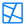
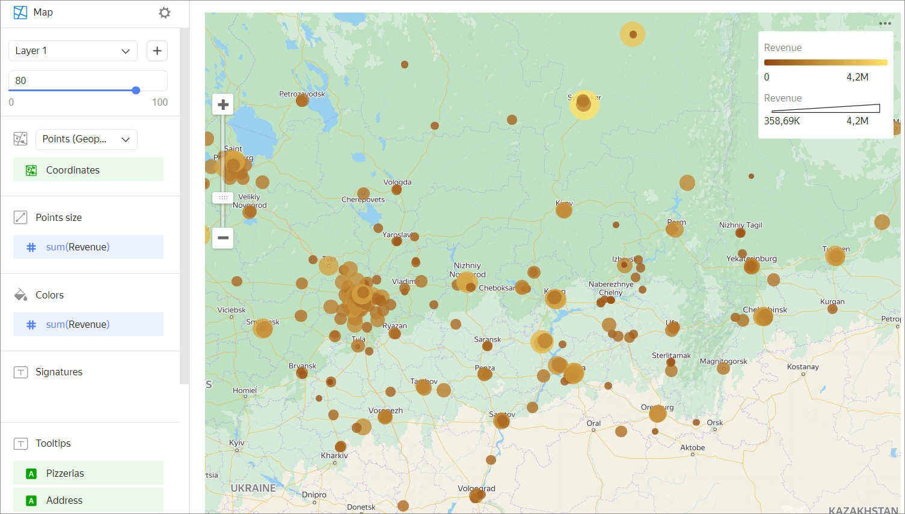

# Point map 

Each point is plotted by its geographic coordinates.

The size of a point can indicate the value of a measure: the larger the point area, the higher the measure value. This type of map is also called a bubble map.

Points may have different colors depending on the category they belong to. The color of a point can also indicate the value of a measure: the higher the value, the more intense the point fill.

This map is used to monitor how points are distributed across the area. For example, you can plot the location of stores on a point map and highlight a group with a high profit.

## Sections in the wizard {#wizard-sections}

| Section  in the wizard | Description |
----- | ----
| Points (Geopoints) | Measure with the type [Geopoint](../concepts/data-types.md#geopoint). |
| Points size | Measure. Sets a point size depending on the measure value. |
| Colors | Dimension or measure. Affects the intensity of point fill. |
| Signatures | Measure. Displayed as text on a point. When used, point size control is blocked. |
| Tooltips | Dimension or measure. A tooltip that appears when you hover over a point. |
| Layer filters | Dimension or measure. Used as a filter for the current layer. |
| Chart filters | Dimension or measure. Used as a filter for the entire chart. |

## Creating a point map {#create-diagram}

1. On the {{ datalens-full-name }} [home page]({{ link-datalens-main }}), click **Create chart**.
1. Under **Dataset**, select a dataset for visualization. If you don't have a dataset, [create one](../operations/dataset/create.md).
1. Select the **Map** chart type.
1. Select the **Points (Geopoints)** layer type.
1. Drag a dimension with the [Geopoint](../concepts/data-types.md#geopoint) type from the dataset to the layer type selection section.
1. Set the size of the points displayed on the point map. Drag a measure to the **Point size** section or click  in the line with the section name.
1. Color the points on the map. Move the measure or dimension to the **Colors** section.
1. Add tooltips to show the dimension and measure values when hovering over a point.

You can also:

* Add, rename, and delete a layer.
* Reorder the layers within a layer type.
* Apply a filter to the whole chart or one layer.

## Recommendations {#recomendations}

* Use color palettes corresponding to visualization aims and objectives.
* If the density of points on the map is high, make them less transparent. This will help you see where data intersects.
