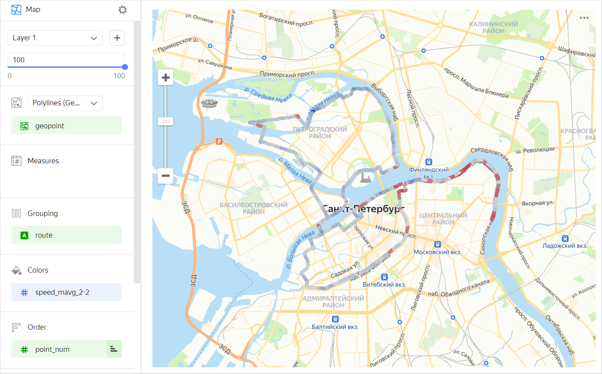
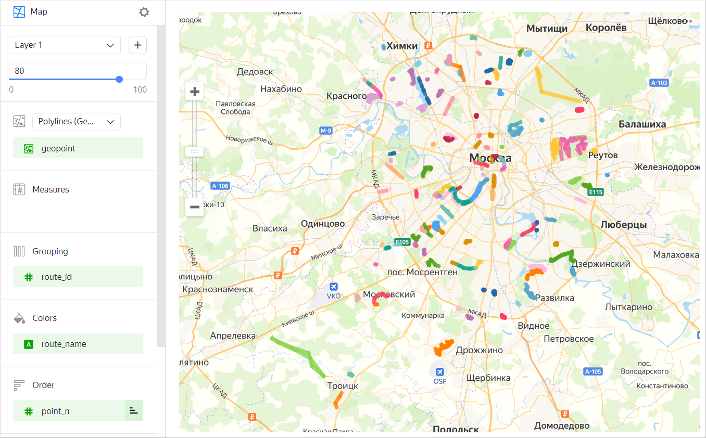

# Polyline map 

A polyline map is a type of geolayer on a **Map** chart that lets you draw polylines on the map. A polyline consists of points connected in a certain order. A polyline map is used, for example, to show the path of a moving object.

To build a polyline map, you need the following data:

* Coordinates of line points of the [Geopoint](../concepts/data-types.md#geopoint) data type. Each point of each polyline must be stored in a dataset as a separate row.
* A field or a set of fields to group points into lines (each line's ID).
* A field to sort the order of points in each line (such as a timestamp or point number).

You can color polyline segments in one of the following ways:

* In a gradient by measure (for a example, an average speed in a point).

  

* In discrete colors by dimension (for example, by trip name).

  

## Sections in the wizard {#wizard-sections}

| Section  in the wizard | Description |
----- | ----
| Polylines	(Geopoints) | Measure with the type [Geopoint](../concepts/data-types.md#geopoint). |
| Measures | Measure. The value displayed when you hover over a point. |
| Grouping | Dimension. Defines a group of points forming a polyline. |
| Colors | Dimension or measure. Affects the intensity of line segment fill. A segment is filled in from the originating point. |
| Order | Dimension. Defines the order for connecting points within a group. |
| Layer filters | Dimension or measure. Used as a filter for the current layer. |
| Chart filters | Dimension or measure. Used as a filter for the entire chart. |

## Creating a polyline map {#create-diagram}

To create a polyline map:

1. On the {{ datalens-full-name }} [home page]({{ link-datalens-main }}), click **Create chart**.
1. Under **Dataset**, select a dataset for visualization.
1. Select the **Map** chart type.
1. Select the **Polylines (Geopoints)** layer type.
1. Drag a dimension with the [Geopoint](../concepts/data-types.md#geopoint) type from the dataset to the layer type selection section.
1. Specify a group of points that defines polylines. Move the measure to the **Grouping** section.
1. Define the order for connecting points within the group. Move the measure to the **Order** section.
1. Color the line on the map. Move the measure or dimension to the **Colors** section.

You can also:

* Add, rename, and delete a layer.
* Apply a filter to the whole chart or one layer.

## Recommendations {#recomendations}

* Reduce the number of route points at the source level if there are too many of them. To do this, use a chart-level filter. This will speed up map loading and rendering.
* Use the [MAVG](../function-ref/MAVG.md) moving average function to smooth measure outliers of individual points/sections. For example, when building a line to represent the average speed using the `MAVG([speed],2,2)` function, the speed measure values are averaged in the current, two previous, and two subsequent points. As a result, the color gradient changes more smoothly.
