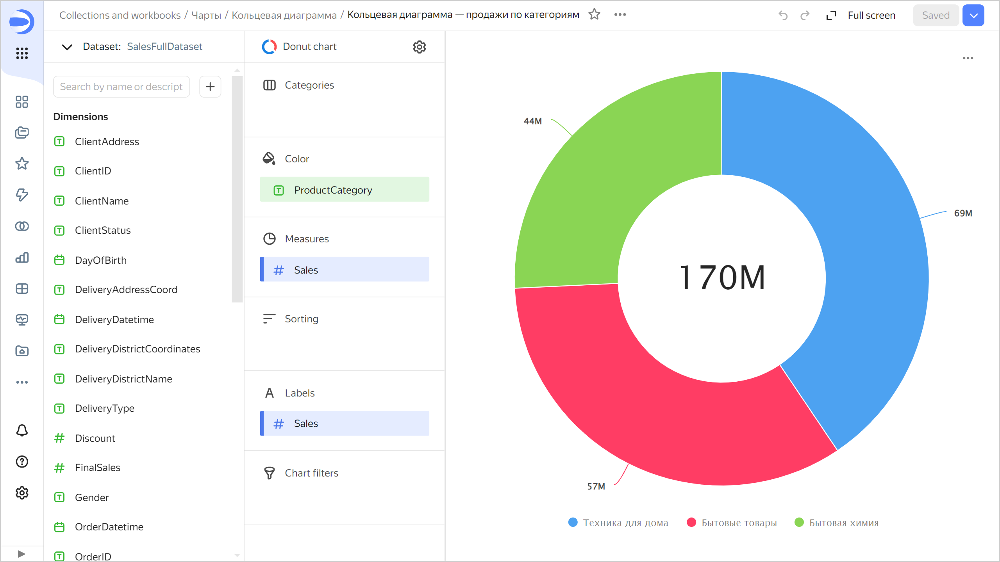

# Donut chart 

This chart shows the proportion of different categories using donut segments. The sum of all segments is 100%. The size of each segment corresponds to the percentage of a category in the total amount. A number in the center of a ring depends on the selected measure and indicates the overall total. Donut charts are a good choice if you need to display a small number of segments.



| Year | Sales |
-----|---------| 
| 2022 | 6M |
| 2021 | 28M |
| 2020 | 18M |
| 2019 | 9M |
| 2018 | 1M |



## Sections in the wizard {#wizard-sections}

| Section  in the wizard | Description |
----- | ----
| Color | Dimension. Only one field can be specified. |
| Measures | Affects the size of donut segments. The total value of a measure is displayed in the center of a ring. Only one field can be specified. |
| Sorting | A measure or dimension from the **Color** section. Affects segment sorting. The sorting direction is marked with an icon next to the field: ascending  or descending . To change the sorting direction, click the icon. |
| Signatures | Measure. Displays measure values on the chart. To add callouts with category names to the chart, drag the [Measure Names](../concepts/chart/measure-values.md) dimension to this section. |
| Filters | Dimension or measure. Used as a filter. |

## Creating a donut chart {#create-diagram}

To create a donut chart:

1. On the {{ datalens-full-name }} [home page]({{ link-datalens-main }}), click **Create chart**.
1. Under **Dataset**, select a dataset for visualization.
1. Select **Donut chart** as the chart type.
1. Drag a dimension or measure from the dataset to the **Color** section.
1. Drag a measure from the dataset to the **Measures** section. The values are displayed as donut chart segments.

To disable displaying a number in the center:

1. In the upper-left part of the screen, click .
1. In the **Chart settings** window, disable the **Results** option.
1. Click **Apply**.

## Recommendations {#recommendations}

* If there are more than 4-6 segments per chart, group the smallest of them as **Other**. A larger number of segments overloads a chart and makes it difficult to understand the data.
* You can't display negative and null values on this type of chart.
* Don't use donut charts to show changes to proportions over time or for precisely comparing data by category.