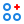
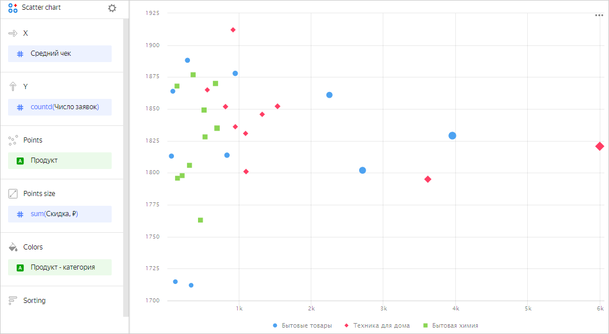
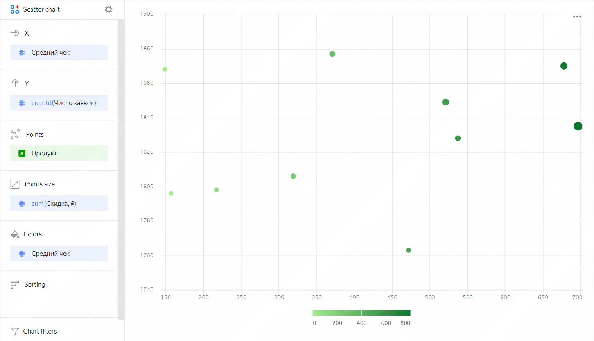

# Scatter chart 

A scatter chart shows the relationship between two values (dimensions or measures). Their values are represented as points. A scatter chart always has two axes: the values of one dimension or measure are plotted along the X-axis and those of the other along the Y-axis. A data point that links these two values is displayed at the intersection of the X and Y coordinates. These data points can be distributed along the X-axis evenly or unevenly, depending on specific data.

Use this type of chart if you need to find the dependency between dimensions and measures or show a range of values. For example, the relationship between the average order value and the number of orders for a product.

You can also represent dependencies on a scatter chart using point sizes. The size of a point depends on the measure value: the higher the value, the larger the point size. For example, the size of a point may depend on the discount on a product.





| Product | Category | Average order value | Number of orders | Discount |
----|----|----|----|-----|
| Floor cleaner liquid | Household cleaners | 153.0 | 1 | 0 |
| Multicooker with 40 modes | Home appliances | 3442.0 | 1 | 0 |
| Liquid detergent for colored clothes | Household cleaners | 525.0 | 1 | 0 |
| Carpet detergent | Household cleaners | 463.0 | 1 | 0 |
| Lemon dishwashing liquid | Household cleaners | 362.0 | 1 | 0 |

The dataset is built on [Sample ClickHouse](../quickstart.md) connection tables.



You can use a gradient in a chart by adding a measure to the **Colors** section. For example, the higher the average order value for a product, the darker the point shade.



## Sections in the wizard {#wizard-sections}

| Section  in the wizard | Description |
----- | ----
| X | Dimension or measure. Sets the X-axis value. |
| Y | Dimension or measure. Sets the Y-axis value. |
| Points | Dimension. Specifies the number of points on the chart. |
| Points size | Measure. Sets a point size depending on the measure value. |
| Colors | Dimension or measure. Affects the color of points. |
| Sorting | Dimension. Can only use a dimension from the X-axis. Affects the sorting of the X-axis. |
| Chart filters | Dimension or measure. Used as a filter. |

## Creating a scatter chart {#create-diagram}

To create a scatter chart:

1. On the {{ datalens-full-name }} [home page]({{link-datalens-main}}), click **Create chart**.
1. Under **Dataset**, select a dataset for visualization. If you don't have a dataset, [create one](../operations/dataset/create.md).
1. Select **Scatter chart** as the chart type.
1. Drag a dimension from the dataset to the **X** section.
1. Drag one or more measures from the dataset to the **Y** section. The values will be represented as points at the intersection of the X and Y coordinates.

You can also:

1. Change the color of points:

   1. Drag a dimension or measure from the dataset to the **Colors** section.
   1. Click  and set new colors.

1. Specify an additional dimension. To do this, drag a dimension to the **Points** section.

### Configuring the display of `null` values {#null-settings}



## Recommendations {#recomendations}

* 
* The axis scale often varies and may start with a value other than 0.  Pay attention to value signatures.
* A scatter chart isn't suitable for visualization of data over time.
* When visualizing multiple measures, select colors carefully. They should be distinguishable and contrasting.

