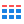
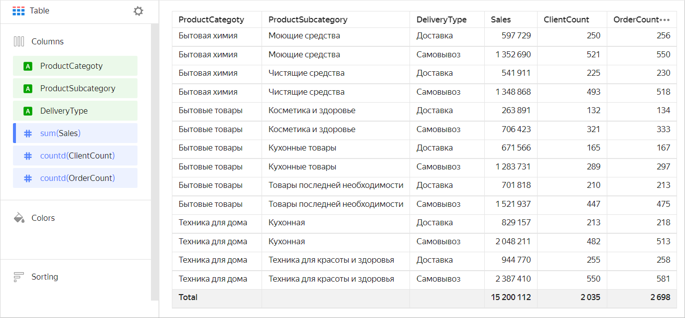
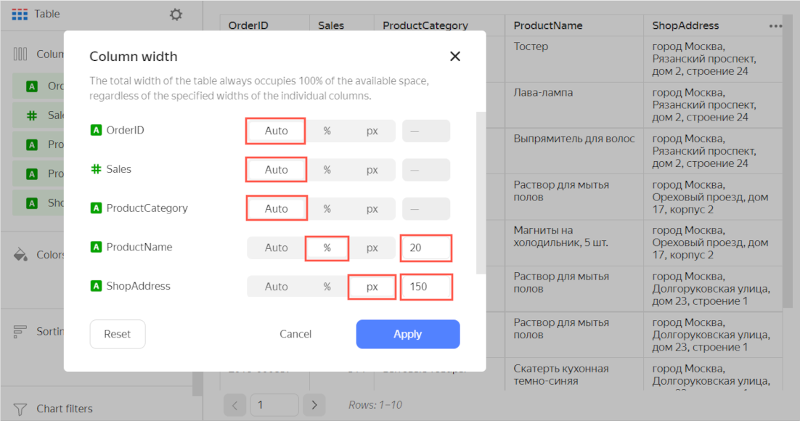
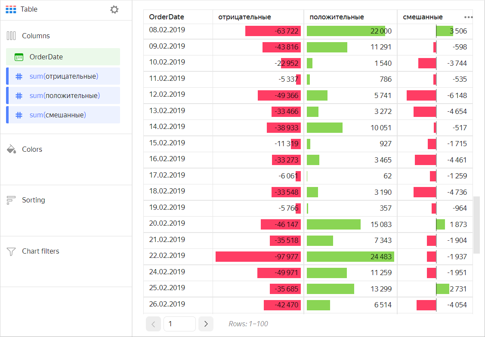
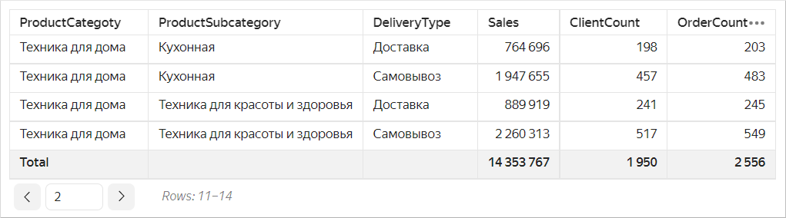
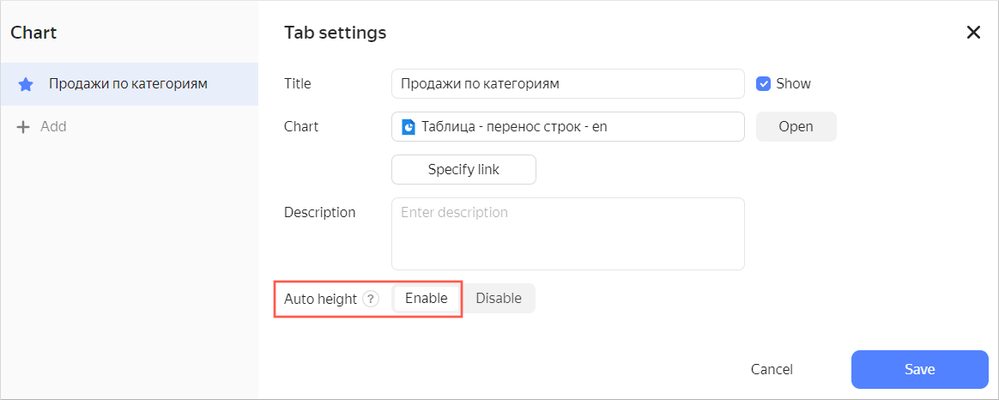
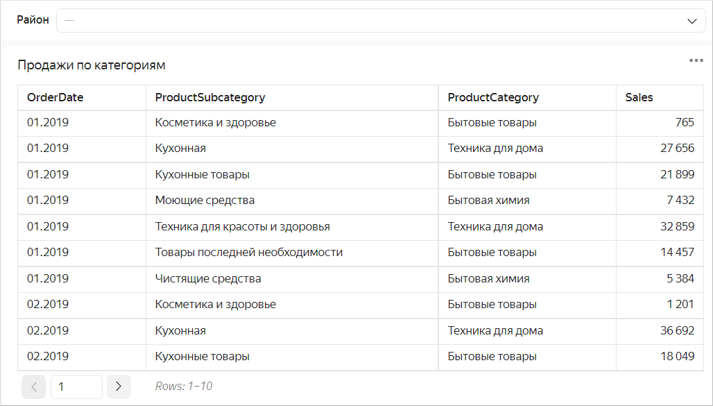
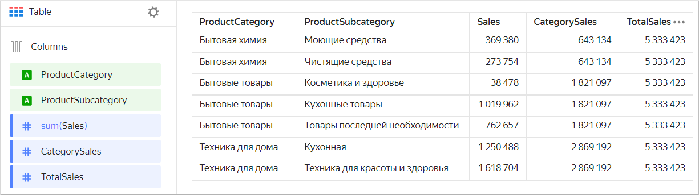
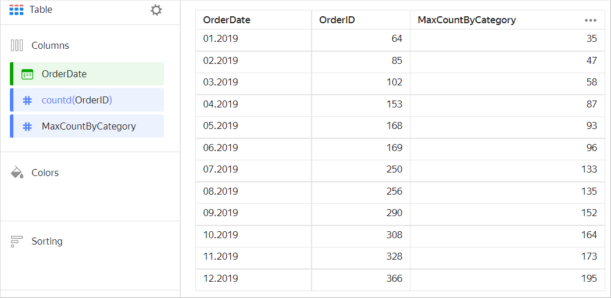
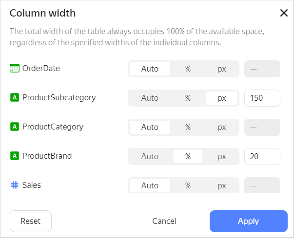

# Table 

A table is a standard form of data representation with as many details as possible. It stores data as a two-dimensional array that consists of columns and rows. Table column headers show dimension or measure names, while cells contain their values.  Each row is a set of cells with each column's value. A table may also contain a row with results.

Tables are a great tool for detailed analysis (a deep dive into figures) and problem detection. At the same time, it takes longer to read information from a table than from a graph or chart. That's why it's a good idea to place it at the end of a dashboard.

A table is a good choice for quantitative comparison, where you can see different values of multiple categories or dimensions. The table below shows three different measures by three categories.



| Categories | Subcategories | Delivery type | Sales | Number of customers | Number of orders |
---------|---------|---------|---------|---------|---------				
| Household cleaners | Detergents | Delivery | 597729 | 250 | 256 |
| Household cleaners | Detergents | Pickup | 1352690 | 521 | 550 |
| Household cleaners | Cleaners | Delivery | 541911 | 225 | 230 |
| Household cleaners | Cleaners | Pickup | 1348868 | 493 | 518 |
| Household goods | Beauty and health products | Delivery | 263891 | 132 | 134 |
| Household goods | Beauty and health products | Pickup | 706423 | 321 | 333 |
| Household goods | Kitchen products | Delivery | 671566 | 165 | 167 |
| Household goods | Kitchen products | Pickup | 1283731 | 289 | 297 |
| Household goods | Non-essential goods | Delivery | 701818 | 210 | 213 |
| Household goods | Non-essential goods | Pickup | 1521937 | 447 | 475 |
| Home appliances | Kitchenware | Delivery | 829157 | 213 | 218 |
| Home appliances | Kitchenware | Pickup | 2048211 | 482 | 513 |
| Home appliances | Health and beauty equipment | Delivery | 944770 | 255 | 258 |
| Home appliances | Health and beauty equipment | Pickup | 2387410 | 550 | 581 |



To make it easier to compare different values, you can add conditional formatting to a table: [row color](#add-column-colour) or [linear indicators](#add-linear-indicator).

## Sections in the wizard {#wizard-sections}

| Section  in the wizard | Description |
----- | ----
| Columns | Dimensions and measures to be used as columns. Field names are used as column headers. |
| Colors | Measure. Affects shading of all cells within a row. It may only contain one measure. |
| Sorting | Dimensions and measures specified in the **Columns** section. You can use multiple dimensions and measures. The order of section fields affects the sorting order of table fields. |
| Chart filters | Dimension or measure. Used as a filter. |

## Creating a table {#create-diagram}

To create a table:

1. On the {{ datalens-full-name }} [home page]({{ link-datalens-main }}), click **Create chart**.
1. Under **Dataset**, select a dataset for visualization.
1. Select the **Table** chart type.
1. Drag a dimension or measure from the dataset to **Columns**. The field is displayed as a column.

### Additional settings {#additional-settings}

#### Renaming table columns {#change-columns-names}

1. Under **Columns**, click the icon to the left of the dimension or measure name.
1. In the window that opens, change the **Name** field value and click **Apply**.

#### Setting up the width of table columns {#set-column-width}

1. In the top right corner of the **Columns** section, click  (the icon is displayed when you hover the mouse over the section).
1. In the **Column width** window that opens, set up the width of each column:

* `Auto`: Automatic column width.
* `%`: Column width as a percentage of the table's total width.
* `px`: Column width in pixels.

The `%` and `px` options let you make a table cell break (by word). This may increase the number of rows in a cell.







The total width of a table always takes up 100% of available space regardless of the specified width of individual columns.



1. Click **Apply**.

To set the width of any column to `Auto`, click **Reset**.

#### Adding a row with totals {#add-totals}

1. In the left part of the screen above the chart, click .
1. Enable the **Totals** settings.

The **Total** row is displayed in the table. Values in the row are calculated using the same formulas as [aggregation](../concepts/dataset/data-model.md#aggregation) in the measure.



Values in the **Total** row are calculated only for measures. For dimensions, the row is empty.



#### Adding row colors {#add-column-colour}

1. Drag a measure to the **Colors** section.
1. In the top right corner of the **Colors** section, click  (the icon is displayed when you mouse over the section).
1. Set up colors:

   * **Gradient type**: Select 2 or 3 colors.
     * Gradient color: Select a color palette for the gradient from the list.
     * Gradient direction: Change the gradient direction using the  icon.
   * **Set threshold values**: Set numeric thresholds for each color. Works if the **X** section contains a single value.

#### Adding a linear indicator to a column with a measure {#add-linear-indicator}

1. Under **Columns**, click the icon to the left of the measure name.
1. In the window that opens, enable **Linear indicator**.
1. You can also set up:

   * **Fill type**: Type of fill color for the indicator.
   * **Positive values**: Indicator color for positive values.
   * **Negative values**: Indicator color for negative values.
   * **Show labels**: This option enables or disables the display of measure values in a column.
   * **Align**: Left or right alignment of the indicator position in a column. Only applies if all numbers in a column are either positive or negative.
   * **Scale**: Sets the indicator scale. If you set it manually, specify the **min** and **max** values. Make sure the **min** value is less than or equal to `0` and the **max** value is larger than or equal to `0`.

   

   

   

1. Click **Apply**.





## Recommendations {#recomendations}

* Limit the size of a table, or use filters or sorting. It's hard to read tables with a large number of rows or columns.
* Use tables for their intended purpose only. Don't try to replace all visual data representation forms with them.
* Place dimensions on the left and measures on the right. This facilitates information perception.
* Make sure column names you use are short and easy to read.
* Enable the display of totals at the bottom of a table. If the **Pagination** option is selected, the `Total` row is placed on the last page.

  

  

  

* When posting a table on a dashboard, enable auto height in the widget settings. This will help you save dashboard space.

  

  

  

  If you use a filter, the table height will automatically adapt to the number of rows.

  

  If no value is set in the filter, a table displays all rows depending on the limit to the number of rows per page.

  

  If the number of displayed rows decreases when using the filter, the table height is reduced automatically.

  

  

* Represent totals (or subtotals) as a column. To do this, use calculated fields based on [window functions](../concepts/window-function-tutorial.md) or [LOD expressions](../concepts/lod-aggregation.md). For example:

  * Subtotal amount of sales by product category: the `CategorySales` measure with the formula `SUM(SUM([Sales]) WITHIN [ProductCategory])`.
  * Total sales: the `TotalSales` measure with the formula `SUM(SUM([Sales]) TOTAL)`.

    

    

    

  * Maximum order count per month grouped by product category: the `MaxCountByCategory` measure with the formula `MAX(COUNTD([OrderID] INCLUDE [ProductCategory]))`.

    

    

    

* Use sorting. This facilitates information perception.
* Use the [URL](../function-ref/URL.md) function in table cells to enable users to follow a link.

* If a table cell contains a long text, [set up](#additional-settings) the column width to enable a row break in cells.

  

  

  

* When displaying numeric data, specify units and the number of decimal places. For example, if you select `Millions, M` in the drop-down list of the **Units** field, the `10.3 M` value is displayed instead of `10,345,234.23` . If you set the `Precision` field value to `2`, then `123.12` is displayed instead of `123.1234`.
