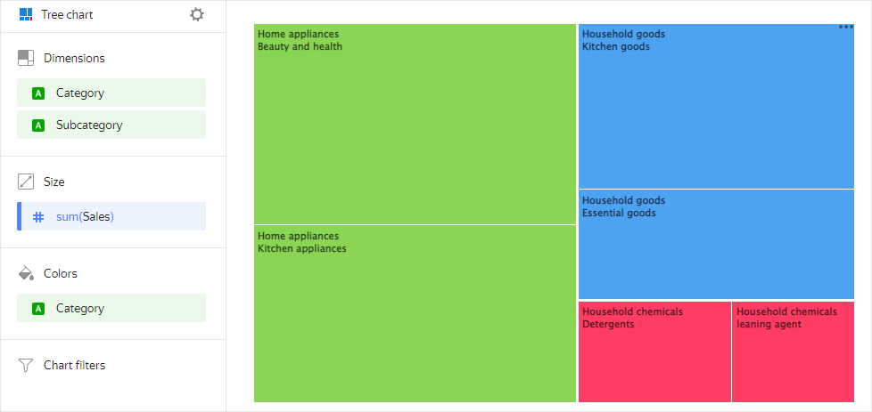

# Tree chart 

A tree chart displays hierarchy data as a set of nested rectangles. Each hierarchy level corresponds to a dimension and is shown as a colored rectangle with nested rectangles. The size of each rectangle depends on the measure value: the higher the value, the larger the size. A chart does not take up much space on a dashboard, even if it contains a lot of data.

For example, you can use a tree chart to visualize sales by product category and subcategory.



| Category        | Subcategory         | Sales  |
|------------------|----------------------|----------|
| Home appliances | Kitchenware             | 15000000 |
| Home appliances | Beauty and health products   | 17000000 |
| Household goods   | Kitchen products      | 12000000 |
| Household goods   | Essential goods | 8000000  |
| Household cleaners    | Detergents      | 4100000  |
| Household cleaners    | Cleaners    | 3300000  |



## Wizard sections {#wizard-sections}

Wizard  section| Description
----- | ----
Dimensions | Dimensions Determines the hierarchy tree of nested rectangles. For `String` type fields, you can configure using basic [{#T}](../dashboard/markdown.md) syntax: click the icon before the field name and enable **Markdown**.
Disk | Measure. One measure that determines the area of a rectangle.
Colors | Dimension or measure. Affects the shading of rectangles in a chart.
Filters | Dimension or measure. Used as a filter.

## Creating a tree chart {#create-diagram}

To create a tree chart:



1. Go to the {{ datalens-short-name }} [home page]({{ link-datalens-main }}).
1. In the left-hand panel, select  **Charts**.
1. Click **Create chart** → **Chart**.
1. At the top left, click  **Select dataset** and specify the dataset to visualize.
1. Select **Tree chart** as the chart type.
1. Drag one or more dimensions from the dataset to the **Dimensions** section.
1. Drag a measure from the dataset to the **Size** section. The values will be displayed as rectangles. The areas of the rectangles are proportional to the corresponding values of the selected measure.
1. Drag a measure or dimension from the **Dimensions** section to the **Color** section. As a result, the rectangles will be colored depending on the value of the added measure or dimension. A dimension that you can add to the **Color** section must be from the **Dimensions **section.
1. Drag a dimension or measure from the dataset to the **Filters** section. The field can be empty. In this case, no filters are applied.

## Recommendations {#recommendations}

* Use this type of chart to show the relationship between a part and a whole.
* If there are few categories (up to six), use a pie or donut chart.
* You cannot display negative values on a tree chart.