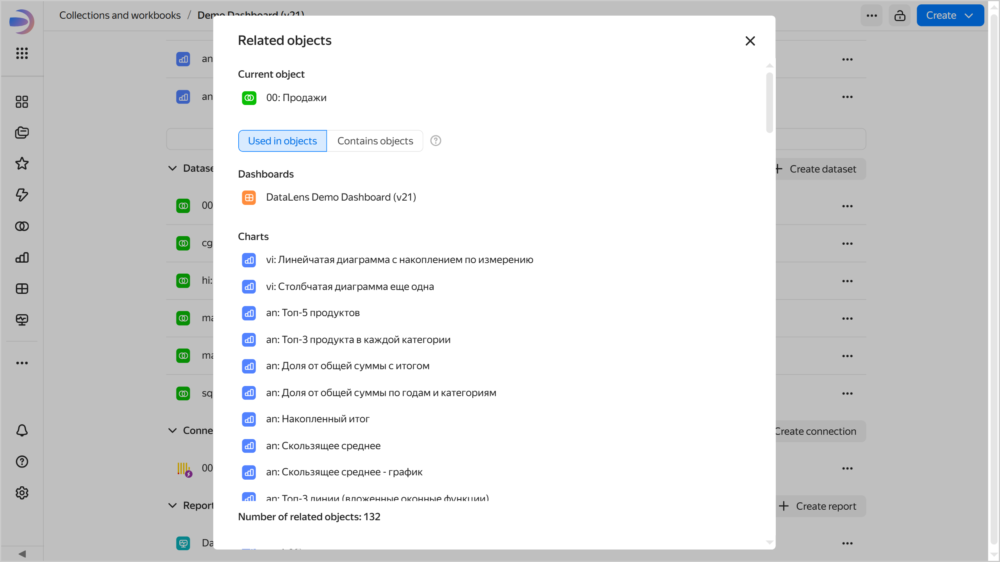

# {{ datalens-full-name }} workbooks and collections

Workbooks and collections are a new way to store objects in {{ datalens-short-name }}, which is alternative to the old navigation across folders. This new approach allows you to place {{ datalens-short-name }} objects in special containers:

* A **workbook** stores [connections](../concepts/connection.md), [datasets](../dataset/index.md), [charts](../concepts/chart/index.md), and [dashboards](../concepts/dashboard.md).

  

  

  

* A **collection** is a container used for grouping workbooks and other collections.

## Features of the new approach {#features}

Workbooks make it much easier to work with objects:

* They allow you to consistently [set up permissions](./security.md) to linked objects: connections, datasets, charts, and dashboards.
* With them, you can set up permissions for [user groups](../../iam/operations/groups/create.md).
* You can copy workbooks maintaining the integrity of internal links and making their copies independent of the original.

  

  Copying workbooks with [file](../operations/connection/create-file.md) connections is not supported.

  

* You can group workbooks into collections.

Object storage in workbooks and in folders of the old object model does not overlap:

* A workbook cannot be placed inside a folder.
* An object from a workbook cannot be added to a dashboard placed inside a folder.
* Folders do not support customization of user group access.
* An object from a workbook cannot be moved to a folder.

## How to enable workbooks and collections {#enable-workbooks}



* To enable workbooks, a user must have the `{{ roles-datalens-admin }}` role. They can do this only if a {{ datalens-short-name }} instance is deployed at the [organization](../concepts/organizations.md) level.
* Only workbooks and collections are available in new {{ datalens-short-name }} instances.



To get started with workbooks:

1. Go to the [service settings]({{ link-datalens-settings }}).
1. Under **Workbooks**, click **Enable workbooks**.

To transfer any object from a folder to a workbook, perform [migration](./migrations.md). If you are not going to use folder navigation anymore, you can [disable](../settings/disable-folder-navigation.md) it.

## Viewing linked objects {#related-objects}

You can look up where the object is used or which objects are used by it. Do it by clicking  →  **Linked objects** on the workbook page or object editing window. For example, this can give you a clue as to the sources used to build a dashboard or the charts based on a certain dataset.





If you get an error when opening the linked object window, click **Retry**.