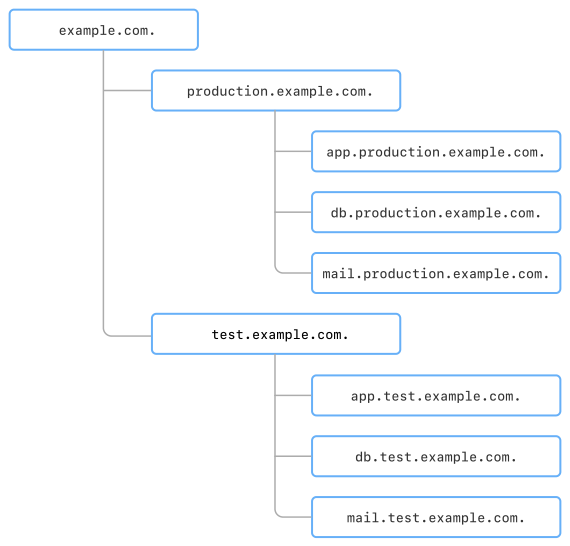

# DNS zones

A DNS zone is a logical space that combines the domain names of your resources and stores the necessary [resource records](resource-record.md). There are two types of DNS zones: [public](#public-zones) and [private](#private-zones). Regardless of the type, they have a hierarchy: a zone may have one or more subzones. There is a separate hierarchy of [reverse zones](#reverse-zone).

You can manage the hierarchy of cloud resources and route DNS requests. For example, you can create subzones for the production and test environments and, within them, subzones for applications, DB clusters, caching servers, and more.

The {{ yandex-cloud }} resource model is used to control access to zones, subzones, and resource records.
If a public zone is registered in {{ yandex-cloud }}:

* To create a subzone, you need the rights to manage the parent zone.
* To manage a subzone and its records, no rights to the parent zone are required.

This prevents the creation of subzones for the zones registered in {{ yandex-cloud }} that users have no access to.
You can create zones and subzones in different folders. To do this, assign the `editor` role for the folder the parent zone is in to a user or [service account](../../iam/concepts/users/service-accounts.md). To learn more, see [{#T}](../security/index.md).

For example, the `example.com.` parent zone is in the folder named `my-folder`. If you have the permissions to manage this zone, you can create the `test.example.com.` and `production.example.com.` subzones in the folders named `my-test-folder` and `my-production-folder`, respectively.

## Public zones {#public-zones}

Domain names in public zones are available from the internet. If you have a registered domain, you can delegate it. To do this, specify the addresses of {{ yandex-cloud }} name servers in the `NS` records of your registrar:

* `ns1.{{ dns-ns-host-sld }}.`
* `ns2.{{ dns-ns-host-sld }}.`

If you have already set up domain delegation, delete other `NS` records.



Make sure to transfer resource records (A, CNAME, TXT, etc., except for NS) from the previously used servers to the new public zone.



You cannot create top-level domain ([TLD](https://en.wikipedia.org/wiki/Top-level_domain)) zones, such as `ru.`, `com.`, `org.`, etc.

For security reasons, nested public zones can only be created by users and service accounts with the `dns.editor`, `dns.admin`, `editor`, or `admin` role for the folder the parent public zone is in. Remember this when organizing the structure of your domain names. For more complex scenarios, contact [support](../../support/overview.md).

The service does not require confirmation of domain ownership. You can use a domain zone even though it is not registered to you. If you delegated your domain to {{ dns-name }} without creating a respective public DNS zone in {{ dns-name }}, this zone can be used by someone else. Therefore, we recommend that you first create a public DNS zone in {{ dns-name }} and then delegate your domain. 



If somebody is using your public DNS zone, contact [support](../../support/overview.md) to confirm your rights to the zone.



Requests to public DNS zones and requests for external DNS names from your VMs are public DNS requests. {{ dns-name }} is used for public DNS requests even if your cloud doesn't contain any DNS zones other than service zones.

We recommend using [caching resolvers](../tutorials/local-dns-cache.md), such as `systemd-resolved`, `dnsmasq`, or `unbound`. You can use these to reduce the number of public DNS requests, and thereby, your [costs](../pricing.md#public-dns-requests).

## Private zones {#private-zones}

Domain names from private zones can only be used in the [{{ vpc-name }}](../../vpc/) (VPC) networks specified when creating a zone. Within private zones, you can use the entire namespace in the selected network's subnets, including `internal.` and `.`.



A created private zone overlaps public zones. If you create a private zone named `example.com`, all the `example.com.` subdomains accessible from the internet will become unavailable in this {{ vpc-short-name }} network.



### Service zones {#service-zones}

Service zones can be created in {{ vpc-short-name }} networks automatically. A list of these zones depends on the address range of the subnets used. For example:



* `.`
* `internal.`
* `10.in-addr.arpa.`
* `168.192.in-addr.arpa.`
* `16.172.in-addr.arpa.`
* `17.172.in-addr.arpa.`
* `18.172.in-addr.arpa.`
* `19.172.in-addr.arpa.`
* `20.172.in-addr.arpa.`
* `21.172.in-addr.arpa.`
* `22.172.in-addr.arpa.`
* `23.172.in-addr.arpa.`
* `24.172.in-addr.arpa.`
* `25.172.in-addr.arpa.`
* `26.172.in-addr.arpa.`
* `27.172.in-addr.arpa.`
* `28.172.in-addr.arpa.`
* `29.172.in-addr.arpa.`
* `30.172.in-addr.arpa.`
* `31.172.in-addr.arpa.`



These zones contain records with internal FQDNs of VMs and MDB database names, VM user names, and reverse records. You cannot edit records that are created automatically, but you can manage records that are added manually.

For security reasons, it is not allowed to create user records formatted as `*.yandexcloud.net` and `*.cloud.yandex.net`. To set up easy-to-memorize domain names for resources, we recommend registering [CNAME](resource-record.md#cname) or [ANAME](resource-record.md#aname) records in your private DNS zones.

To increase fault tolerance, some traffic may be routed to third-party recursive resolvers. To avoid this, contact [support](../../support/overview.md).

## Reverse zones {#reverse-zone}

In regular DNS records, a domain name is mapped to an IP address. For example, the `ya.ru` domain corresponds to `77.88.55.242`. Reverse DNS converts IP addresses back to domain names. For example, `77.88.55.242` will correspond to `ya.ru`.

Reverse DNS records reside in special DNS zones called ARPA zones. IPv4 and IPv6 blocks reside in separate zones.

You can [delegate reverse zone management](../qa/index.md#dns-reverse-zone).

## Use cases {#examples}

* [{#T}](../tutorials/local-dns-cache.md)
* [{#T}](../tutorials/dns-integration.md)
* [{#T}](../tutorials/mdb-dns-peering.md)
* [{#T}](../tutorials/bind-domain-vm/console.md)