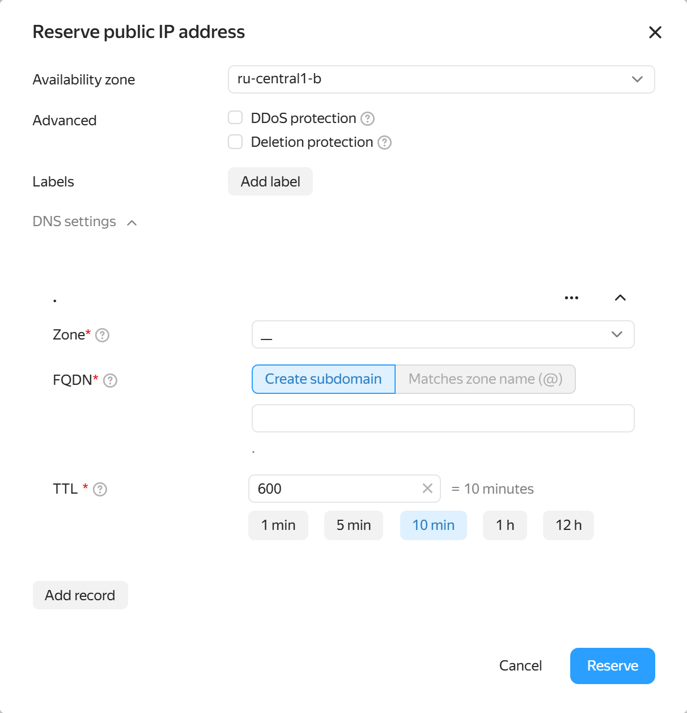
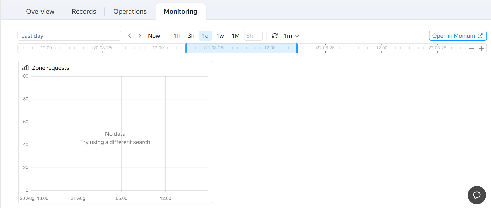

# {{ dns-full-name }} release notes

<!-- Changelog begin -->


```
date: 2024-09
index: 3
```

### {{ dns-name }} and {{ vpc-name }} integration



Indicate DNS records directly within public address specifications, set up resolution with zero extra steps, and store your network configuration in a single place.




```
date: 2024-06
index: 2
```

### NSDI (National Domain Name System) servers in your network

Extend the scope of your DNS infrastructure and manage names using your familiar administration tools in {{ yandex-cloud }}.




```
date: 2024-03
index: 1
```

### SVCB/HTTPS resource records

Speed up client connections to services and apply modern standards for more flexible traffic routing.

### Monitoring metrics



Monitor the state of your DNS infrastructure in real time and find the root causes of failures faster.



<!-- Changelog end -->

## Q3 2024 {#q3-2024}

Implemented integration with {{ vpc-name }} to define DNS records in public address specifications.

## Q2 2024 {#q2-2024}

Connected NSDI (National Domain Name System) servers to {{ dns-name }}.

## Q1 2024 {#q1-2024}

* Added resource records of the [SVCB/HTTPS](./concepts/resource-record.md#svcb-and-https-svcb-https) type.
* Added [monitoring metrics](./metrics.md).

