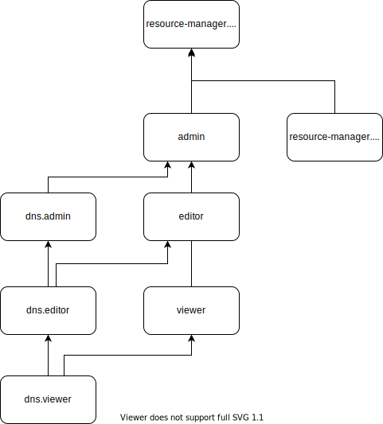

# Access management in {{ dns-name }}

In this section, you will learn:
* [Which resources you can assign roles to](#resources).
* [Which roles exist in the service](#roles-list).
* [Which roles are required](#required-roles) for particular actions.



## Which resources you can assign roles to {#resources}



## Which roles exist in the service {#roles-list}



### Service roles {#service-roles}

* 
* 
* 
* 

### Primitive roles {#primitive-roles}



## What roles do I need {#required-roles}

The table below lists the roles needed to perform a particular action. You can always assign a role granting more permissions than the role specified. For example, assign `editor` instead of `viewer` or `dns.admin` instead of `dns.editor`.

| Action | Methods | Required roles |
|:----------------------------------------------------------------------------------------------------------------------------------------------------|:-----------------------------------------------------------------:|:--------------------------------------------------------------------------------------------------------------------------------------------------------------------------------------------|
| **Viewing metadata** |                                                                   |                                                                                                                                                                                             |
| Viewing information about DNS zones | `get`, `list` | `dns.auditor` for this resource |
| **View data** |                                                                   |                                                                                                                                                                                             |
| Viewing information about DNS zones and their resource records | `get`, `list`, `listRecordSets` | `viewer` or `dns.viewer` for the resource in question |
| **Manage DNS zones** |                                                                   |                                                                                                                                                                                             |
| Create a zone | `create` | `editor` or `dns.editor` for the folder as well as `vpc.user` for the folder and the {{ vpc-short-name }} network if it is an internal zone |
| Edit and delete zones | `update`, `delete` | `editor` or `dns.editor` for the folder as well as `vpc.user` for the folder and the {{ vpc-short-name }} network if it is an internal zone |
| Creating subzones | `create` | `editor` or `dns.editor` for the folder housing the zone that will include the subzones being created as well as `vpc.user` for this folder or {{ vpc-short-name }} network if it is an internal zone |
| **Manage resource records** |                                                                   |                                                                                                                                                                            |
| Create resource records in a DNS zone | `create` | `editor` or `dns.editor` for the folder or zone |
| Edit and delete resource records | `update`, `delete` | `editor` or `dns.editor` |
| **Manage access to DNS zones** |                                                                   |                                                                                                                                                                            |
| [Grant a role](../../iam/operations/roles/grant.md), [revoke a role](../../iam/operations/roles/revoke.md), and view roles granted for DNS zones | `setAccessBindings`, `updateAccessBindings`, `listAccessBindings` | `admin` or `dns.admin` for the folder or zone |

To restrict user access, assign users roles for individual zones or subzones.

#### What's next {#next}

* [How to assign a role](../../iam/operations/roles/grant.md).
* [How to revoke a role](../../iam/operations/roles/revoke.md).
* [Learn more about access management in {{ yandex-cloud }}](../../iam/concepts/access-control/index.md).
* [Learn more about inheriting roles](../../resource-manager/concepts/resources-hierarchy.md#access-rights-inheritance).
