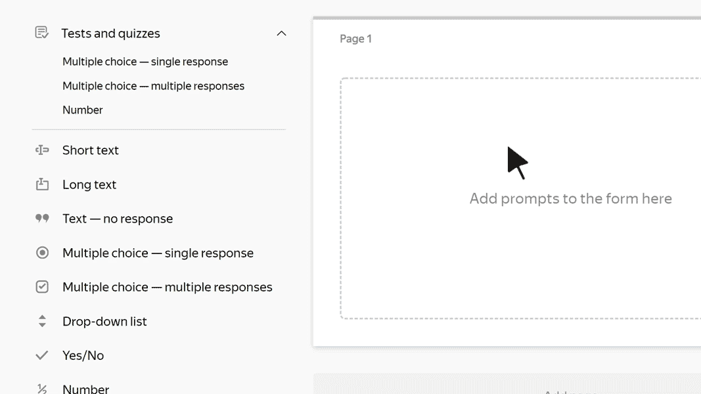
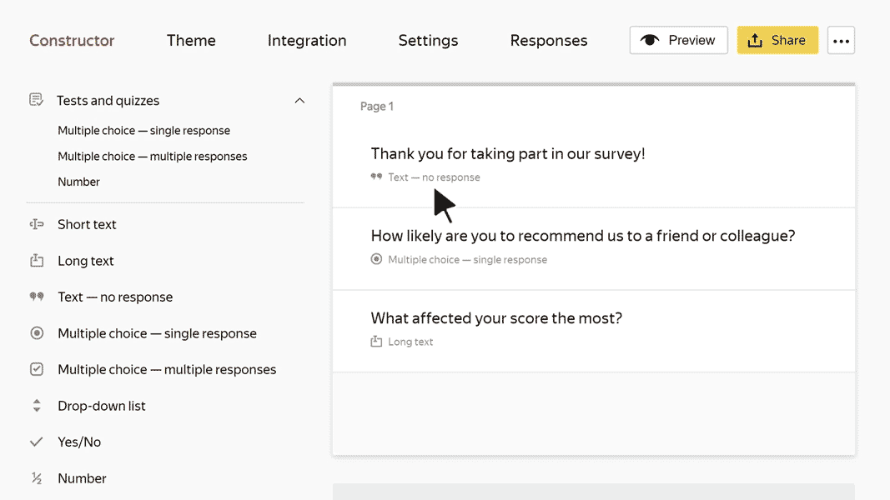

# Add prompts

A form consists of blocks of prompts, which are fields or lists where users can respond to a prompt or enter some data. You can set limits or response options for blocks and set conditions for showing or hiding blocks depending on how the user responded to other prompts.

## Add a prompt block {#section_zlk_g4z_sbb}

1. Select a form. The **Constructor** tab opens.

1. To add a prompt block to the form, select it from the list on the left and drag it to the workspace. To learn more about how different prompt blocks work, go to [{#T}](#sec_questions_ref).

1. In the **Edit a response** window that opens, [set the block parameters](#params). To configure a previously added block, click it.

1. To change the order of prompts, hover over the block and drag the  icon to where you want it.

   

1. If you want to show or hide a block depending on how the user responded to other prompts, [set the block display conditions](#conditions).

1. To remove a prompt block, click .

1. To split a form into multiple pages, click **Add page** at the bottom of the workspace. Users can switch between form pages using the **Next** and **Back** buttons.

   

   Users can't go to the next page until they fill in the required fields.

   

1. To see what the form you created looks like, click **Preview**.

## Configure prompt parameters {#params}

To configure the parameters of a prompt block, click it. This opens the **Edit a response** window:

- On the left of the window, you can configure prompt parameters.

- On the right of the window, you can see what the prompt looks like in the form.

Depending on the prompt type, different parameters are available for editing:

- **Prompt**: The main text in the block. It is usually a field header or a prompt for the user to respond to.

- **Responses**: Parameters for blocks where the user needs to select responses from multiple options. You can set a list of acceptable responses or limit the choice of responses (for example, for prompts to select a date or city).

- **Settings**: Parameters you can use to set limits or additional block properties. For instance, you can require the user to fill in a field or configure the sorting of response options.

- **Validation**: Works for some types of fields, such as Number or TIN. Use validation to check the response format. If the format is incorrect, the user sees a warning. For more information, see the [Response validation](option-validation) section.

For more information about parameter descriptions, see [{#T}](blocks-ref/blocks-reference.md).

## Set conditions for showing a prompt {#conditions}

You can show or hide a block depending on how the user responded to previous prompts:

1. Hover over the section and сlick the .

1. Select the **provided** option

1. Set the condition for showing your prompt:

   - Select the prompt that determines whether to show or hide the block.
      You can only pick a prompt that precedes the block being set up.
      You can't set the condition for showing the first prompt.

   - Choose a comparison operation: **equal** or **not equal**.

   - Select or enter a response that the user's response needs to match.

1. To add multiple conditions, click **Add condition** and set a logical operator.

   If you put the **AND** logical operator between two conditions, both of them must be met. If you use **OR**, at least one condition must be met.

   If you add multiple conditions with different operators, the conditions are checked from top to bottom. The **AND** operator doesn't take priority over the **OR** operator.

   

   To make sure results are predictable when checking a group of conditions, we recommend using just one operator type: all conditions with **AND** or all conditions with **OR**.

   

## How to add a field for an arbitrary response {#field-free-answ}

To allow a user to give an arbitrary response in a form with a fixed set of responses, use a condition for showing a prompt:

1. Add prompts to the form:

   - **Multiple answers** or **One answer** with multiple response options. In addition to fixed responses, set an arbitrary response, such as "Other".

   - **Short text**. The user can enter any text in this field.

1. In the constructor, hover over the "Short text" prompt and click .

1. Select the **provided** option

1. Set the condition for showing your prompt:

   - Select a prompt with fixed response options that determine whether to show or hide the block.

   - Choose a comparison operation **equal**.

   - Select "Other".

This way, if the user selects "Other" in a multiple-choice prompt, they will see a field for entering any text.

## What prompts to use {#sec_questions_ref}

If you aren't sure which prompt block is right for your form, use the table:

| What kind of response you want to get | Which block to choose |
----- | -----
| Any word or short phrase. For example, a name. | [{#T}](blocks-ref/short-text.md) |
| An arbitrary long text. For example, feedback | [{#T}](blocks-ref/long-text.md) |
| Number. For example, an amount of money. | [{#T}](blocks-ref/number.md)  [{#T}](blocks-ref/integer.md) |
| Date or date range. For example, the date of an event. | [{#T}](blocks-ref/date.md) |
| Email address | [{#T}](blocks-ref/email.md) |
| Phone number | [{#T}](blocks-ref/phone.md) |
| Link. For example, a link to a social media profile. | [{#T}](blocks-ref/link.md) |
| File uploaded by the user. For example, photo. | [{#T}](blocks-ref/file.md) |
| A response selected from the suggested options. For example, a product color. | [{#T}](blocks-ref/dropdown.md)  [{#T}](blocks-ref/radiobutton.md) |
| Multiple responses selected from the suggested options. For example, a request for multiple services. | [{#T}](blocks-ref/multiple.md) |
| The name of a city or country. For example, the user's place of residence. | [{#T}](blocks-ref/cities.md) |
| Multiple ratings on a scale. For example, rating an event using multiple criteria. | [{#T}](blocks-ref/rating.md) |
| Agreement with a statement or acceptance of an action. For example, consent to receive emails. | [{#T}](blocks-ref/yes-no.md) |
| A response to a [test](tests.md) prompt that earns points for correct responses. | Prompts from the **Tests and quizzes** category:<ul><li>[{#T}](blocks-ref/test-single.md)<li>[{#T}](blocks-ref/test-multiple.md)<li>[{#T}](blocks-ref/test-number.md)<ul/> |
| Information that doesn't require a response. For example, a header for a group of prompts. | [{#T}](blocks-ref/no-question.md) |
| TIN of company | [{#T}](blocks-ref/inn.md) |
| Responses to a group of repeating prompts. For example, you may need to specify the details of several participants to register them for an event. | [{#T}](blocks-ref/series.md) |
| The name of an employee of a {{ org-full-name }} organization | [{#T}](blocks-ref/people.md) |
| Name of a department or team in {{ org-full-name }} company | [{#T}](blocks-ref/departments.md) [{#T}](blocks-ref/teams.md) |
| A block with response options that are loaded from a [dynamic {{ wiki-name }} table](../wiki/create-grid.md) | [{#T}](blocks-ref/wiki.md) |
