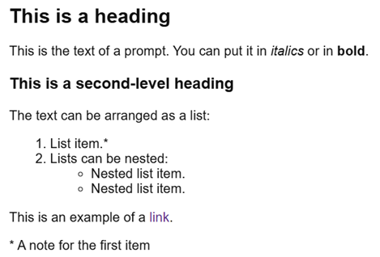

# Customize the form appearance

## Customize the theme {#section_sgz_my3_j3b}

To make your form unique and appealing, customize the appearance of the text and buttons or add a background image:

1. Select the form and go to the **Theme** tab.

1. Pick one of the available themes or create your own using the **Create theme** button:

    1. Set a background for the form workspace: choose a fill color or an image from the gallery, or upload your own background. You can set background transparency, corner rounding, and text indentation. To make the background visible behind the response fields, set field transparency.

    1. Select a font and color of the text. Try to choose a color that makes the text easy to read against your selected background.

    1. Adjust the color, shape, and position of the buttons.

    1. Select the backdrop — that's the background around the form workspace. To do so, turn on **Add backdrop**, and then select a fill color, pick an image from the gallery, or upload your own background. The backdrop is visible if you [open the form via the link](publish.md#section_link).

    1. Click **Save**. To change your theme, hover over it and click .

1. Click **Save** at the bottom of the page.

If the form is already published, its design changes.

## Button names and messages {#sec_submit}

You can set button names on the form and the message that the user sees after submitting their response:

1. Select the form and go to **Settings** → **Text and submit logic**.

1. In the **Form submission button**, **Next page button**, **Previous page button** blocks, change the button names.

1. In the **Event after submit** section, edit the title and text of your message.

1. Click **Save**.

## Text formatting {#section_pzm_m1j_j3b}

To add formatting elements like headers, lists, links, and italics to the text, use [Markdown]({{ link-wikipedia-markdown }}). You can use Markdown to format:

- Prompts and comments.

- Response options.

- The message about sending the form.



For text formatting, Markdown uses `*`, `-`, `>`, and some other characters. If these characters are at the beginning of a line, they change the appearance of the text, but aren't displayed. To display them, add `\*` (a backslash) before them.



## Sample markup {#markdown-example}

**Markup:**

```
## This is a heading

This is the text of a prompt. You can put it in *italics* or in **bold**.

### This is a second-level heading

The text can be arranged as a list:
1. List item.*
1. Lists can be nested:
    * Nested list item.
    * Nested list item.

This is an example of a [link](https://yandex.ru).

\* A note for the first item.
```

**Result:**



