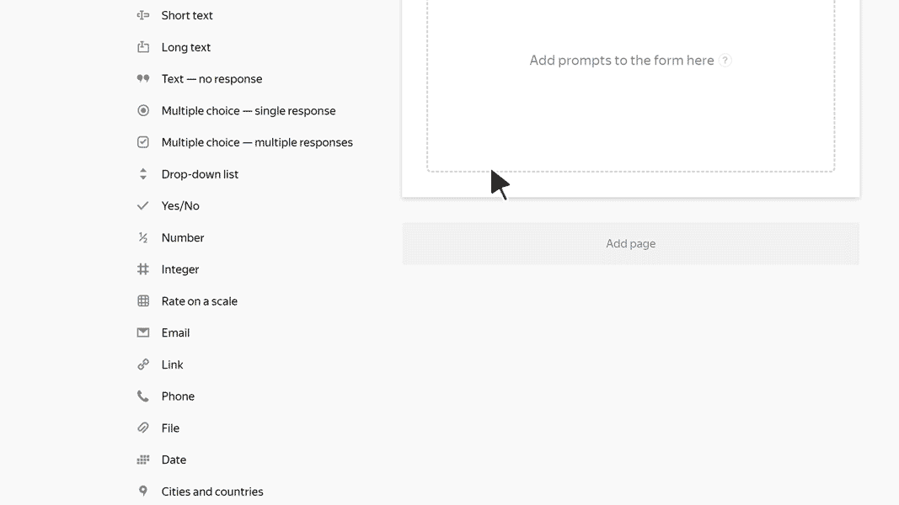

# Cities and countries

In this block, the user can select cities or countries. For example, they can specify the city where they live.

Suggestions are available from the city and country directory.

## Block settings {#sec_settings}

### Question {#question}

Enter a field name or a prompt.



### Responses {#answer}

You can limit response options to a set list of countries or cities.

- To allow users to only select the countries that you specified:

   1. Select **Countries**.

   1. Turn on **Limit list of countries**.

   1. In the **Select countries** field, specify one or more countries.

- To allow users to only select cities in the countries that you specified (for example, if you use a form to accept mail orders but can only deliver them within Russia):

   1. Select **Cities**.

   1. Turn on **Limit countries available for city selection**.

   1. In the **Select countries** field, specify one or more countries.



### Several options {#multi}

Enable this option to allow multiple choice of cities or countries. For example, to specify the countries the user has been to.

