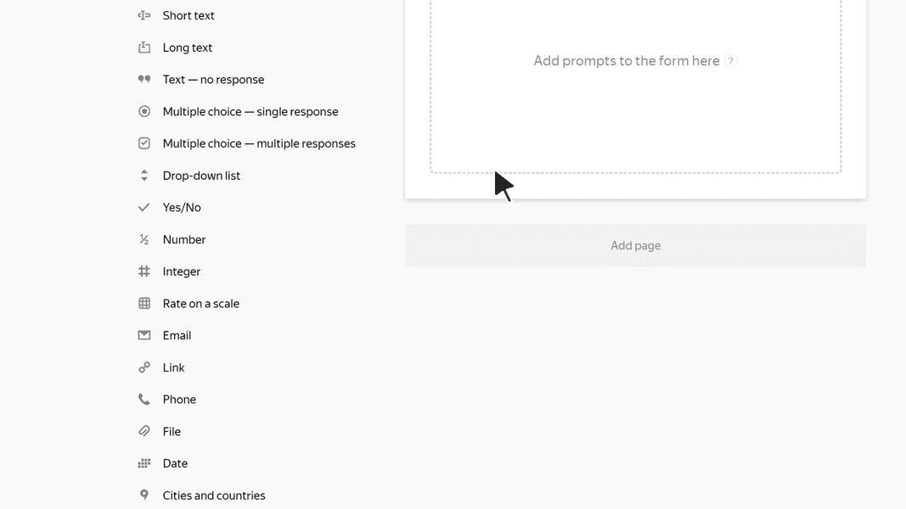

# Date

In this block, the user can specify a date or a range of dates. For example, a date of birth or a vacation period.

## Block settings {#sec_settings}

### Question {#question}

Enter a field name or a prompt.



### Date range {#range}

Enable this option to get a range of dates in a response. For example, vacation start and end dates.
If the option is disabled, the user can only enter a single date.

### Limit a response to a period {#limit}

Enable this option to specify a range for the user to select a date from. For example, if you are having users sign up for an event that will last a week. 







