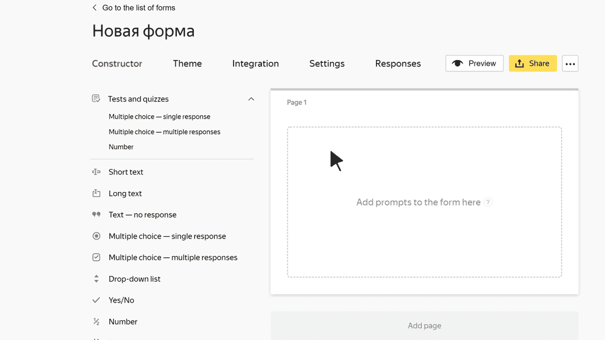

# Drop-down list

In this block, the user can select an item from a drop-down list. For example, their marital status.

## Block settings {#sec_settings}

### Question {#question}

Enter the list title or prompt.









### Automatically insert the first response option {#first}

Turn on this option to insert the first response in the list by default. For example, do this if you think that this option fits most users.
Sorting responses affects which response is automatically inserted.

### Filter responses when typing text in the field {#filter}

Turn on this option so that the user can type in the field with the list. In this case, only the response options that match the entered text are displayed in the list.





