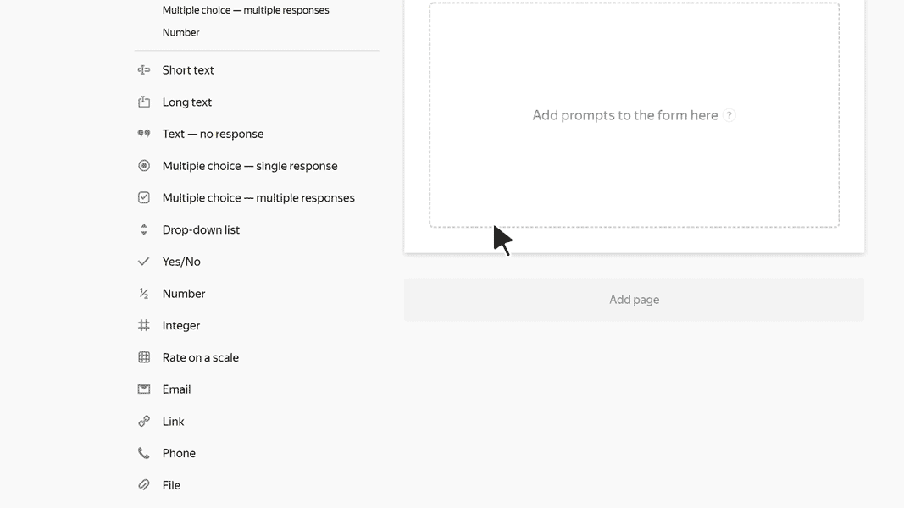

# File

Using this block, the user can attach a file to a form. For example, a photo or error report.

Users can attach up to 20 files with a maximum total size of 20 MB. Within these limits, you can restrict the total number and size of files that your users can attach.



The service stores files attached to the form for 3 months 1 year. After that, the files are deleted and no longer available for download.



## Block settings {#sec_settings}

### Question {#question}

Enter the block title.





### Allow multiple attachments {#alow-multi}

This option is always on by default. The user can attach up to 20 files to the form. To only allow one file to be attached, turn off this option.