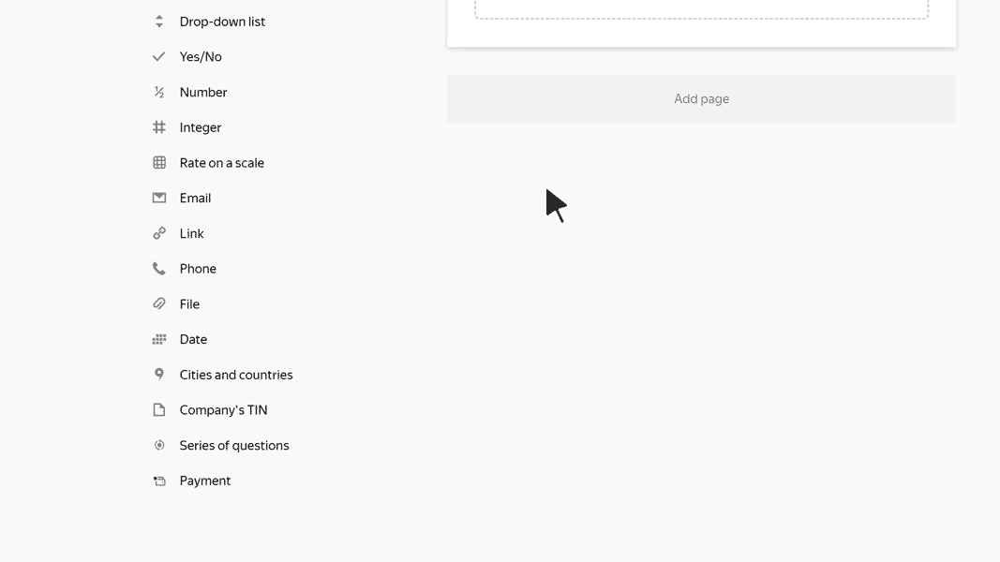

# TIN

In this block, the user can enter the TIN (taxpayer ID) of an individual or a legal entity. When the form is sent, the TIN format and the check digit are verified.

## Block settings {#sec_settings}

### Question {#question}

Enter a field name.





### Validation {#validate}

