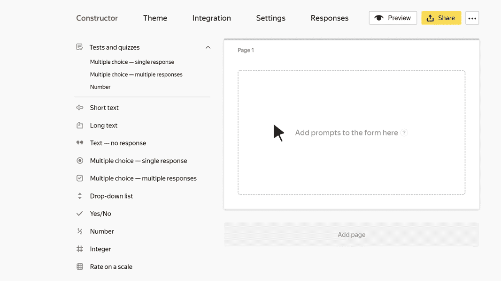

# Integer

In this block, the user can enter an integer. For example, height in centimeters.

## Block settings {#sec_settings}

### Question {#question}

Enter a field name or a prompt.







### Limit numbers in a response {#limit}

Set the minimum and maximum values for the field.

