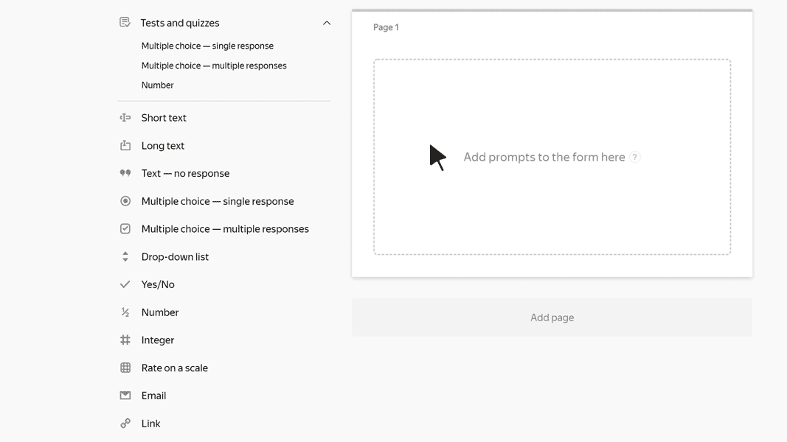

# Link

In this block, the user can specify a website or page address. For example, a link to a social media profile.

## Block settings {#sec_settings}

### Question {#question}

Enter a field name.





