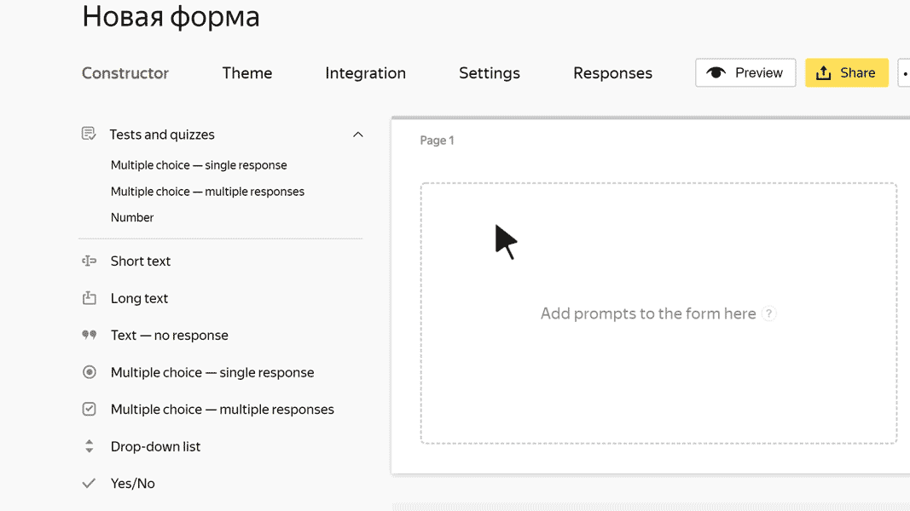

# Long text

In this block, the user can enter any long text. For example, a review or description of a problem.

## Block settings {#sec_settings}

### Question {#question}

Enter your prompt. For example, ask the user to describe the problem in detail.







### Limit the number of characters in a response {#limit}

Set the minimum and maximum response length.





