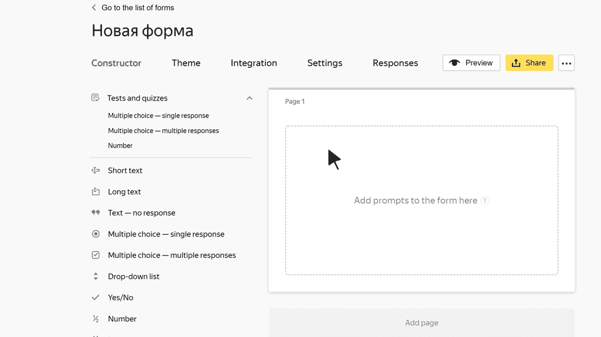

# Block "Multiple answers"

In this block, the user can select multiple responses from the options suggested. For example, they can select the services that they want to request.

## Block settings {#sec_settings}

### Question {#param-question}

Enter your prompt.









