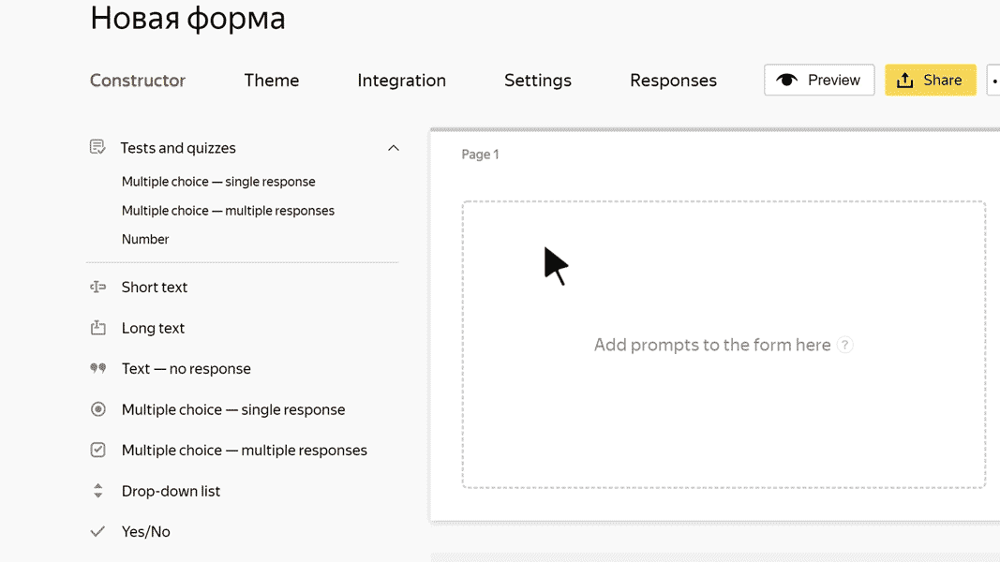

# Text with no questions

This block doesn't require a response from the user. You can add any text to it, such as form information or a heading for a group of questions.

## Block settings {#sec_settings}

### Text {#text}

Enter the text that you want to put on the form.

- To use the block as a heading for a group of questions, enable the **Make header** option. The heading is displayed in large font and separated from the previous question with a horizontal line.

- To add an image to the text, click .

- To add a comment to the text, click **+ Add comment**. The comment is displayed in a small font.

- To format the text or comment, use [Markdown](../appearance.md#section_pzm_m1j_j3b).

