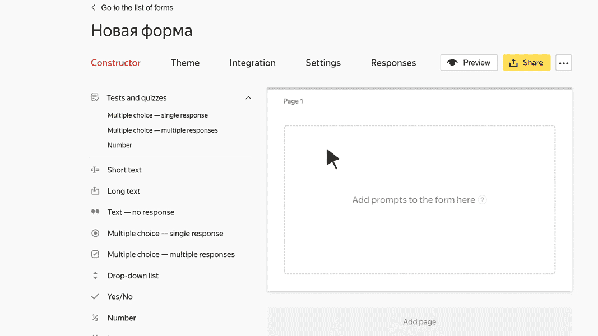

# "Number" block

In this block, the user can enter an integer or a fraction. For example, height in meters or body temperature.

## Block settings {#sec_settings}

### Question {#question}

Enter a field name or a prompt.







### Validation {#validate}

