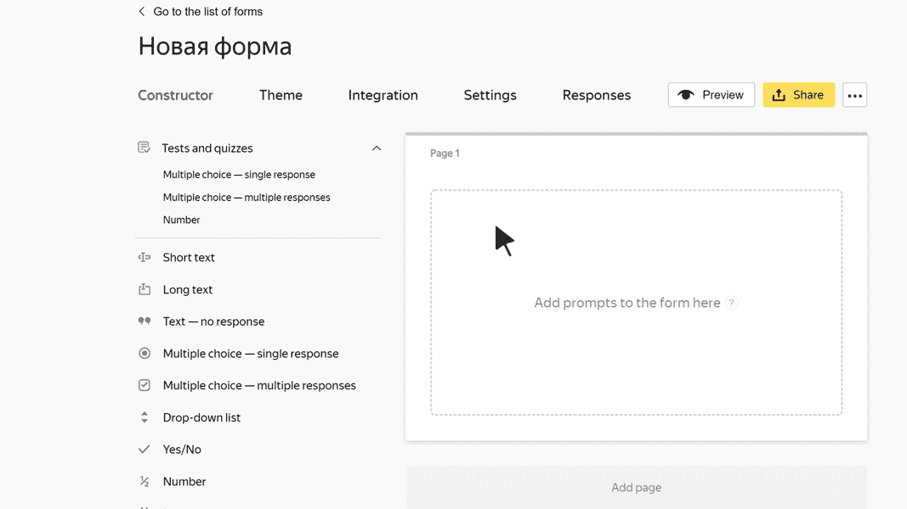

# Block "One answer"

In this block, the user can choose a response from several options. For example, they can specify their marital status.

## Block settings {#sec_settings}

### Question {#param-question}

Enter your prompt.















