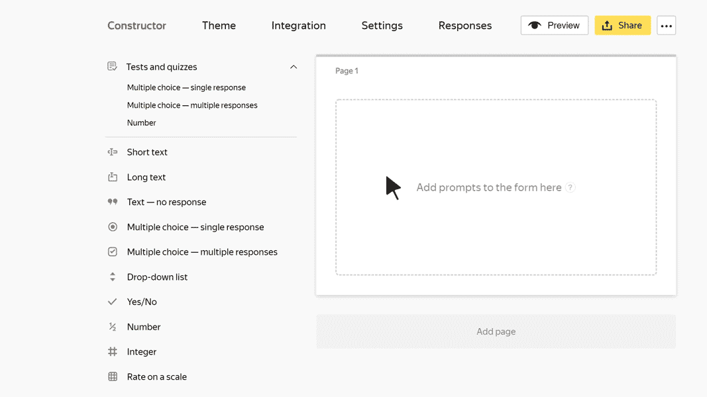

# Rating on a scale

In this block, the user can evaluate an item or event on a given scale. For example, if you want to collect feedback about an event, you can ask users to rate it on a five-point scale for categories like how well it was organized, topics presented, and how well the host or moderator did their job.

## Block settings {#sec_settings}

### Question {#param-question}

Enter your prompt. For example, ask the user to rate something.



- For a prompt to work properly, set at least one [criterion](#param-criterion).

### Criteria {#param-criterion}

In the **Criteria** section, set the criteria for evaluating items or list multiple items to evaluate. For example, you can set the following criteria for evaluating an event: how well it was organized, topics presented, and how well the host or moderator did their job.

- To add a criterion, select the **Add option** field and enter a name.

- To relocate a criterion in the list, drag it with .

- To delete a criterion, click .

### Responses {#param-answers}

In the **{{ ui-key.forms.common.blocks_correct-answers.title }}** section, set the rating scale. The user needs to select a response option for each criterion. For example, to rate on a five-point scale, you can set numbers from 1 to 5 as responses. Or you can set three grades: <q>good</q>, <q>satisfactory</q>, and <q>bad</q>.

- To add a response option, select **Add option** and enter the response text.

- To format the response text, use [Markdown markup](../appearance.md#section_pzm_m1j_j3b).

- To relocate a response option in the list, drag it with .



