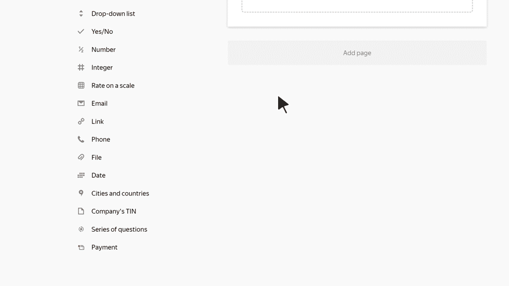

# Questions series

A series of questions combines several different types of questions. When the user fills out a form, they can copy a series of questions and answer them again. This is convenient if they need to enter the same data multiple times in the same form.

For example, you can add a series of questions with the <q>First name</q>, <q>Last name</q>, and <q>Email</q> fields to a form for registering event participants. Then the user can create a group application for taking part in the event by copying the series of questions and entering multiple participants' data in the same form.

You can also use a series to group multiple prompts together and set up common [display conditions](../add-questions.md#conditions) for them.

To add a series of questions:

1. Add a **Series of questions** block to the form workspace.

1. To add questions to the series, drag them from the workspace or from the left panel to the **Series of questions** block.  Questions in a series are marked with a vertical line along the left edge of the workspace. You can [edit](../add-questions.md#params) prompts in a series the same way you edit separate prompts.



If you create a series out of prompts from the [**Tests and quizzes**](tests-ref.md) category, then [scoring](../tests.md#test-result) won't work in the test.



1. To change the header for a series of questions, click it.

1. To change where a series of questions is placed on a form, hover over the series and drag the  icon to the right place.

1. To [set up display conditions](../add-questions.md#conditions) for a series of questions, hover over it and click the icon that appears: .

