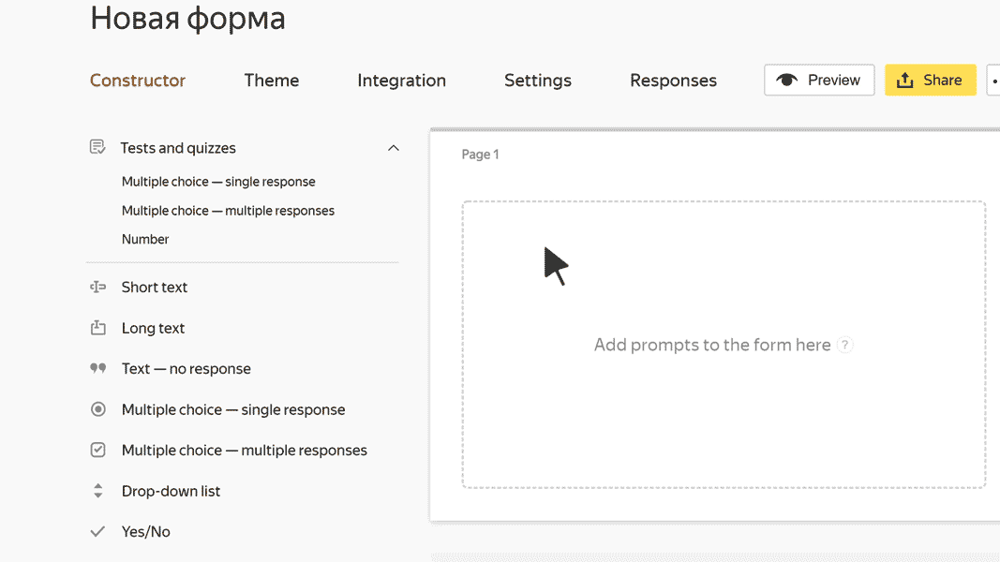

# Short text

In this block, the user can enter a word or a short phrase. For example, their first and last name.

The <q>Short text</q> field allows a maximum of 255 characters.

## Block settings {#sec_settings}

### Question {#param-question}

Enter a field name or a prompt.





### Limit the number of characters in a response {#param-symbol-max}

Set the minimum and maximum response length.



No matter what value is set for the maximum response length, the <q>Short text</q> field can't have more than 255 characters.



### Add hint {#param-tip}

Turn on this option to suggest response options from a directory when the user enters text. Select the type of hint:

- **Department**, **Team**, **User**: Users or divisions from the organization's address book in [{{ org-full-name }}]({{ link-org-main }}).

- **Address**, **Cities**, **Countries**: hint from directories of addresses.

- **Email address**: Email address of user.

- **Gender**: The user's gender.

### Validation {#param-validation}

