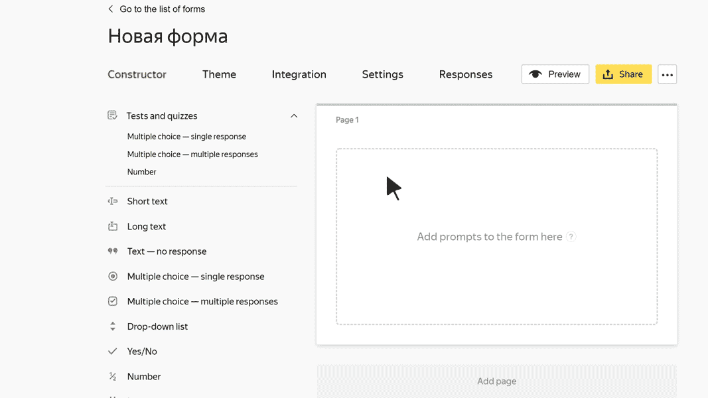

# Block "Multiple answers"

In this block, the user can select multiple responses from the options suggested. One or more responses may be correct. The user gets points for this prompt only if they select all the correct responses and no incorrect ones.

>**For example, the prompt says:** Which of these cities are in Italy?
>
>**Response options:**
>
>- Nice: 0 points.
>- Naples: 1 point.
>- Valencia: 0 points.
>- Milan: 1 point.
>
>There are two correct responses: Naples and Milan. If the user selects these two cities but not Nice and Valencia, they get 2 points.

## Block settings {#sec_settings}

### Question {#question}

Enter your prompt.





Under all the responses you think are correct, select **Correct**.

Under the correct responses, specify the number of points that the user gets for each response. It must be a positive integer or fraction with no more than two decimal places.

Points for all correct responses are summed up. The user gets all the points only if they choose all the correct responses to the prompt.











